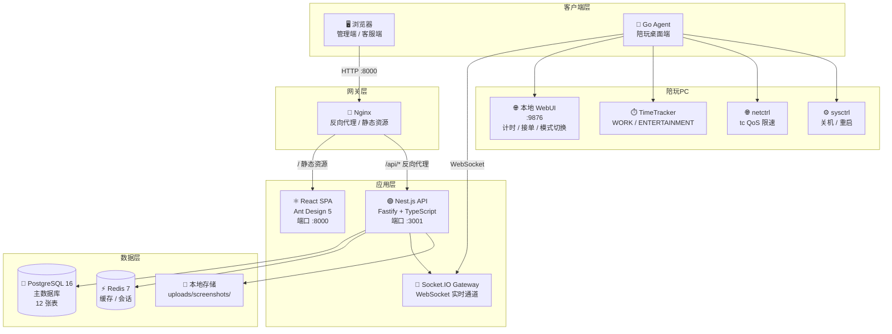
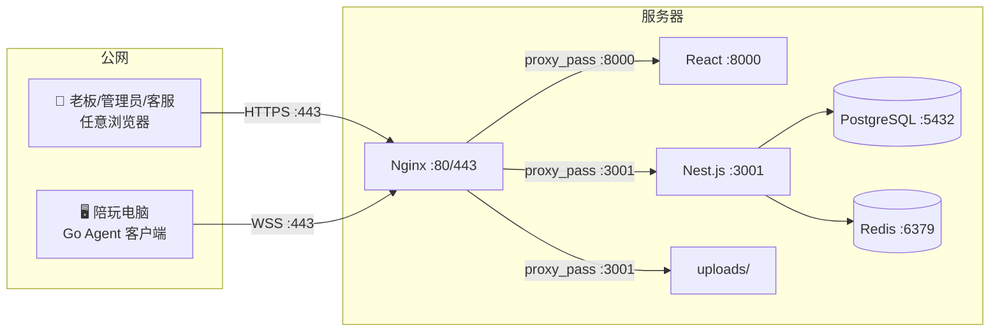
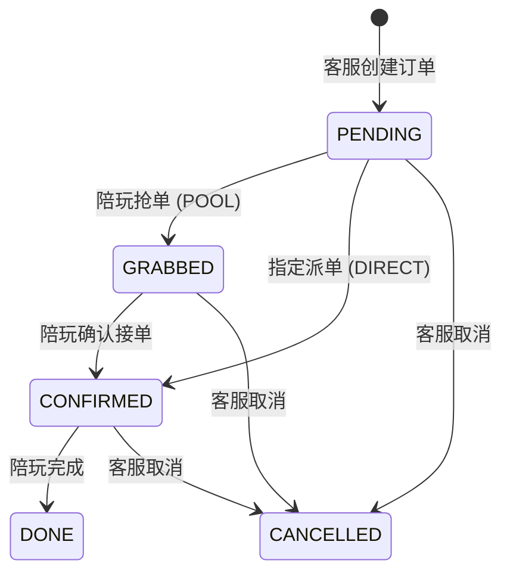
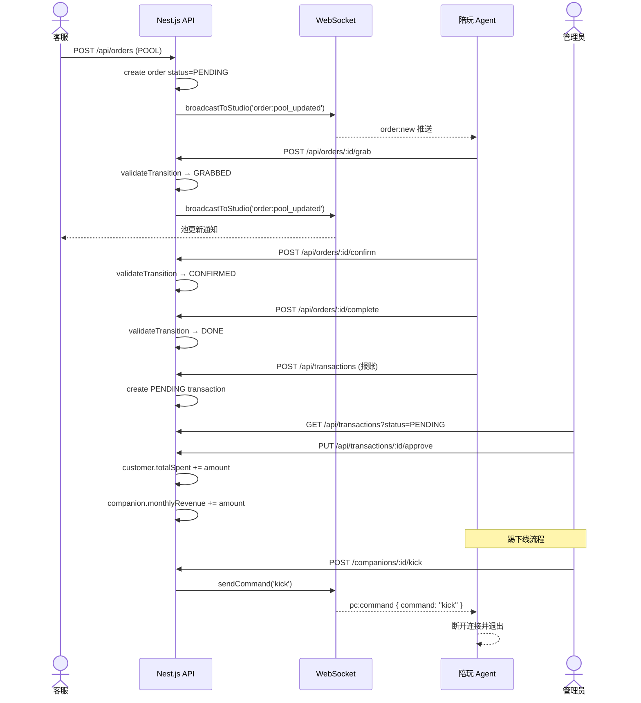
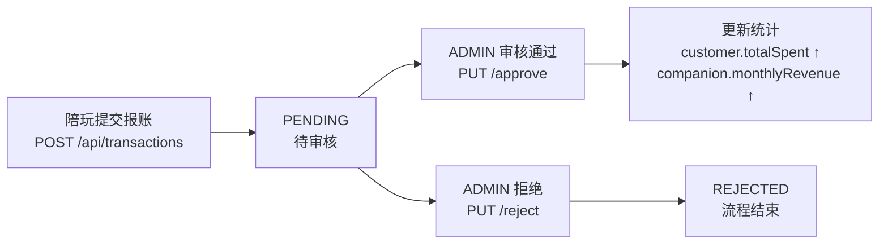
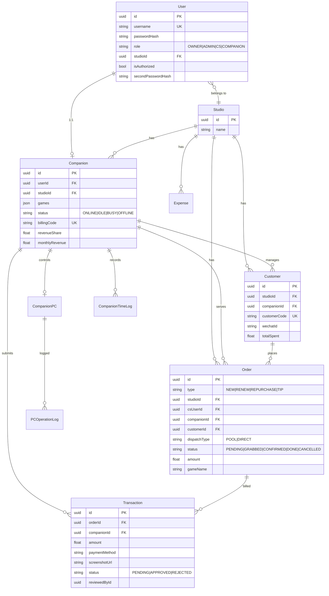
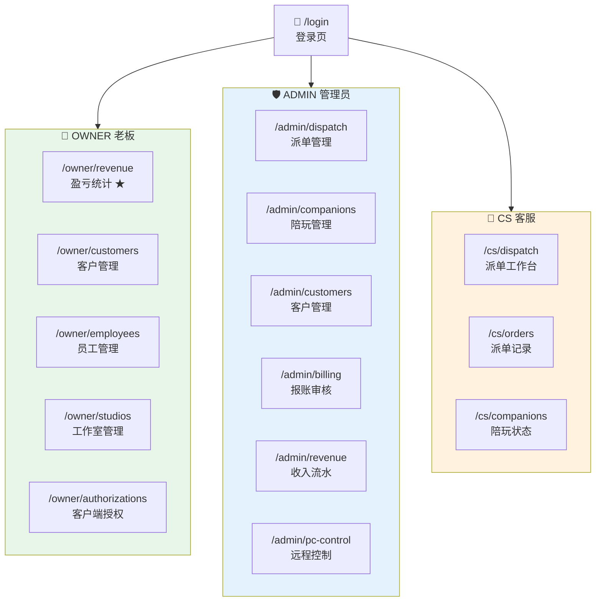
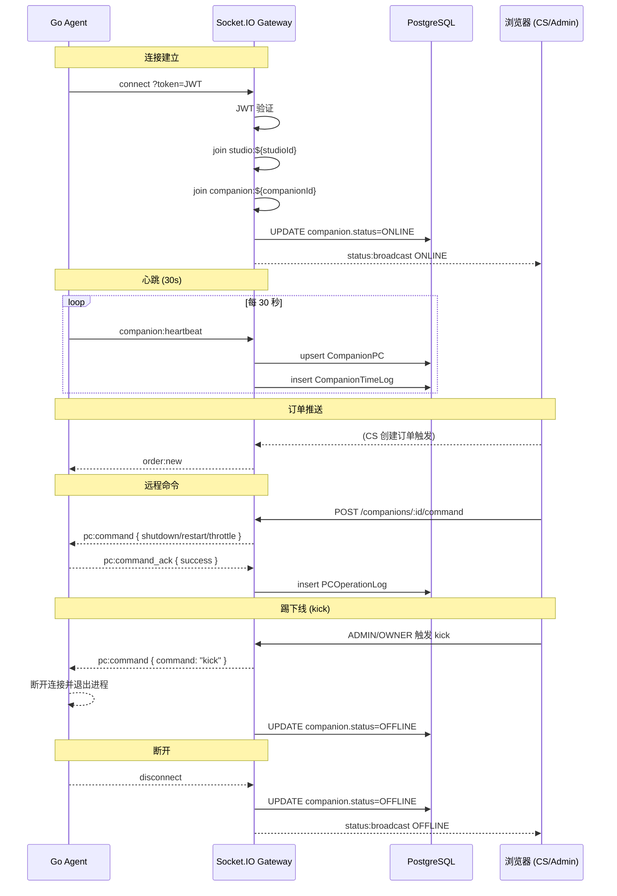
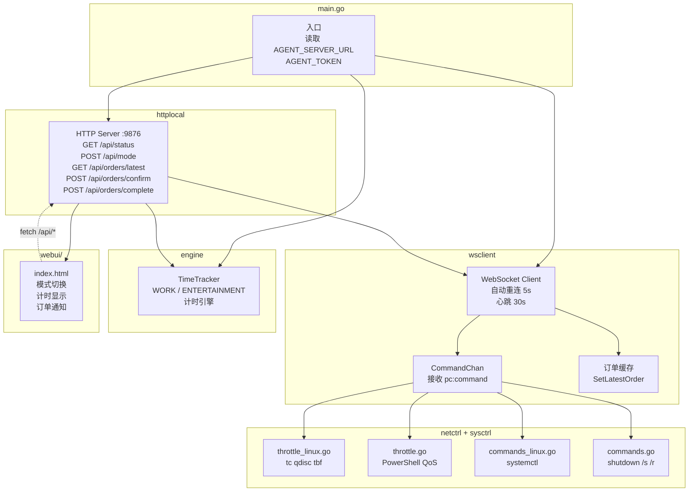
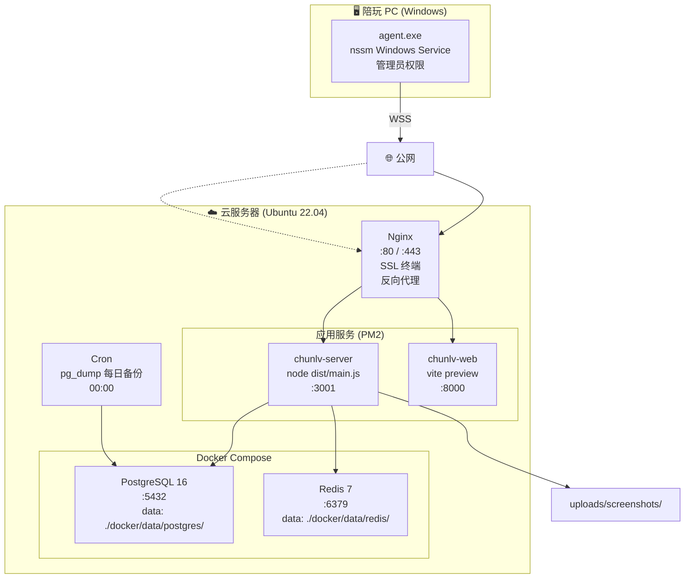

# 蠢驴电竞陪玩派单管理系统 — 架构说明

> 以图表形式阐述整个平台的系统架构、数据流转、业务流程和部署拓扑。

---

## 1. 系统全景架构



## 2. 网络拓扑



## 3. 核心业务流程

### 3.1 订单全生命周期



### 3.2 派单流程时序



### 3.3 报账审核流程



## 4. 数据模型 ER 图



## 5. 前端路由与角色权限



> ★ 盈亏统计需二级密码验证（5 分钟 secondToken）

## 6. WebSocket 事件流



## 7. 认证流程

```
老板创建陪玩(自动授权) → 陪玩输入账号密码 → Agent自动登录 → 在线
```

## 8. Go Agent 内部架构



## 9. 部署架构



---

> 图表使用 Mermaid 语法，支持 GitHub / VS Code / 多数 Markdown 渲染器直接预览。
