# 蠢驴电竞陪玩派单管理系统 — 架构说明

> 以图表形式阐述整个平台的系统架构、数据流转、业务流程和部署拓扑。
> 最后更新: 2026-06-30 · v3.0.0

## 新增功能

- **统一数据看板**: 昨日/全月流水, 31天趋势图, 订单类型饼图, 陪玩收入排行+明细下钻
- **陪玩钱包+结算**: 押金/余额/冻结/可支取 + 支取申请审核 + 阶梯分成月底结算
- **客户画像+AI**: 19字段画像, 首单/复购检测, 活跃状态判定, AI分析+话术生成
- **双陪搭档**: 呼叫/接受搭档 WebSocket 通知
- **流量池+离职+授权+工作微信**: 渠道管理, 离职清退, 租客授权, 微信绑定

---

## 1. 系统全景架构

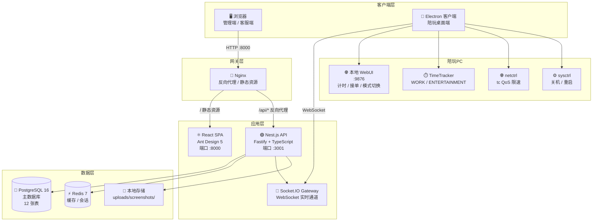
```mermaid
graph TB
    subgraph 客户端层
        BROWSER["🖥️ 浏览器<br/>管理端 / 客服端"]
        AGENT["🤖 Electron 客户端<br/>陪玩桌面端"]
    end

    subgraph 网关层
        NGINX["🔀 Nginx<br/>反向代理 / 静态资源"]
    end

    subgraph 应用层
        WEB["⚛️ React SPA<br/>Ant Design 5<br/>端口 :8000"]
        API["🟢 Nest.js API<br/>Fastify + TypeScript<br/>端口 :3001"]
        WS["📡 Socket.IO Gateway<br/>WebSocket 实时通道"]
    end

    subgraph 数据层
        PG[("🐘 PostgreSQL 16<br/>主数据库<br/>12 张表")]
        REDIS[("⚡ Redis 7<br/>缓存 / 会话")]
        DISK["📁 本地存储<br/>uploads/screenshots/"]
    end

    subgraph 陪玩PC
        LOCAL["🌐 本地 WebUI<br/>:9876<br/>计时 / 接单 / 模式切换"]
        TIMER["⏱️ TimeTracker<br/>WORK / ENTERTAINMENT"]
        NET["🌐 netctrl<br/>tc QoS 限速"]
        SYS["⚙️ sysctrl<br/>关机 / 重启"]
    end

    BROWSER -->|"HTTP :8000"| NGINX
    AGENT -->|"WebSocket"| WS
    NGINX -->|"/ 静态资源"| WEB
    NGINX -->|"/api/* 反向代理"| API
    API --> PG
    API --> REDIS
    API --> WS
    API --> DISK
    AGENT --> LOCAL
    AGENT --> TIMER
    AGENT --> NET
    AGENT --> SYS
```

## 2. 网络拓扑

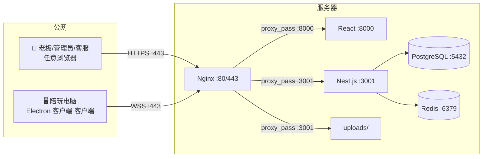
```mermaid
graph LR
    subgraph 公网
        USER["👤 老板/管理员/客服<br/>任意浏览器"]
        CP["🖥️ 陪玩电脑<br/>Electron 客户端 客户端"]
    end

    subgraph 服务器
        NGINX["Nginx :80/443"]
        WEB["React :8000"]
        API["Nest.js :3001"]
        PG[("PostgreSQL :5432")]
        REDIS[("Redis :6379")]
        UPLOAD["uploads/"]
    end

    USER -->|"HTTPS :443"| NGINX
    CP -->|"WSS :443"| NGINX
    NGINX -->|"proxy_pass :8000"| WEB
    NGINX -->|"proxy_pass :3001"| API
    NGINX -->|"proxy_pass :3001"| UPLOAD
    API --> PG
    API --> REDIS
```

## 3. 核心业务流程

### 3.1 订单全生命周期

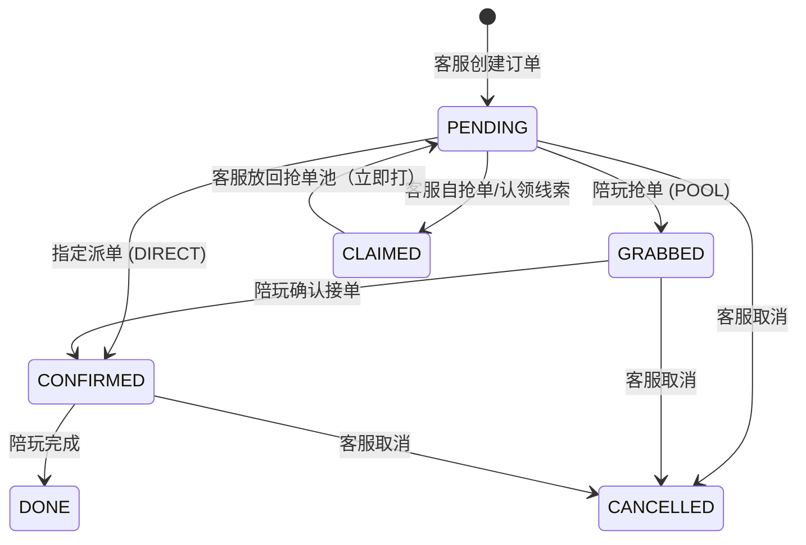
```mermaid
stateDiagram-v2
    [*] --> PENDING: 客服创建订单
    PENDING --> GRABBED: 陪玩抢单 (POOL)
    PENDING --> CLAIMED: 客服自抢单/认领线索
    PENDING --> CONFIRMED: 指定派单 (DIRECT)
    PENDING --> CANCELLED: 客服取消
    CLAIMED --> PENDING: 客服放回抢单池（立即打）
    GRABBED --> CONFIRMED: 陪玩确认接单
    GRABBED --> CANCELLED: 客服取消
    CONFIRMED --> DONE: 陪玩完成
    CONFIRMED --> CANCELLED: 客服取消
```

### 3.2 派单流程时序

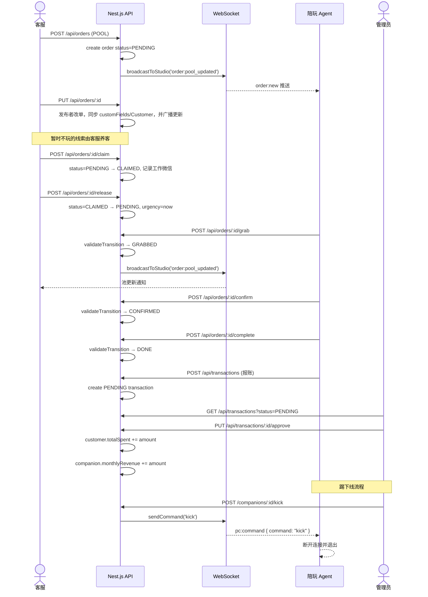
```mermaid
sequenceDiagram
    actor CS as 客服
    participant API as Nest.js API
    participant WS as WebSocket
    participant CP as 陪玩 Agent
    actor ADMIN as 管理员

    CS->>API: POST /api/orders (POOL)
    API->>API: create order status=PENDING
    API->>WS: broadcastToStudio('order:pool_updated')
    WS-->>CP: order:new 推送
    CS->>API: PUT /api/orders/:id
    API->>API: 发布者改单，同步 customFields/Customer，并广播更新

    Note over CS,API: 暂时不玩的线索由客服养客
    CS->>API: POST /api/orders/:id/claim
    API->>API: status=PENDING → CLAIMED, 记录工作微信
    CS->>API: POST /api/orders/:id/release
    API->>API: status=CLAIMED → PENDING, urgency=now

    CP->>API: POST /api/orders/:id/grab
    API->>API: validateTransition → GRABBED
    API->>WS: broadcastToStudio('order:pool_updated')
    WS-->>CS: 池更新通知

    CP->>API: POST /api/orders/:id/confirm
    API->>API: validateTransition → CONFIRMED

    CP->>API: POST /api/orders/:id/complete
    API->>API: validateTransition → DONE

    CP->>API: POST /api/transactions (报账)
    API->>API: create PENDING transaction

    ADMIN->>API: GET /api/transactions?status=PENDING
    ADMIN->>API: PUT /api/transactions/:id/approve
    API->>API: customer.totalSpent += amount
    API->>API: companion.monthlyRevenue += amount

    Note over ADMIN,CP: 踢下线流程
    ADMIN->>API: POST /companions/:id/kick
    API->>WS: sendCommand('kick')
    WS-->>CP: pc:command { command: "kick" }
    CP-->>CP: 断开连接并退出
```

### 3.3 报账审核流程

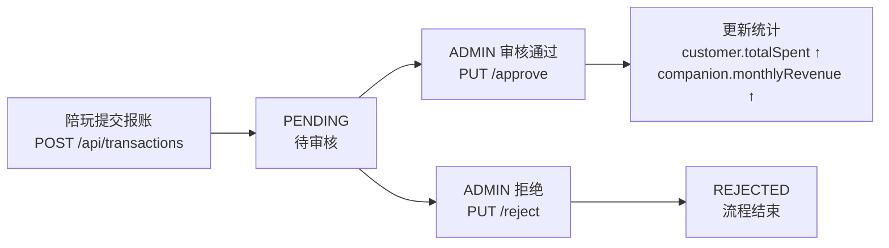
```mermaid
flowchart LR
    COMPANION["陪玩提交报账<br/>POST /api/transactions"] --> PENDING["PENDING<br/>待审核"]
    PENDING --> APPROVE["ADMIN 审核通过<br/>PUT /approve"]
    PENDING --> REJECT["ADMIN 拒绝<br/>PUT /reject"]
    APPROVE --> UPDATE["更新统计<br/>customer.totalSpent ↑<br/>companion.monthlyRevenue ↑"]
    REJECT --> END["REJECTED<br/>流程结束"]
```

## 4. 数据模型 ER 图

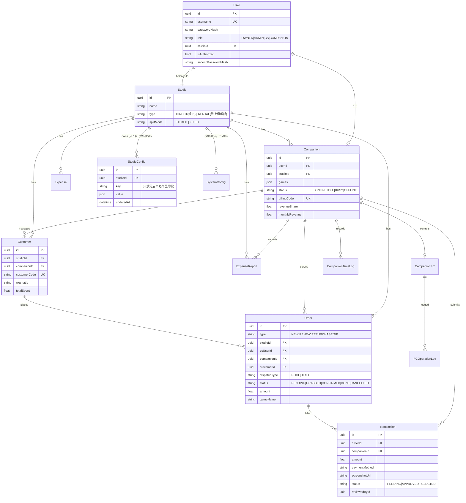
```mermaid
erDiagram
    User ||--o| Companion : "1:1"
    User }o--|| Studio : "belongs to"
    Studio ||--o{ Companion : "has"
    Studio ||--o{ Order : "has"
    Studio ||--o{ Customer : "has"
    Studio ||--o{ Expense : "has"
    Studio ||--o{ StudioConfig : "owns (店长自己填的配置)"
    Studio ||--o{ SystemConfig : "(全局默认，不分店)"
    Companion ||--o{ ExpenseReport : "submits"
    Studio ||--o{ ExpenseReport : "has"
    Companion ||--o{ Order : "serves"
    Companion ||--o| CompanionPC : "controls"
    Companion ||--o{ CompanionTimeLog : "records"
    Companion ||--o{ Transaction : "submits"
    Companion ||--o{ Customer : "manages"
    Customer ||--o{ Order : "places"
    Order ||--o{ Transaction : "billed"
    CompanionPC ||--o{ PCOperationLog : "logged"

    User {
        uuid id PK
        string username UK
        string passwordHash
        string role "OWNER|ADMIN|CS|COMPANION"
        uuid studioId FK
        bool isAuthorized
        string secondPasswordHash
    }

    Studio {
        uuid id PK
        string name
        string type "DIRECT(线下) | RENTAL(线上俱乐部)"
        string splitMode "TIERED | FIXED"
    }

    StudioConfig {
        uuid id PK
        uuid studioId FK
        string key "只放分店白名单里的键"
        json value
        datetime updatedAt
    }

    Companion {
        uuid id PK
        uuid userId FK
        uuid studioId FK
        json games
        string status "ONLINE|IDLE|BUSY|OFFLINE"
        string billingCode UK
        float revenueShare
        float monthlyRevenue
    }

    Order {
        uuid id PK
        string type "NEW|RENEW|REPURCHASE|TIP"
        uuid studioId FK
        uuid csUserId FK
        uuid companionId FK
        uuid customerId FK
        string dispatchType "POOL|DIRECT"
        string status "PENDING|GRABBED|CONFIRMED|DONE|CANCELLED"
        float amount
        string gameName
    }

    Customer {
        uuid id PK
        uuid studioId FK
        uuid companionId FK
        string customerCode UK
        string wechatId
        float totalSpent
    }

    Transaction {
        uuid id PK
        uuid orderId FK
        uuid companionId FK
        float amount
        string paymentMethod
        string screenshotUrl
        string status "PENDING|APPROVED|REJECTED"
        uuid reviewedById
    }
```

## 5. 前端路由与角色权限

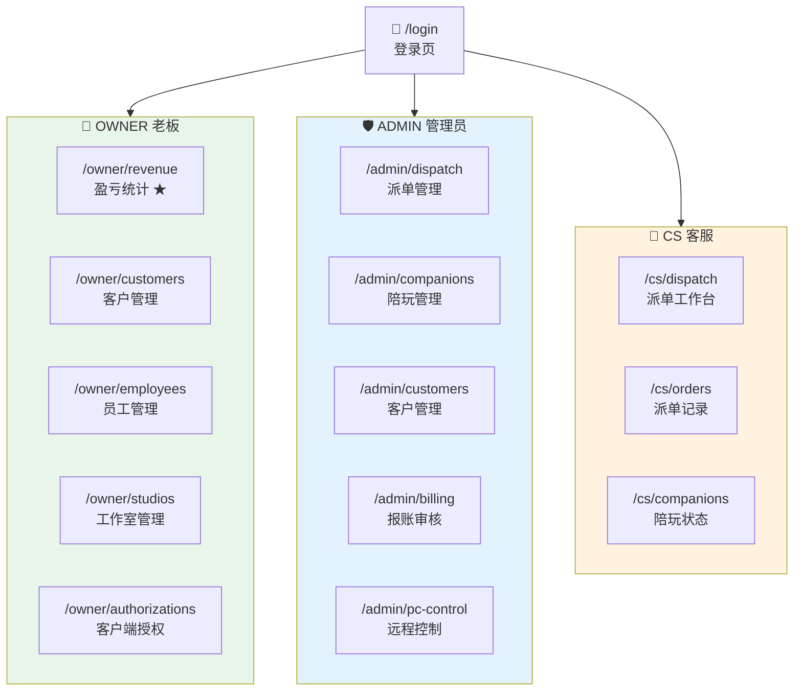
```mermaid
graph TB
    LOGIN["🔐 /login<br/>登录页"]

    LOGIN --> OWNER
    LOGIN --> ADMIN
    LOGIN --> CS

    subgraph OWNER["👑 OWNER 老板"]
        O1["/owner/revenue<br/>盈亏统计 ★"]
        O2["/owner/customers<br/>客户管理"]
        O3["/owner/employees<br/>员工管理"]
        O4["/owner/studios<br/>工作室管理"]
        O5["/owner/authorizations<br/>客户端授权"]
    end

    subgraph ADMIN["🛡️ ADMIN 管理员"]
        A1["/admin/dispatch<br/>派单管理"]
        A2["/admin/companions<br/>陪玩管理"]
        A3["/admin/customers<br/>客户管理"]
        A4["/admin/billing<br/>报账审核"]
        A5["/admin/pc-control<br/>远程控制"]
    end

    subgraph CS["💬 CS 客服"]
        C1["/cs/dispatch<br/>派单工作台"]
        C2["/cs/orders<br/>派单记录"]
        C3["/cs/companions<br/>陪玩状态"]
    end

    style OWNER fill:#e8f5e9
    style ADMIN fill:#e3f2fd
    style CS fill:#fff3e0
```

> ★ 盈亏统计需二级密码验证（5 分钟 secondToken）

## 6. WebSocket 事件流

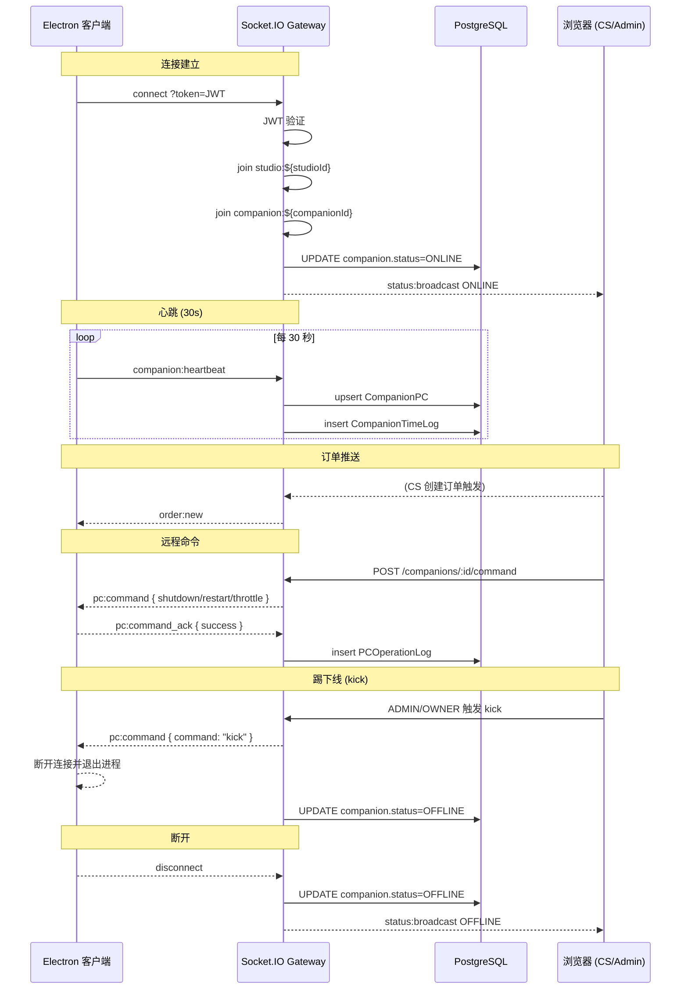
```mermaid
sequenceDiagram
    participant AGENT as Electron 客户端
    participant GW as Socket.IO Gateway
    participant DB as PostgreSQL
    participant BROWSER as 浏览器 (CS/Admin)

    Note over AGENT,GW: 连接建立
    AGENT->>GW: connect ?token=JWT
    GW->>GW: JWT 验证
    GW->>GW: join studio:${studioId}
    GW->>GW: join companion:${companionId}
    GW->>DB: UPDATE companion.status=ONLINE
    GW-->>BROWSER: status:broadcast ONLINE

    Note over AGENT,GW: 心跳 (30s)
    loop 每 30 秒
        AGENT->>GW: companion:heartbeat
        GW->>DB: upsert CompanionPC
        GW->>DB: insert CompanionTimeLog
    end

    Note over AGENT,BROWSER: 订单推送
    BROWSER-->>GW: (CS 创建订单触发)
    GW-->>AGENT: order:new

    Note over AGENT,GW: 远程命令
    BROWSER->>GW: POST /companions/:id/command
    GW-->>AGENT: pc:command { shutdown/restart/throttle }
    AGENT-->>GW: pc:command_ack { success }
    GW->>DB: insert PCOperationLog

    Note over AGENT,BROWSER: 踢下线 (kick)
    BROWSER->>GW: ADMIN/OWNER 触发 kick
    GW-->>AGENT: pc:command { command: "kick" }
    AGENT-->>AGENT: 断开连接并退出进程
    GW->>DB: UPDATE companion.status=OFFLINE

    Note over AGENT,GW: 断开
    AGENT-->>GW: disconnect
    GW->>DB: UPDATE companion.status=OFFLINE
    GW-->>BROWSER: status:broadcast OFFLINE
```

**订单推送补充（订单池里程碑 / 广播）:**

- 订单池的可见范围按里程碑逐级放开：本店上等马 → 桥接工作室 → 本店中等马 → …，「桥接工作室等待」由 `pool.bridge_delay_seconds` 控制（当前线上 300 秒）。
- 「广播」发单（`dispatchType=BROADCAST`，落库仍为 `POOL` 以保持可抢）：创建时立刻向本店在线空闲陪玩推 `order:urgent`（右下角弹窗）；到「桥接工作室等待」时间后，`WsGateway.broadcastUrgentToBridgedStudios()` 再向桥接工作室的在线空闲陪玩推一次同一条 `order:urgent`（带 `_bridged: true`，弹窗标题区分）。延时推送前会复查订单仍为 `PENDING` 且无人抢单/无人认领。
- 网关连接时会自动 join 桥接工作室的房间（`studio:${bridgedStudioId}`），用于订单池、状态等跨工作室实时广播。

## 7. 认证流程

```
老板创建陪玩(自动授权) → 陪玩输入账号密码 → Agent自动登录 → 在线
```

## 8. Electron 客户端 内部架构

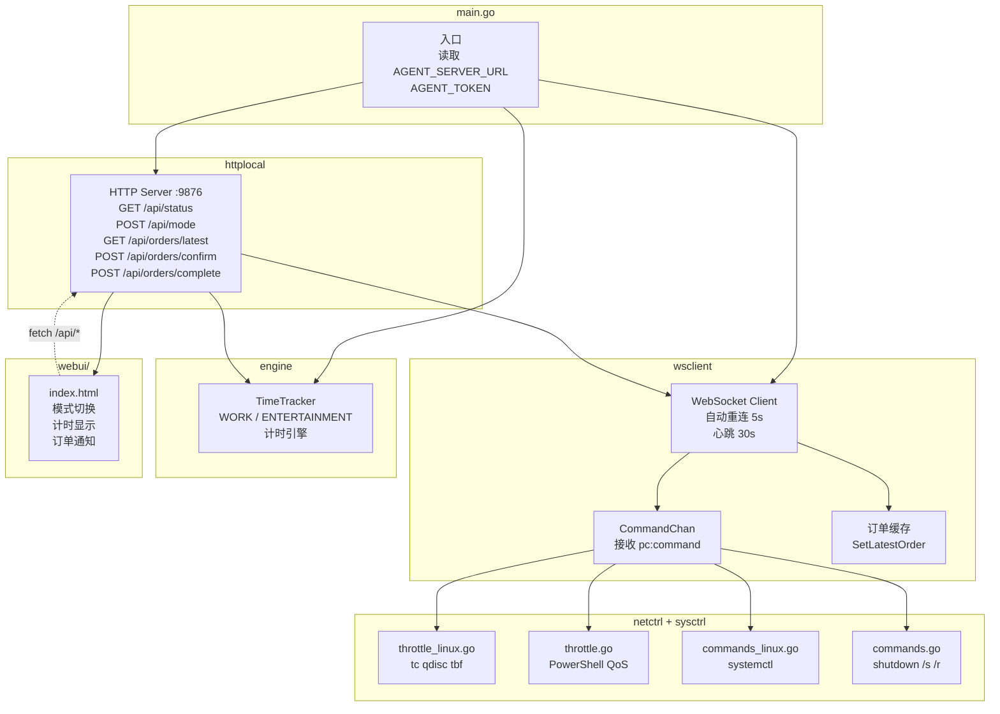
```mermaid
graph TB
    subgraph main["main.go"]
        ENTRY["入口<br/>读取 AGENT_SERVER_URL<br/>AGENT_TOKEN"]
    end

    subgraph ws["wsclient"]
        WSC["WebSocket Client<br/>自动重连 5s<br/>心跳 30s"]
        CMDS["CommandChan<br/>接收 pc:command"]
        ORDERS["订单缓存<br/>SetLatestOrder"]
    end

    subgraph engine["engine"]
        TRACKER["TimeTracker<br/>WORK / ENTERTAINMENT<br/>计时引擎"]
    end

    subgraph http["httplocal"]
        HTTP_SRV["HTTP Server :9876<br/>GET /api/status<br/>POST /api/mode<br/>GET /api/orders/latest<br/>POST /api/orders/confirm<br/>POST /api/orders/complete"]
    end

    subgraph ctrl["netctrl + sysctrl"]
        NETCTRL_LINUX["throttle_linux.go<br/>tc qdisc tbf"]
        NETCTRL_WIN["throttle.go<br/>PowerShell QoS"]
        SYSCTRL_LINUX["commands_linux.go<br/>systemctl"]
        SYSCTRL_WIN["commands.go<br/>shutdown /s /r"]
    end

    subgraph webui["webui/"]
        UI["index.html<br/>模式切换<br/>计时显示<br/>订单通知"]
    end

    ENTRY --> WSC
    ENTRY --> HTTP_SRV
    ENTRY --> TRACKER
    WSC --> CMDS
    WSC --> ORDERS
    CMDS --> NETCTRL_LINUX
    CMDS --> NETCTRL_WIN
    CMDS --> SYSCTRL_LINUX
    CMDS --> SYSCTRL_WIN
    HTTP_SRV --> TRACKER
    HTTP_SRV --> WSC
    HTTP_SRV --> UI
    UI -.->|"fetch /api/*"| HTTP_SRV
```

## 8.1 配置分层（分店配置）

老板 2026-09-21 拍板：**以后进来的租赁线下工作室 / 线上俱乐部，所有数据由他们自己的店长填写。**
所以读配置一律走 `apps/server/src/common/studio-config.ts`，生效顺序：

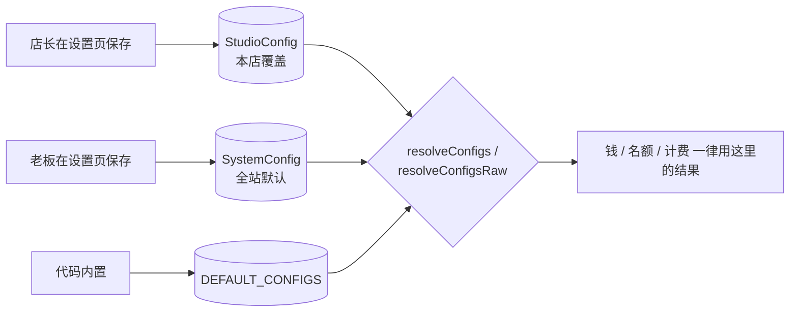
```mermaid
flowchart LR
    A["店长在设置页保存"] --> B[("StudioConfig<br/>本店覆盖")]
    C["老板在设置页保存"] --> D[("SystemConfig<br/>全站默认")]
    E["代码内置"] --> F[("DEFAULT_CONFIGS")]
    B --> G{"resolveConfigs /<br/>resolveConfigsRaw"}
    D --> G
    F --> G
    G --> H["钱 / 名额 / 计费 一律用这里的结果"]
```

- `resolveConfigs(prisma, studioId, keys)` —— 带内置默认兜底，给界面和「显示即生效」的场景用。
- `resolveConfigsRaw(prisma, studioId, keys)` —— **不做内置兜底**，没配过就返回 `undefined`，
  让调用处原来的 `?? 兜底值` 继续生效。所有从 `systemConfig.findUnique(key)` 改造过来的读点都用它，
  保证「本店没填」时行为与改造前**一模一样**。
- `STUDIO_SCOPED_KEYS`（`common/default-config.ts`）是店长可自填的**白名单**，
  只放「真的有人读、且真的按店生效」的键；名单外的全站唯一项（JWT、AI 密钥、前端版本、
  杀黑名单开关等）店长改不了。
- `PUT /api/config` 按身份分流（老板写全局 / 店长写本店），
  `DELETE /api/config/studio-overrides` 恢复默认，`GET /api/config` 返回生效值 + `_meta.overridden`。

## 9. 部署架构

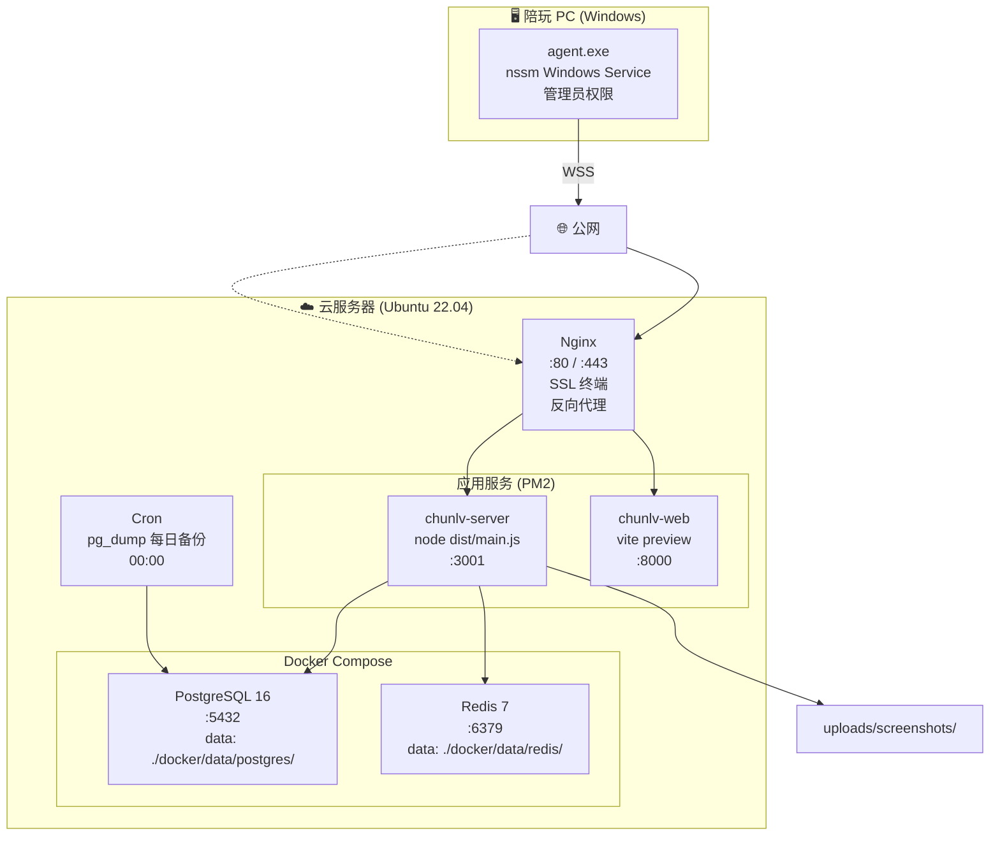
```mermaid
graph TB
    subgraph VPS["☁️ 云服务器 (Ubuntu 22.04)"]
        subgraph Docker["Docker Compose"]
            PG_D["PostgreSQL 16<br/>:5432<br/>data: ./docker/data/postgres/"]
            REDIS_D["Redis 7<br/>:6379<br/>data: ./docker/data/redis/"]
        end

        subgraph App["应用服务 (PM2)"]
            API_P["chunlv-server<br/>node dist/main.js<br/>:3001"]
            WEB_P["chunlv-web<br/>vite preview<br/>:8000"]
        end

        NGINX_P["Nginx<br/>:80 / :443<br/>SSL 终端<br/>反向代理"]
        CRON["Cron<br/>pg_dump 每日备份<br/>00:00"]
    end

    subgraph Client["🖥️ 陪玩 PC (Windows)"]
        AGENT_EXE["agent.exe<br/>nssm Windows Service<br/>管理员权限"]
    end

    INTERNET["🌐 公网"] --> NGINX_P
    NGINX_P --> API_P
    NGINX_P --> WEB_P
    API_P --> PG_D
    API_P --> REDIS_D
    API_P --> DISK_P["uploads/screenshots/"]
    AGENT_EXE -->|"WSS"| INTERNET
    INTERNET -.-> NGINX_P
    CRON --> PG_D
```

---

> 图表使用 Mermaid 语法，支持 GitHub / VS Code / 多数 Markdown 渲染器直接预览。

### 进程黑名单管理模块

**数据模型:**
- ProcessBlacklist: 工作室级黑名单规则 (processName + isActive)
- CompanionBlacklistOverride: 陪玩个人黑名单覆盖
- ProcessWhitelist: 白名单 (isSystem 标记内置条目)
- CompanionProcessReport: 陪玩进程上报快照
- ProcessKillLog: 杀进程审计日志

**API 端点:**
- `GET/POST/PUT/DELETE /api/blacklist` — 黑名单 CRUD
- `POST /api/blacklist/push` — 推送黑名单到陪玩终端
- `GET /api/blacklist/my-rules` — 陪玩端拉取自身黑名单(REST兜底)
- `GET/POST/DELETE /api/whitelist` — 白名单管理
- `GET /api/processes/unique-names` — 陪玩已上报进程去重列表
- `GET /api/processes/reports` — 进程上报记录
- `GET /api/processes/kill-logs` — 杀进程日志

**WebSocket 事件:**
- `blacklist:report` (C→S): 陪玩上报进程列表
- `blacklist:update` (S→C): 推送黑名单+白名单
- `blacklist:kill_result` (C→S): 杀进程结果
- `blacklist:update_ack` (C→S): 黑名单接收确认

**客户端 (Electron):**
- process-monitor.ts: PowerShell 进程采集 → OS 过滤 → 5分钟上报
- process-killer.ts: taskkill /F /PID 杀进程 + 速率限制
- blacklist-notification.ts: 5秒倒计时气泡弹窗
- 60秒 REST 轮询拉取黑名单 (WebSocket 断开时兜底)

### 内容查重与违禁词检测模块 (Content Check)

**功能:**
- 发布小红书/抖音等笔记前检查标题、正文、标签中的高危词与提醒词。
- 按 2 字滑动分片 Jaccard 相似度检查当前文案、同批草稿、历史文案和系统已录 `TrafficNote`。
- 可选用已配置的 DeepSeek / 豆包模型做语义级查重，识别换词但卖点和结构相同的文案。
- 命中高风险导流词、极限词、低价词、异常互动词时给出具体修改建议。

**API 端点:**
- `GET /api/content-check/lexicon` — 当前违禁词库与版本
- `POST /api/content-check/check` — 提交 `{ title, body, tags, historyTexts, includeStoredNotes, useSemantic }` 并返回检测结果

### 财务对账与防私单模块 (Finance)

**数据模型:**
- PriceRule: 游戏/模式价格规则 (首单底价、续单区间，金额整数分)
- MerchantPaymentRecord: 员工收款码到账流水
- CommissionRule / CommissionLedger: 客服/店长提成规则与月度结算
- SettlementSnapshot: 陪玩月度分成不可变快照

**核心规则:**
- 金额统一整数分存储，营业日以每日 12:00 为界，月结周期 = 当月 1 日 12:00 至次月 1 日 12:00
- 分成阶梯：**只用于线下工作室**（Studio.type=DIRECT、splitMode=TIERED；线上俱乐部 RENTAL 是按人固定比例，
  不走阶梯）。阶梯明细以「设置 → 分成阶梯」里老板填的为准（线上现在是 0–5999.9 五五 / 6000–9999.99 六四 /
  ≥10000 七三，老板口语里也写成 55/64/73，指的是同一套）；**最高一档需入职满 6 个月**，没满回落下一档（勾「老员工」可豁免）
- 一单流水的四个人分（老板 2026-09-21）：**陪玩**（线下阶梯 / 线上俱乐部固定比例）+ **客服**（线下按流水比例、
  线上按每单固定金额，均在「客服设置」）+ **店长**（`commission.admin_offline_rate_percent` /
  `commission.admin_online_rate_percent`，在「利润分成」页填）+ **工作室**（拿剩下的）。
  唯一实现在 `common/order-split.ts`；店长分成随月度提成写入 `CommissionLedger`（一店多店长按人数均分，
  桥接单不算本店店长分成）
- 成对百分比一律「填一个、另一个自动算」：**工作室 = 100 − 陪玩**（陪玩那一栏才真正参与算钱）。
  前端（设置 → 分账规则、利润分成设置）改任意一栏另一个自动补足；服务端保存阶梯时同样归一化，
  陪玩比例不在 0-100 直接拒绝（`apps/server/src/common/percent-split.ts`），
  任何客户端都写不进「工作室 60 + 陪玩 60 = 120%」这种配置
- 线上俱乐部固定比例：`revenue.club_companion_share`（陪玩分成百分比，工作室拿剩余份额）。只用于
  **RENTAL / FIXED** 的店；代码里读不到该配置时的兜底值与「设置 → 分账规则」页面的显示值一致（默认 80%），
  **页面显示的就是实际生效值，保存后落库**（前端加载时会把兜底值落进表单，避免「看着有、其实没存过」）
- 审核金额 = 填写时长 × 声明单价；转账截图合计 >= 审核金额即通过，超出算加价，低于标红
- 服务结束时由 `PUT /api/companions/sessions/:id/finish` 接收 `transferTotalYuan`，将审核金额、转账合计与审核状态写入订单 `auditAmountCents / transferTotalCents / auditStatus`
- 开始服务 `POST /api/orders/:id/start-session` 必填 `claimedMode / claimedPrice / duration / transferScreenshotUrl`，并将会话 `duration` 落库
- 证据长图按「服务信息表 → 转账截图 → 游戏截图 → 财务核对卡 → AI 异常分析卡」顺序拼接；`CompositeService.buildComposite(sessionId, flaggedReason, flaggedLevel)` 在结束服务时调用，0 截图红标、转账低于审核金额黄标
- 「每日统计」页复用 `GET /api/stats/daily`，升级为客服派单/提成核对工作台：发单客服、认领客服、工作微信、客户付款去向、收款账号、陪玩费状态与方式
- 报账协商：`PUT /api/transactions/:id/propose` 发起改价（`NEGOTIATING`），`accept-proposal` / `reject-proposal` 由陪玩确认或退回
- 支出/支取审核：`GET/PUT /api/expense-reports*` 与 `GET/PUT /api/wallet-transactions*` 审核陪玩支出、支取与钱包流水（`PENDING → APPROVED/REJECTED`）
- 提成复核：`PATCH /api/finance/commission/ledgers/:id/status` 将 `CommissionLedger` 在 `DRAFT / CONFIRMED` 间流转
- 截图阈值：`GET/PUT /api/config` 读取/更新 `capture.*`（截图间隔、首张延迟、黑屏判定、每小时期望张数与合格率），Electron 客户端开始服务时拉取并动态执行

**API 端点:**
- `GET/POST/PATCH /api/finance/price-rules` — 价格规则 CRUD（内置默认机密 35/绝密 45）
- `POST/GET /api/finance/settlement/:month` — 月度分成结算快照
- `GET/POST /api/finance/commission/rules` — 提成规则
- `POST /api/finance/commission/calculate/:month` — 幂等月度提成计算
- `GET /api/finance/commission/:month` — 提成结算列表
- `GET /api/finance/reconciliation?day=` — 每日到账对账
- `GET /api/finance/risk-queue` — 客户画像 + AI 私单风险工作台
- `PATCH /api/finance/commission/ledgers/:id/status` — 提成结算确认/撤销
- `GET/PUT /api/expense-reports*` — 支出/支取申请查询与审核
- `GET/PUT /api/wallet-transactions*` — 钱包流水查询与审核
- `GET/PUT /api/config` — 全局配置（含 `capture.*` 截图阈值）
