# 蠢驴电竞陪玩派单管理系统 — 架构说明

> 以图表形式阐述整个平台的系统架构、数据流转、业务流程和部署拓扑。
> 最后更新: 2026-10-03 · v3.3.0

## 新增功能

- **弹窗 / 邀请统一成「可点击横幅」（2026-10-03，客户端 `electron/main.ts` + `utils/notify.ts` + `layouts/AppLayout.tsx`）**：
  客服发单的横幅（桌面右下角、可点、点了进抢单池）以前和「搭档邀请 / 转让 / @提醒 / 账目异常」的弹窗是两套东西 ——
  后者是普通系统通知，点了不跳转。现在横幅模板吃 `action` / `actionPayload`，主进程新增 IPC `banner:action`
  （先 `mainWindow.show()/focus()`，再 `webContents.send('banner-action', ...)`）；`broadcast:popup` 透传整包；
  网页 `showBannerNotification()` 在客户端里画横幅、在浏览器里退回系统通知；`AppLayout` 的 `onBannerAction`
  按 action 打开订单管理（搭档邀请在这里同意 / 拒绝）/ 转让气泡 / 订单页 / 账目页 / 抢单池，`open-chat` 走 `openDirectChat` / `openGroupChat`。
  2026-10-03 晚（网页 `v881`）：搭档邀请**不再**弹软件内模态框，横幅一律 `action:'open-orders'`，待处理的邀请在订单管理页顶部的 `components/PartnerInviteCards.tsx`（共享 `stores/partnerInviteStore.ts`）里同意 / 拒绝。

- **管理端「实时看板」（2026-10-03，`GET /api/companions/live-board` + `pages/admin/LiveBoardPage.tsx`）**：
  `CompanionsService.liveBoard(user)` 一次查出：在线（`pc.lastHeartbeat` 2 分钟窗口）、状态、
  以及「`ACTIVE` 且已 `startedAt`」的会话 —— **主陪、副陪各出一格**，写搭档、游戏、客户**编号**、
  已打时长（`elapsedSec` 扣累计暂停）。同日追加：**今日业绩** `todayRevenue`（走 `companionOrderRevenue`
  统一口径）、`todayOrders`、`todayMinutes`（`CompanionTimeLog mode=BUSY` 落在本营业日的部分）。
  **排序以「是否有活跃会话」优先**：客户端掉线但单还在跑的人仍排进「接单中」（前端标「已掉线」），
  离线统计不含这类人。前端 15 秒轮询、「一人一格」网格 + 顶部状态数可点筛选、时长本地走字。
  2026-10-04 扩展（网页 `v886`，老板「也给陪玩端加上 / 把桥接工作室的也加进来，但不显示他们挣了多少」）：
  权限放开到 **OWNER / ADMIN / CS / COMPANION**；可见范围 = 老板全站、其余**本店 + 桥接工作室**
  （`bridgeService.getBridgedStudioIds`）；桥接行 `isBridged:true`，店长/客服/陪玩看桥接行一律
  `earningsHidden:true`（`todayRevenue`、`serving.myAmount` 置 `null`，只留订单信息）；
  **陪玩端再收一层**：只有 `companionId` 等于自己那一行给业绩，同店同事也隐藏。
  没挂工作室的账号直接返回空（不给 `studioId` 为空时泄漏全站）。陪玩端菜单 `派单管理 → 实时看板`。

- **客户看板（2026-10-03，`GET /api/customers/board` + `pages/CustomerBoardPage.tsx`）**：
  `CustomersService.customerBoard(user, { sort, companionId })` 汇总每个客户的消费与在打情况 ——
  消费 = 已完成单（`DONE`）金额之和、时长 = 已完成会话（`OrderSession.status='DONE'`）`duration` 之和、
  在打 = `ACTIVE` 且已开打的会话命中该客户（`parentOrder.customerId`）。
  范围与「客户管理」一致（陪玩=自己的客户 / 店长·客服=本店 / 老板=全站）；来源平台 / 引流账号用
  `canSeeCustomerSource(user, studioId)` 在**服务层**抹掉（拦截器认不出 `platformAccount` 这一列）。
  今日口径（网页 `v885`，老板 2026-10-04「同样口径」）：再按 `currentBusinessDayRange()`（当日 12:00 至次日 12:00）
  统计每个客户的 `todaySpent`（已完成单按下单时间落在本营业日）/ `todayOrders` / `todayHours`，另给
  `counts.todaySpentTotal`；排序新增 `today`（今日消费优先）—— 与实时看板的「今日业绩」用同一条时间界线，
  两个看板配合看才对得上。前端 15 秒轮询、正在打的行呼吸闪烁。

- **客户端自动更新：「接单中先下好、一打完立刻装」（2026-10-03，陪玩端 `1.0.20261009`，`electron/updater.ts` + `electron/main.ts`）**：
  以前 `performUpdate` 的第一步就是 `waitUntilIdle('before download')` —— 连下载都要等陪玩空闲，
  一单打十几个小时的机器（王甲振那单从 10-02 20:51 打到 10-03 中午）就永远轮不到更新，于是点邀请横幅不跳转
  （能跳要客户端主进程认 `banner:action`，那是 `1.0.20261008` 才有的）。现在：
  下载不再等空闲（全网仍一次只放行一台）→ 下完写 `C:\ProgramData\chunlv\staged-update.json` 备货标记 →
  **只有退出进程让看门狗换文件那一步等空闲**；`main.ts` 在 `blacklist:update` 里检测到状态从 `BUSY` 变回别的，
  立刻 `checkForUpdates()`（包已备好，几秒就能装）；备货包下次开机也认，`clearStagedUpdate` 在版本装上 /
  被 `blocked-versions.json` 拉黑时清标记。排队等更新名额时也不因为「这期间接了单」整轮放弃。
  再补一层（`1.0.20261010`，老板 2026-10-04「什么都不用加，每次开机就给他们更新」）：`waitUntilIdle` 加
  「开机宽限期」—— 用 `os.uptime()`（**不是** `process.uptime()`，防止看门狗单独拉起时把老机器误判成刚开机）
  判断系统刚启动（< 10 分钟）：此时残留的 BUSY 不算「接单中」，直接把已备好的包装上；开机已久又确实在接单的
  仍老实等空闲，绝不打断。开机时机器上还没人开打，所以这一步无痛。

  **收紧成「只在刚开机 / 刚登录落地」（2026-10-06，老板「等他们下次关机开机登录的时候再更新吧」，
  陪玩端 `1.0.20261018` / 客服端 `1.0.20260937`）**：`waitUntilIdle` 换成
  `mayApplyUpdateNow(why, bootWindow, allowIdleFallback)` —— 宽限期内照装；**宽限期外一律 `return false`
  （离线包留着下次开机装），不再等空闲**，于是运行中途永不换版。`bootWindow` 在 `performUpdate`
  **下载开始前**取一次（下载要排队限速、可能十几分钟，下载完再判断会把这次开机白错过）；
  下载失败那条「交给看门狗去下」的兜底同样受这道门管（它也会退出重启）。后台「推送更新」走
  `handleUpdateCommand → performUpdate(url, version, true)`，`allowIdleFallback=true` 仍按老规矩等空闲（最多 30 分钟）。
  客服端 `apps/cs-electron/main.js` 同口径：`withinLaunchGrace()`（`process.uptime() < 10 分钟`）之外只查版本不换装。

- **订单列表给陪玩加了 `scope='served'`（2026-10-03，`OrdersService.findAll` + `order-privacy.ts`）**：
  「我服务的」＝ 我是该单主陪 **或** 我是它某条会话的副陪（`sessions.some.coCompanionId`）。
  没有 `companionId` 的账号走这条分支时直接返回空数组（防越权）。非主陪的 `served` 单统一过
  `maskPartnerContactView()`：抹客户微信 + 二维码，留房间码 / YY / KOOK。前端 `OrdersPage` 由两栏改三栏。

- **「服务端改状态必须推黑名单」这条链路补齐了（2026-10-03，服务端 `OrdersService` / `CompanionStatusSweepService`）**：
  老板报「徐泽宁接受搭档邀请后一直不让启动游戏」。黑名单是**按状态**下发的（`CompanionStatusBlacklist` 里
  蠢驴电竞配的是 `AVAILABLE → DeltaForceClient-Win64-Shipping`），陪玩端守卫的开关条件只有一个：
  `store.get('lastStatus') === 'AVAILABLE'`，而这个 `lastStatus` **只由 `blacklist:update` 写入**。
  问题在于「接单中（BUSY）」是服务端内部自动进入的状态（`acceptPartnerInvite` / `startSession`），
  `WsGateway.pushCurrentBlacklist` 是唯一的下发口，可这几条路径谁都没调 —— 客户端于是永远停在「空闲」，
  把空闲名单挂着，刚启动的游戏立刻被 `taskkill`。
  修法：`OrdersService.markCompanionsBusy(ids)`（**先 `companion.update` 落库，再逐个
  `wsGateway.refreshCompanionBlacklist(id)`** —— 顺序不能反，`pushCurrentBlacklist` 是照库里的状态组名单的），
  `acceptPartnerInvite`（主陪 + 搭档）与 `startSession`（主陪 + 副陪）都改走它；
  `CompanionStatusSweepService` 把脏 BUSY 清回 `AVAILABLE` / `OFFLINE` 时也补推一次（同一根因的镜像方向）。
  配套用例：`apps/server/src/__tests__/orders.partner-busy-blacklist.test.ts`。

- **转让订单要经被转让方同意（2026-10-03，老板：「想转让的订单，需要被转让方同意才能过来，要不然乱套了」）**：
  新表 `OrderTransferRequest`（`PENDING | PROCESSING | ACCEPTED | REJECTED | CANCELLED | EXPIRED`，无外键，
  只有 `orderId`/`fromCompanionId`/`toCompanionId`/`reason`/`status`/`createdAt`/`resolvedAt` + 4 个索引）。
  `OrdersService.requestTransfer()` 只做校验 + 落 `PENDING` + 推 `order:transfer_requested`（订单不动、不写留痕），
  同一张单的旧 `PENDING` 会被顶成 `CANCELLED` 并通知旧对象；`acceptTransferRequest()` 先原子占位
  （`updateMany where status=PENDING → PROCESSING`，拿不到就拒）再调 `applyTransfer()` —— 也就是原来那套换手事务
  （写 `OrderTransfer` + 换 `companionId`/`grabbedAt` + 转客户归属 + 清联系进度 + 主副陪对调），失败把申请退回 `PENDING`；
  `rejectTransferRequest()` / `cancelTransferRequest()` 只改状态 + 推事件；`listMyTransferRequests()` 返回
  `{ incoming, outgoing }`（带 orderCode/gameName/amount/expiresAt，`incoming` 还带 `valid` —— 单已经不在发起人名下
  就为 false）。超时由 `OrdersService.onModuleInit` 里 30 秒一次的 `cleanupExpiredTransferRequests()` 置 `EXPIRED`
  （TTL 30 分钟）。接口：`POST /orders/:id/transfer`（改为发申请）、`GET /orders/transfer-requests/mine`、
  `POST /orders/transfer-requests/:id/{accept,reject,cancel}`，全 `@Roles(COMPANION)`。WS 事件：
  `order:transfer_requested`（→ 被转让方）、`order:transfer_accepted` / `order:transfer_rejected` / `order:transfer_expired`
  （→ 发起方）、`order:transfer_cancelled`（→ 被转让方）；同意后仍走老的 `order:transferred` + `pushOrder`。
  网页侧 `AppLayout` 拿 `onTransferRequested` 挂顶栏 🔁 角标（`useSocket` 加了 5 个事件；**自动弹窗按老板 2026-10-03 的话去掉，
  改在订单列表那一行点**），`OrdersPage` 等待期间把「转让」换成「撤回」、**被转让方那一行直接长出「接手 / 拒绝」**
  （数据来自 `findAll` 新挂的 `pendingTransferForMe`：把「转给我、还没处理、最近 30 分钟」的申请也一起捞进列表）。
  订单列表「转让记录」列不受影响（`OrderTransfer` 仍是唯一留痕表）。

- **订单转账留痕的读取口径对齐（2026-10-03，服务端 `OrdersService.findOne` + 网页编辑弹窗）**：
  `OrderTransfer` 的写入只有一条路（`OrdersService.transferOrder`，同时刷新 `grabbedAt`），读却有两条：
  `findAll`（列表）带 `transfers`，`findOne`（`GET /api/orders/:id`，订单详情 / 客户管理跳单）没带 ——
  于是「谁什么时候转给谁」只在列表和客户管理看得到，详情页看不到。现在 `findOne` 用与 `findAll` 相同的
  `select` 补上 `transfers`；网页侧 `CreateOrderModal`（老板在订单管理点整行进的是编辑弹窗）顶部渲染
  `TransferNote`。网页侧另外在「订单管理」列表给转让留痕**单独开了一列**（管理端专属，定宽 64px、不参与补宽、
  陪玩端不插）：`orderColumns.tsx` 在「主陪 · 副陪」之后插 `key: 'transfer'`，红字「已转让（N）」+ Tooltip
  列「什么时候谁转给谁」；`datasetColumns.ts` 的 `FIELD_WIDTH.transfer = 64`、`ORDER_TABLE_KEYS` 里排在
  `studio` 与 `createdAt` 之间（基准宽 1300 → 1364px），`ORDER_COLUMN_MAX_WIDTH` 故意不含它（宽度恒定）。WS / 表结构都没动。

- **更新铺开 + 黑名单杀进程的两处客户端加固（2026-10-03，陪玩端 `1.0.20261006` + 服务端 `AgentService`）**：
  ① **更新名额预约**：`AgentController.pumpUpdateQueue()` 叫号成功后调 `AgentService.reserveUpdateSlot()`，把名额临时
  留给被叫到的机器（`RESERVE_TTL_MS = 3 分钟`，不来领就由 60 秒定时器放回），客户端 `acquireUpdateSlotWithRetry()`
  拿不到名额就带抖动重试（15-30 秒，最多 30 分钟）；`sent === false`（离线 / WS 没连上）的机器 `requeueUpdateWaiter()`
  放回队列。老版本客户端也吃到这个改动（`acquireUpdateSlot` 语义不变，同一个 id 仍直接放行）。
  ② **进程启动监听**：陪玩端不再是「每 10 秒 tasklist 全表扫」，而是常驻 PowerShell 子进程跑
  `Register-WmiEvent -Class Win32_ProcessStartTrace`（降级链：`__InstanceCreationEvent(WITHIN 1)` → 3 秒快扫），
  事件回调里匹配黑名单 → `taskkill /F /IM x /T`；兜底扫描 60 秒一次，用来补「开机时就已经开着」的进程。
  WS 事件 / IPC 没变，只是检测方式与提示频率（同进程 5 分钟一次）变了。

- **黑名单「按人特批」的三处修正（2026-10-03，服务端 + 陪玩端 `1.0.20261004`）**：老板「单独给三个人开了黑名单，
  只有一个人被杀掉」。① `WsGateway.pushCurrentBlacklist` / `sendBlacklistUpdate` 改成**始终下发服务端真实状态**
  （原来 `authoritative ? status : undefined`）：陪玩端守卫是 `store.get('lastStatus') === 'AVAILABLE'` 才动手，
  而 `lastStatus` 只在陪玩本人点过状态 / 解锁屏幕时才写，本地没记过状态的机器会一直 `armed:false`，老板的「按人开关」
  在那台机器上等于没开。客户端侧原有的 `localOffDuty && data.status === 'AVAILABLE'` 保护不变 ——
  **本地明确选了娱乐中 / 休息的仍然拒绝服务端补推的空闲**，只有「本地没状态」的机器才跟服务端走。
  ② `CompanionsService.findAll`（`GET /companions`）默认加 `where.user = { resignedAt: null }` + `where.isResigned = false`，
  与 `listPersonnel` 同口径，需要离职人员的显式传 `includeResigned=true`。
  ③ 陪玩端杀进程提示从 `new Notification`（系统通知，专注助手 / 全屏游戏会吞）换成 `showBroadcastPopup`
  （右下角置顶小窗，`screen-saver` 层级），同一进程 3 分钟冷却一次；杀失败另记一条带 taskkill 报错的日志。

- **采集插件「装不上」的排查结论 + 界面兜底（2026-10-03，网页 v874）**: 老板报「邵泽慧那台选完文件夹什么都没有」。
  排查路径与结论（**只读**，临时配置目录，不动用户浏览器配置、不动业务数据）：① 包没问题 ——
  `/uploads/xhs-note-collector.zip` 解压 4 文件、`manifest.json` 在根，本机 Chromium `--load-extension` 装得上；
  ② 她那台 360 极速浏览器 X 的真实内核 = **Chromium 132**（用 `--remote-debugging-port` 的 `/json/version` 读出来，
  360 会把 `chrome.dll` 的文件版本号改写成自家 23.1.1298.64，别拿文件版本号当内核号）；
  ③ 她的 360 配置里 10 条插件记录全是商店 / 内置插件，`extensions.settings` 无桌面路径 —— 自装插件从未登记成功；
  ④ 对照实验：同一份插件用 Chrome 124 与 360 极速 X 各装一次（非 headless，headless=new 会吞掉 `--load-extension`），
  两个都登记成功（`path` = 桌面文件夹）→ 问题在界面那一步，不在内核 / 不在包。
  界面侧改动只在前端 `CollectorPluginHint.tsx`：`BrowserHint` 新增可选 `blocker`，360 极速 / 360 安全 / 火狐给黄色
  `Alert`（点哪个按钮、文件夹选哪一层、还不行换 Chrome 的三步），Chrome / Edge / QQ / 搜狗 / 2345 / 猎豹 / 傲游不变。

- **「杀进程」按人特批（2026-10-02）**: 判定从「只看本店开关」扩成两层合成 —— `common/blacklist-switch.ts` 新增
  `resolveCompanionBlacklistEnabled(prisma, studioId, companionId)` 与 `resolveCompanionOverrides()`：
  `StudioConfig.blacklist.companion_overrides`（`{ [companionId]: true|false }`）里**没有**这个陪玩时就回到原来的
  本店开关 `blacklist.enabled`（老行为一个字节不变），有就按本人值（本店关着也能单独开、本店开着也能单独关）。
  接入点三处：`ProcessBlacklistService.getEffectiveBlacklist`（REST 兜底名单）、
  `WsGateway.sendBlacklistUpdate`（唯一的 WS 出口，配 `isCompanionBlacklistEnabled()` + 5 秒 `companionOverridesCache`）、
  管理端 `GET|PUT /processes/blacklist/companion-switches`（PUT 之后 `invalidateBlacklistSwitchCache()` +
  `pushCurrentBlacklist(companionId, studioId)`，只重推这一个人）。特批表是**分店**键（`StudioConfig`，默认空对象）：
  老板 / 店长可写（老板可指定 studioId，店长 / 客服强制本店），客服只读；`settings.controller` 里
  「改完当场重推」的判定把 `blacklist.companion_overrides` 与 `blacklist.enabled` 一起算。

- **「无人接」判定收口到一处、并排除客服已接手的单（2026-10-02）**: 状态列的红字「无人接」原来在两处各写一遍
  （`apps/web/src/components/orderColumns.tsx` 的行内条件 + `apps/web/src/constants/orderFields.ts` 的
  `isOrderStuck()`），口径是 `customFields.poolExpired === true && !companionId` —— 这是**抢单池**的结论，
  但这一列在订单管理 / 订单池流转失败明细 / 管理端直添客户流转明细三张表共用，于是「超时退回、客服已接手跟进」
  的单（`contactStatus` 有值）在流转明细里也被标成「无人接」。现在只保留 `isOrderStuck()` 一份判定，
  并加上「客服已接手不算」：`cf.directAdd === true || order.contactStatus` 成立时按订单自身状态走
  （`PENDING` → 待派单）。`orderStatusLabel()`（订单详情 / 导出 CSV）跟着同一份判定。

- **聊天框「打开即到底 + 跳未读」（2026-10-02）**: 消息列表（`apps/web/src/components/chat/MessageList.tsx`）
  是虚拟列表（`@tanstack/react-virtual`），高度先估算后回填，所以「打开贴底」必须跟着 `virtualizer.getTotalSize()`
  持续纠正 —— 只在挂载时滚一次会停在半截。会话消息接口（`GET /api/chat/rooms/:id/messages` /
  `GET /api/chat/conversations/:id/messages`）新增返回 `myReadSeq`（1v1 = `aReadSeq` / `bReadSeq`，
  群聊 = `ChatRoomMember.readSeq`），前端据此定位未读起点：消息流里画「以下为新消息」分界线 +
  聊天框顶部「N 条未读」跳转条；换会话靠 `conversationId` 触发整份重置（组件不重建）。

- **客户来源只给发单工作室的管理端看（2026-10-02）**: 「来源平台 / 引流账号 / 客户昵称 / 客户账号ID」这一组
  字段的可见性从「按角色」改成「按**归属工作室**」—— `common/order-privacy.ts` 的 `canSeeCustomerSource(user, item?)`
  只有 `user.studioId === item.studioId`（或全站老板 `OWNER` 且无 `studioId`）才放行，陪玩一律 `false`。
  管理端接口响应走 `stripCustomerSourceForViewer()`：**逐条**按对象自己的 `studioId` 判（没有 `studioId` 的嵌套对象
  继承外层结论），订单 / 客户档案列表里混着自家和桥接工作室的单也能分对；WS 推送（新单 / 叫号 / 广播 / 房间广播）走
  `stripCustomerSourceDeep()`（谁都别想看到）。前端 `constants/datasetColumns.ts` 同一口径逐行判，别家的单这 4 列显示 `-`。
  联系方式（微信 / 二维码 / 房间码 / YY / KOOK）不受影响。

- **陪玩自己提交工作微信 + 管理端审核（2026-10-02）**: 新表 `WorkWechatRequest`（`PENDING|APPROVED|REJECTED`）只存「申请」；
  真正生效 / 界面显示 / 抢单判重用的仍是 `WorkWechat` —— 只有管理端点通过才会去改它（回滚友好：换了号没过审也不影响在用号）。
  陪玩端 `GET|POST /companions/me/work-wechat`；管理端 `GET /companions/work-wechat-requests` +
  `PUT .../:id/approve|reject`。审核通过在一个事务里：先把该陪玩原绑的号置 `AVAILABLE`，再把新号 `type=COMPANION, status=BOUND`
  绑上去（没有这条 `WorkWechat` 就新建），同一人的其它待审申请一并置 `REJECTED`。
  提交与通过都走 `assertWechatUsable()`（别人的号 / 客服在用的号 / `type=STUDIO` 的号一律拒绝）。
  WS：`work-wechat:request`（→ 本店老板/店长/客服的 `user:${id}`）、`work-wechat:updated`（→ 陪玩 `companion:${id}`）。

- **抢单超时自动回收删除 + 转让订单（2026-09-29）**: `stale-grab-sweep` 服务与 `pool.grab_return_minutes`
  / `pool.stale_cancel_hours` 全删（「是谁抢的就是谁的」）；新表 `OrderTransfer` + `POST /orders/:id/transfer`
  让持单陪玩把单转给同工作室的另一个人（一个事务里换 `companionId`/`grabbedAt`、落留痕、转客户归属、清零联系进度），
  转出方的接单记录靠 `transfers.some(fromCompanionId = 我)` 保留，并标注「已于某时转让给某人」

- **统一数据看板**: 昨日/全月流水, 31天趋势图, 订单类型饼图, 陪玩收入排行+明细下钻
- **陪玩钱包+结算**: 押金/余额/冻结/可支取 + 支取申请审核 + 阶梯分成月底结算
- **客户画像+AI**: 19字段画像, 首单/复购检测, 活跃状态判定, AI分析+话术生成
- **双陪搭档**: 呼叫/接受搭档 WebSocket 通知
- **流量池+离职+授权+工作微信**: 渠道管理, 离职清退, 租客授权, 微信绑定
- **客服派单范围 + 结果反馈 + 提成看板**（2026-09-29）: 每张单入池方式（`Order.poolScope`：线下→线上流转 /
  线上→线下流转）、线上 / 桥接单的接单方反馈（`Order.outcome`，线下点「开始首单」即成功）、
  成功口径唯一实现 `common/order-outcome.ts`（含 `orderUnits` 单量、`orderGrossYuan` 流水、
  `outsideViewerVisible` 别家可见时机）、按人客服档位 `CsProfile`、重做的今日看板
- **入池方式两条链 + 线下转桥接 / 线上统计**（2026-10-01 改口径）: 「线下→线上流转」本店线下先抢
  `pool.offline_first_bridge_minutes`（默认 3 分钟）再轮到桥接 / 线上；「线上→线下流转」桥接 + 线上俱乐部**秒看到**，
  没人接再按 `pool.online_first_release_minutes`（默认 5 分钟）放给本店线下（到点自动放的那一刻会**给本店每个陪玩弹一次**，见 `OnlineFirstReleaseService`）；客服提成桥接按单量、线上按流水比例（`commission.cs_online_rate_percent`）；
  新页「线下转桥接/线上统计」（`GET /orders/escalated-pool` + `EscalatedPoolPanel`）标注去向 / 结算模式
  （首单不结 / 抽成）/ 机密·绝密 / 单量 / 应收 / 应返还 / 工作室净得 / 钱在哪里，并给按月汇总；
  这页可按月 + 按客服（`csUserId`，CS 角色服务端强制成自己）筛选，前端一键导出 CSV（逐单明细 + 汇总）；
  「一键导出全员」把每个客服一份月表打成一个 zip（`utils/escalated-pool-csv.ts` 拼表 + `utils/zip.ts` 手写 ZIP，
   不引第三方库），表内容与单人导出同源
- **成交核对：接单方报结果 + 店长拍板定责**（2026-10-06，服务端 + 网页 `v967`）: 老板「客服发起 + 接单方确认，
  这个需要接单方进行发起」—— 线上 / 桥接单的结果由**接单方本人**在 `POST /api/orders/:id/outcome` 自己点
  （`COMPANION` 只能报自己名下 / 搭档名下的单，CS / ADMIN / OWNER 可代录）。**报成功** = 直接推给发单客服计入考核，
  不必店长拍板；**报失败** = **必须粘贴 ≥1 张截图**（存 `Order.outcomeEvidence`，走 `/upload/screenshot`）
  + **必填备注**（老板 2026-10-06「不成功的原因全部删除，只留备注必填，让他们自己填」——
  原因不再有下拉选项，备注内容直接存 `Order.outcomeReason`），推给发单客服 **和** 店长，单上写 `reviewStatus=CS_CONFIRMING` 进「待拍板」。店长 / 老板在「成交核对」页
  `POST /api/orders/:id/review` 拍板定责（`reviewResponsibility` = 接单方 / 发单客服 / 客户 / 无人担责，
  必填结论 `reviewNote`，置 `reviewStatus=DECIDED`），结论同时推给接单方和发单客服 —— **谁的问题就去找谁**。
  成功的不用重点追查，重点追查失败的（如客服发的机密双本来 35+35 可赚，接单方找理由说没打成，店长 + 发单者要去追究）。
  页面 `pages/admin/OrderReviewPage.tsx`（路由 `/owner|admin|cs/order-review`）四栏 Tab：
  待拍板 / 抢了没结果（7 天内）/ 历史记录（满 7 天）/ 已拍板，顶部统计卡 + 拍板弹窗（截图墙 + 责任方 + 结论）；管理端「订单管理」菜单挂
  **待拍板条数**红数字（不是「看过就消」的角标）。
  失败单是**两段式**（老板 2026-10-06 补）：「待拍板」里先由**发单本人**点「已跟接单方确认、双方无异议」
  （`reviewStatus=CS_CONFIRMING → CS_CONFIRMED`，`POST /api/orders/:id/cs-confirm`），
  这时才推给店长 / 老板拍板 —— 没过这一步店长点「拍板定责」会被 400 拦下（免得两边没掰扯清楚就堆给店长）。
  发单本人 = `Order.csUserId`（**NOT NULL**，建单时写死；CS / ADMIN / COMPANION 建的单都算），
  所以每张单都找得到发单人；服务端只把失败单推给他。**钱的口径完全不动**
  （仍只有报成功 / 本店线下点「开始首单」才算提成；失败单只留痕归档、不计提成），历史单不追溯、不倒扣。
  店长 / 老板还可以「**打回重写**」（老板 2026-10-06「乱写就驳回」）：`POST /api/orders/:id/review-reject`
  `{ note }`（仅 ADMIN/OWNER），把糊弄的说明退回接单方 —— 置 `reviewStatus=REJECTED` 退出「待拍板」、
  `customFields.outcomeReject = { at, byUserId, byName, note }` 留痕，实时推接单方 `order:outcome_rejected`
  + 发单客服；接单方重开「报结果」弹窗看到红条 + 备注 / 截图清空，重报（`recordOutcome`）自动清掉标记、
  流程从头走（`listOrderReviews` 的 waiting 分支已 `notIn: ['DECIDED','REJECTED']`，`orderReviewSummary` 另返回 `rejected`）。
- **待处理工作台**（老板 2026-10-06「把店长 / 老板 / 客服需要处理的集合起来……每天上班先点开待处理看一下」）：
  新模块 `apps/server/src/todos`（`TodosService` / `TodosController`），`GET /api/todos` 按角色
  （CS / ADMIN / OWNER）汇总散在各页面的待办 —— 成交核对待拍板 / 等我核对 / 抢了没结果、客服该跟进的客户、
  补单申请、陪玩报账 / 支取 / 流水待审、战绩图、工作微信、实名审核、删除客户、桥接申请（老板专属）——
  每组 `{ key, label, hint, count, href, items[≤5] }`（空组不返回），**只读 + 跳转**（真正的同意 / 驳回 / 拍板
  仍在各页面做，权限 / 留痕 / 实时通知不重写）；scope 用 `bridge.getVisibleStudioIds(studioId)`，OWNER 全量。
  网页 `pages/TodosPage.tsx`（路由 `/todos`，三个角色共用）+ 侧边栏「待处理」入口挂**真实待办条数**角标。
- **「抢了没结果」自动催办**（老板 2026-10-06 定稿：次日 + 第 7 天各一次，之后进历史记录；服务端 + 网页 `v972`）:
  老板「次日弹一次、后边第七天弹一次，然后进历史记录」。`UnstartedOrderReminderService` 每 10 分钟扫一轮，
  判据和上面「成交核对 → 抢了没结果」**同一套**（`outcome` 空 + 没点「开始首单」+ 没退款 / 取消 + 只看最近 14 天）：
  接单方本人在**满 24 小时**、**满 7 天**各提醒一次（同一张单最多 2 次，按节点 `sent` 去重），
  直到点了「开始首单」/ 报了结果 / 退款取消 / 转让；**按人汇总成一条**（一个人名下所有待处理的单列在一起，
  最多 10 条 + 「还有 N 单」），免得压了几十单的人被弹屏；满 7 天 → 给本店客服 / 店长 / 老板留一条待办，
  同一时间这张单从「抢了没结果」挪去「成交核对 → 历史记录」（`scope=archived`）。
  只提醒、**不自动判废**、不动名额、不改钱；进度存 `order.customFields.unstartedReminder`
  （`count / sent / firstAt / lastAt / adminNotified`，不加数据库列）

- **「添加失败」也要贴证据**（2026-10-06，服务端 + 网页 `v977`）: 老板「添加失败的时候 也是不能粘贴」。
  陪玩端「订单管理」操作列的「添加失败」、客服端「管理端直添客户流转明细」的两处「添加失败」都换成弹窗：
  选原因 + `PasteImageBox` 点框内 Ctrl+V 粘贴截图（可选，最多 3 张，走 `POST /api/upload/screenshot`）+ 备注。
  陪玩走 `PUT /api/orders/:id/contact`（`failReason` / `screenshotUrl`，落 `Order.screenshotUrl` 与
  `SupplementRequest.evidenceUrl`）；客服未派单的跟进单走 `PUT /api/orders/:id/cs-contact`
  （`markCsContact` 新增可选 `failReason` / `note`，落 `customFields.csContactFailReason` / `csContactNote`），
  已派出去被接的走 `/orders/:id/contact`。

---

## 1. 系统全景架构

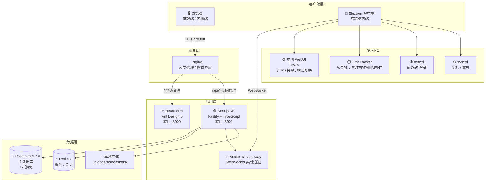
```mermaid
graph TB
    subgraph 客户端层
        BROWSER["🖥️ 浏览器<br/>管理端 / 客服端"]
        AGENT["🤖 Electron 客户端<br/>陪玩桌面端"]
    end

    subgraph 网关层
        NGINX["🔀 Nginx<br/>反向代理 / 静态资源"]
    end

    subgraph 应用层
        WEB["⚛️ React SPA<br/>Ant Design 5<br/>端口 :8000"]
        API["🟢 Nest.js API<br/>Fastify + TypeScript<br/>端口 :3001"]
        WS["📡 Socket.IO Gateway<br/>WebSocket 实时通道"]
    end

    subgraph 数据层
        PG[("🐘 PostgreSQL 16<br/>主数据库<br/>12 张表")]
        REDIS[("⚡ Redis 7<br/>缓存 / 会话")]
        DISK["📁 本地存储<br/>uploads/screenshots/"]
    end

    subgraph 陪玩PC
        LOCAL["🌐 本地 WebUI<br/>:9876<br/>计时 / 接单 / 模式切换"]
        TIMER["⏱️ TimeTracker<br/>WORK / ENTERTAINMENT"]
        NET["🌐 netctrl<br/>tc QoS 限速"]
        SYS["⚙️ sysctrl<br/>关机 / 重启"]
    end

    BROWSER -->|"HTTP :8000"| NGINX
    AGENT -->|"WebSocket"| WS
    NGINX -->|"/ 静态资源"| WEB
    NGINX -->|"/api/* 反向代理"| API
    API --> PG
    API --> REDIS
    API --> WS
    API --> DISK
    AGENT --> LOCAL
    AGENT --> TIMER
    AGENT --> NET
    AGENT --> SYS
```

## 2. 网络拓扑

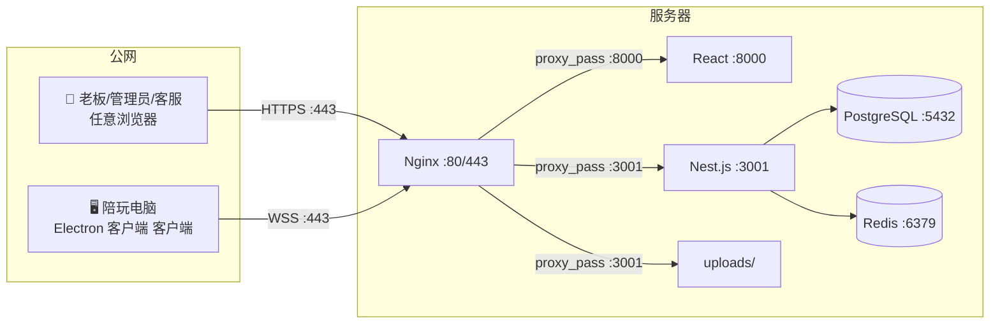
```mermaid
graph LR
    subgraph 公网
        USER["👤 老板/管理员/客服<br/>任意浏览器"]
        CP["🖥️ 陪玩电脑<br/>Electron 客户端 客户端"]
    end

    subgraph 服务器
        NGINX["Nginx :80/443"]
        WEB["React :8000"]
        API["Nest.js :3001"]
        PG[("PostgreSQL :5432")]
        REDIS[("Redis :6379")]
        UPLOAD["uploads/"]
    end

    USER -->|"HTTPS :443"| NGINX
    CP -->|"WSS :443"| NGINX
    NGINX -->|"proxy_pass :8000"| WEB
    NGINX -->|"proxy_pass :3001"| API
    NGINX -->|"proxy_pass :3001"| UPLOAD
    API --> PG
    API --> REDIS
```

## 3. 核心业务流程

### 3.1 订单全生命周期

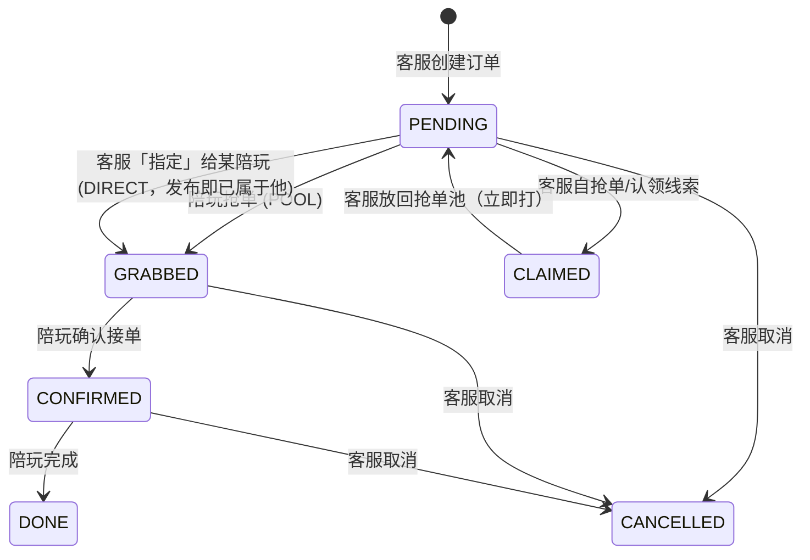
```mermaid
stateDiagram-v2
    [*] --> PENDING: 客服创建订单
    PENDING --> GRABBED: 陪玩抢单 (POOL)
    PENDING --> CLAIMED: 客服自抢单/认领线索
    PENDING --> GRABBED: 客服「指定」给某陪玩 (DIRECT，发布即已属于他)
    PENDING --> CANCELLED: 客服取消
    CLAIMED --> PENDING: 客服放回抢单池（立即打）
    GRABBED --> CONFIRMED: 陪玩确认接单
    GRABBED --> CANCELLED: 客服取消
    CONFIRMED --> DONE: 陪玩完成
    CONFIRMED --> CANCELLED: 客服取消
```

> **客服「指定」单不进抢单池（老板 2026-10-06）。** `dispatchType=DIRECT` + `companionId` 的单在**发布那一刻**
> 就是 `GRABBED`（`OrderService.create`），`findPool()` 的可抢列表又钉死 `companionId` 为空 —— 谁都不会再对它
> 点「抢单」。它在陪玩端以**灰色记录**出现在抢单池下方「今天已发过的单」里（`findTakenPoolOrders()` 现在同时查
> `POOL` 和 `DIRECT`），写「🎯 客服指定给 XX 接」（指定给自己写「🎯 这单指定给你」、紫色，时间栏「指定时间」）。
> 陪玩端桌面横幅对指定单只提示「已指定给你」，不再提示「再点一下抢单」。
>
> **指定单的「怕注意不到」补喊**（`DirectAssignmentReminderService`，2026-10-06）：指定单横幅停 45 秒
> （`DIRECT_ALERT_SECONDS`，普通单 15 秒）；20 分钟内还没点「开始首单」（`sessions` 无 `startedAt`）就在
> 第 5 / 10 / 20 分钟各补喊一条 `order:urgent`（`_direct` + `_directReminder`）。判据与
> `UnstartedOrderReminderService`（次日 + 第 7 天）同一套，20 分钟后交给它。陪玩没连着（`WsGateway.isCompanionConnected`）
> 就不记账、等他上线补喊；多个时间点一起到只喊一条。状态在内存里，不写库。

### 3.2 派单流程时序

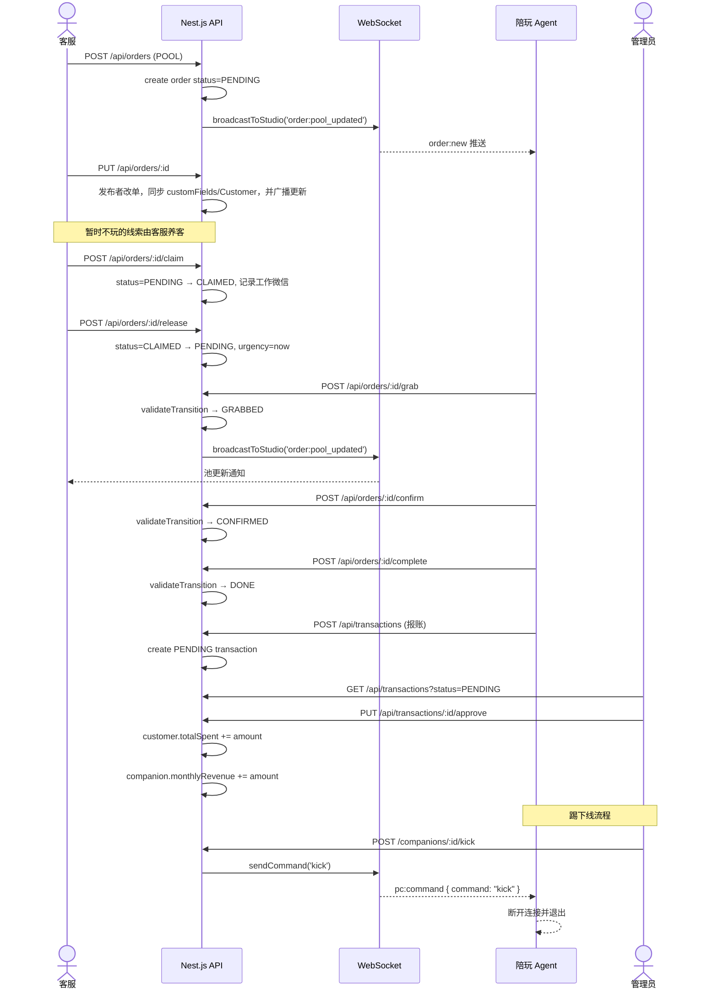
```mermaid
sequenceDiagram
    actor CS as 客服
    participant API as Nest.js API
    participant WS as WebSocket
    participant CP as 陪玩 Agent
    actor ADMIN as 管理员

    CS->>API: POST /api/orders (POOL)
    API->>API: create order status=PENDING
    API->>WS: broadcastToStudio('order:pool_updated')
    WS-->>CP: order:new 推送
    CS->>API: PUT /api/orders/:id
    API->>API: 发布者改单，同步 customFields/Customer，并广播更新

    Note over CS,API: 暂时不玩的线索由客服养客
    CS->>API: POST /api/orders/:id/claim
    API->>API: status=PENDING → CLAIMED, 记录工作微信
    CS->>API: POST /api/orders/:id/release
    API->>API: status=CLAIMED → PENDING, urgency=now

    CP->>API: POST /api/orders/:id/grab
    API->>API: validateTransition → GRABBED
    API->>WS: broadcastToStudio('order:pool_updated')
    WS-->>CS: 池更新通知

    CP->>API: POST /api/orders/:id/confirm
    API->>API: validateTransition → CONFIRMED

    CP->>API: POST /api/orders/:id/complete
    API->>API: validateTransition → DONE

    CP->>API: POST /api/transactions (报账)
    API->>API: create PENDING transaction

    ADMIN->>API: GET /api/transactions?status=PENDING
    ADMIN->>API: PUT /api/transactions/:id/approve
    API->>API: customer.totalSpent += amount
    API->>API: companion.monthlyRevenue += amount

    Note over ADMIN,CP: 踢下线流程
    ADMIN->>API: POST /companions/:id/kick
    API->>WS: sendCommand('kick')
    WS-->>CP: pc:command { command: "kick" }
    CP-->>CP: 断开连接并退出
```

### 3.3 报账审核流程

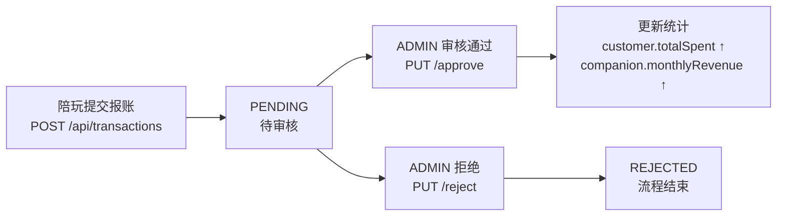
```mermaid
flowchart LR
    COMPANION["陪玩提交报账<br/>POST /api/transactions"] --> PENDING["PENDING<br/>待审核"]
    PENDING --> APPROVE["ADMIN 审核通过<br/>PUT /approve"]
    PENDING --> REJECT["ADMIN 拒绝<br/>PUT /reject"]
    APPROVE --> UPDATE["更新统计<br/>customer.totalSpent ↑<br/>companion.monthlyRevenue ↑"]
    REJECT --> END["REJECTED<br/>流程结束"]
```

## 4. 数据模型 ER 图

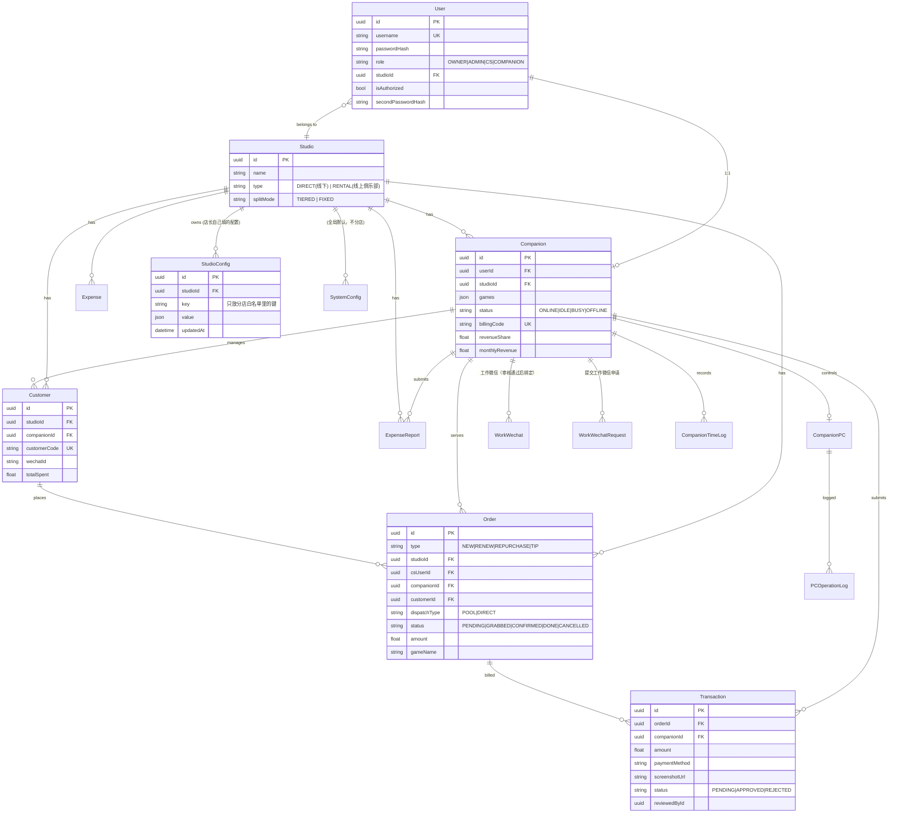
```mermaid
erDiagram
    User ||--o| Companion : "1:1"
    User }o--|| Studio : "belongs to"
    Studio ||--o{ Companion : "has"
    Studio ||--o{ Order : "has"
    Studio ||--o{ Customer : "has"
    Studio ||--o{ Expense : "has"
    Studio ||--o{ StudioConfig : "owns (店长自己填的配置)"
    Studio ||--o{ SystemConfig : "(全局默认，不分店)"
    Companion ||--o{ ExpenseReport : "submits"
    Studio ||--o{ ExpenseReport : "has"
    Companion ||--o{ Order : "serves"
    Companion ||--o| CompanionPC : "controls"
    Companion ||--o{ WorkWechat : "工作微信（审核通过后绑定）"
    Companion ||--o{ WorkWechatRequest : "提交工作微信申请"
    Companion ||--o{ CompanionTimeLog : "records"
    Companion ||--o{ Transaction : "submits"
    Companion ||--o{ Customer : "manages"
    Customer ||--o{ Order : "places"
    Order ||--o{ Transaction : "billed"
    CompanionPC ||--o{ PCOperationLog : "logged"

    User {
        uuid id PK
        string username UK
        string passwordHash
        string role "OWNER|ADMIN|CS|COMPANION"
        uuid studioId FK
        bool isAuthorized
        string secondPasswordHash
    }

    Studio {
        uuid id PK
        string name
        string type "DIRECT(线下) | RENTAL(线上俱乐部)"
        string splitMode "TIERED | FIXED"
    }

    StudioConfig {
        uuid id PK
        uuid studioId FK
        string key "只放分店白名单里的键"
        json value
        datetime updatedAt
    }

    Companion {
        uuid id PK
        uuid userId FK
        uuid studioId FK
        json games
        string status "ONLINE|IDLE|BUSY|OFFLINE"
        string billingCode UK
        float revenueShare
        float monthlyRevenue
    }

    Order {
        uuid id PK
        string type "NEW|RENEW|REPURCHASE|TIP"
        uuid studioId FK
        uuid csUserId FK
        uuid companionId FK
        uuid customerId FK
        string dispatchType "POOL|DIRECT"
        string status "PENDING|GRABBED|CONFIRMED|DONE|CANCELLED"
        float amount
        string gameName
    }

    Customer {
        uuid id PK
        uuid studioId FK
        uuid companionId FK
        string customerCode UK
        string wechatId
        float totalSpent
    }

    Transaction {
        uuid id PK
        uuid orderId FK
        uuid companionId FK
        float amount
        string paymentMethod
        string screenshotUrl
        string status "PENDING|APPROVED|REJECTED"
        uuid reviewedById
    }
```

## 5. 前端路由与角色权限

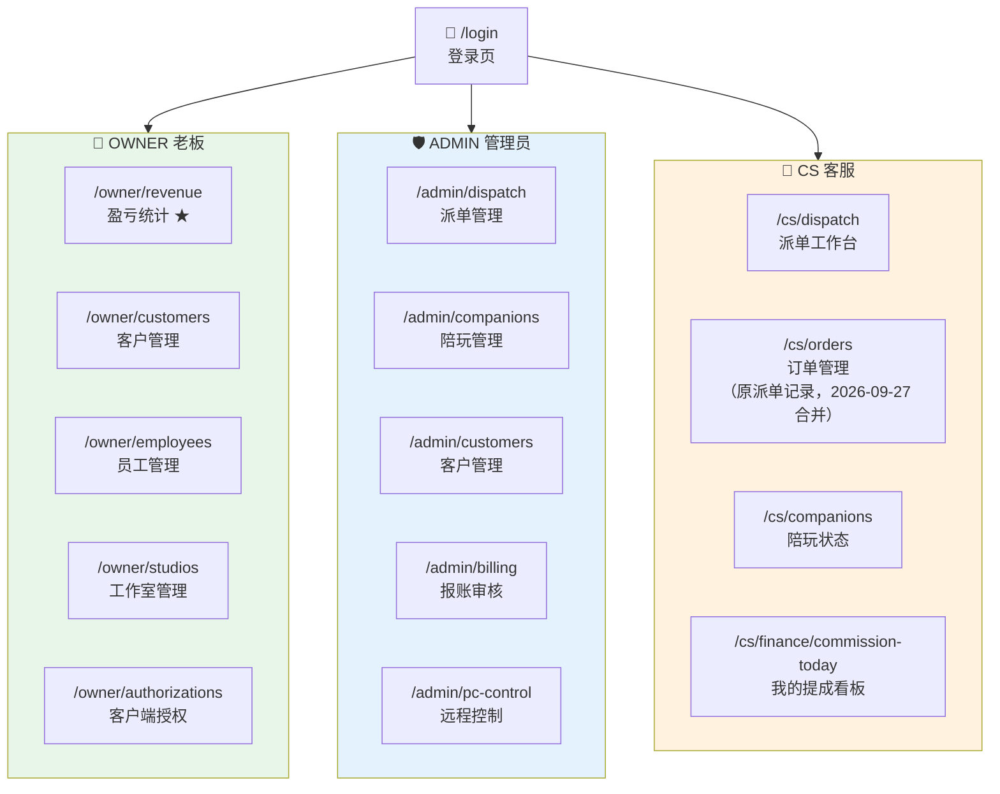
```mermaid
graph TB
    LOGIN["🔐 /login<br/>登录页"]

    LOGIN --> OWNER
    LOGIN --> ADMIN
    LOGIN --> CS

    subgraph OWNER["👑 OWNER 老板"]
        O1["/owner/revenue<br/>盈亏统计 ★"]
        O2["/owner/customers<br/>客户管理"]
        O3["/owner/employees<br/>员工管理"]
        O4["/owner/studios<br/>工作室管理"]
        O5["/owner/authorizations<br/>客户端授权"]
    end

    subgraph ADMIN["🛡️ ADMIN 管理员"]
        A1["/admin/dispatch<br/>派单管理"]
        A2["/admin/companions<br/>陪玩管理"]
        A3["/admin/customers<br/>客户管理"]
        A4["/admin/billing<br/>报账审核"]
        A5["/admin/pc-control<br/>远程控制"]
    end

    subgraph CS["💬 CS 客服"]
        C1["/cs/dispatch<br/>派单工作台"]
        C2["/cs/orders<br/>订单管理<br/>（原派单记录，2026-09-27 合并）"]
        C3["/cs/companions<br/>陪玩状态"]
        C4["/cs/finance/commission-today<br/>我的提成看板"]
    end

    style OWNER fill:#e8f5e9
    style ADMIN fill:#e3f2fd
    style CS fill:#fff3e0
```

> ★ 盈亏统计需二级密码验证（5 分钟 secondToken）

> **路由清单（自动生成，CI 冻结，2026-10-07）：** 上面这张图只是按角色的示意，**完整 86 条**在
> `docs/WEB-ROUTES.json`（由 `scripts/_export_web_routes.mjs` 从 `router.tsx` 静态导出：路径 / 类型
> （page / redirect / layout）/ 组件 / 重定向目标 / 有没有 `errorElement`）。**页面路径是四端共用的契约**
> —— 陪玩端与客服端的内嵌窗口、看门狗、客服外发的链接、老板收藏的链接都写死这些 URL；
> 所以 CI 会重新导出一次再比对，删路径 / 改路径 / 换页面直接红，本地 `pnpm routes` / `pnpm routes:check`。
> 动 `router.tsx` 之前请先看这份表。

### 5.1 前端视觉系统（老板 2026-09-21 要求「整齐、有层次感」）

改界面只改这几处（颜色只认 `tokens.ts`），不要在页面里各写一套颜色：

| 位置 | 管什么 |
|------|--------|
| `apps/web/src/styles/tokens.ts` | **设计令牌唯一真源**：品牌 / 文本 / 背景 / 描边 / 语义色、间距 `SPACE`、圆角 `RADIUS`、字体 `FONT`、阴影 `SHADOW`、渐变 `GRADIENTS`。导出 `applyTokenCssVars()`，`main.tsx` 启动时写进 `:root` 的 CSS 变量（页面 / 组件读 `var(--color-*)`）。**改颜色只改这里。** |
| `apps/web/src/theme.ts` | Ant Design 令牌：**不写色值，全部从 `styles/tokens.ts` 取**，再映射成 antd 的组件级 token（圆角、表格表头与悬浮色、卡片圆角、标签胶囊等，一次影响所有 antd 组件） |
| `apps/web/src/styles/global.css` 末尾「视觉系统 v2」一段 | 整页晕染底色 `.app-shell`、内容白卡 `.app-content`、卡片/表格/按钮/标签/滚动条、左侧导航配色，以及通用小组件类 `.ui-panel` / `.ui-dot` / `.ui-section-title` / `.ui-chip` |
| `apps/web/src/config/roleMenus.tsx` 的 `MODULE_TINTS`（颜色值本体在 `styles/tokens.ts`） | 左侧导航一级菜单的模块配色（按菜单 key 后半段取色：home / dispatch / orders / customers / employees / finance / shop / settings / battle-screenshots）。**菜单配置的唯一来源就是这个文件**（2026-10-07 从 `layouts/AppLayout.tsx` 抽出来，原来混在 3000 行里） |

左栏菜单（`config/roleMenus.tsx`）与页面路由（`router.tsx`）现在各有一道闸：

- **菜单契约测试**（`apps/web/src/config/roleMenus.test.ts`，`pnpm --filter @chunlv/web test`）：
  锁「四个角色各能看到哪些菜单」（快照）、菜单指向的路由必须真实存在、一级菜单必须有图标、
  分组 key 不能与路由混淆。**前端第一份测试**，跑在 vitest 上。
- **路由契约冻结**（`scripts/_export_web_routes.mjs` → `docs/WEB-ROUTES.json`，CI `--check`）：
  页面路径删了 / 改了 / 换了页面直接红。

**改界面怎么验证（2026-10-07）：** 本机跑不起数据库，所以「登录后的页面」看不了 —— 用这两件工具代替：

1. `/ui-kit`（内部设计校对页，不在菜单里）：把令牌与常见控件按真实主题摆出来，**不用登录、不连后端**，
   每个分区有锚点（`/ui-kit#controls`）。改完 `pnpm --filter @chunlv/web build && pnpm preview` 打开 `http://localhost:8100/ui-kit`。
2. `node scripts/_shot_ui.mjs <url> <out.png> [--sel="#controls"] [--scale=2]`：无头 Edge + CDP，
   只截某个元素并放大，改版前后各截一张对照（只允许本地地址）。

3. `pnpm --filter @chunlv/web test`：**真渲染**的冒烟测试（jsdom + Testing Library，不连后端）——
   登录页能渲染、整个 App 打开 `/ui-kit` 能渲染、**冻结的路由表每一条在真路由里都还匹配得到**。
   动了 `router.tsx` / `App.tsx` / 任何页面组件的引用之后，先跑这个。

> 已经靠它抓到过：主按钮的品牌渐变把 `ghost`（紫底紫字、看不见）和 `danger`（删除按钮变成品牌紫、看不出危险）也刷了 —— 
> 现在渐变规则排除了这两类。**再写「全站按钮 / 全站控件」的样式时，先看 `global.css` 第 6 节那条注释。**

**铁律：颜色只认 `styles/tokens.ts`。** 页面 / 组件里**不要再写十六进制色值** —— 要么从 tokens 取
（`TEXT.* / BORDER.* / BG.* / BRAND.* / SEMANTIC.*`），要么在 CSS 里读 `var(--color-*)`。
CI 有一道「UI 硬编码色值冻结」检查（`scripts/_check_ui_tokens.mjs`，基线 `docs/UI-TOKEN-BASELINE.json`）：
**只能减、不能增**，新写硬编码色值会让 CI 直接红；数量降下来了才用 `--update` 把基线调低。
（唯一例外：`styles/tokens.ts` 本身、`styles/commander.ts` 那套深色主题调色板、`index.css` 的 `:root` 首屏兜底
—— 后者的值必须写死，写成 `var(--自身)` 等于没定义。）

**`index.css` 里那段 `:root` 是「自动生成」的（2026-10-07 起）。** 真源还是 `styles/tokens.ts`，
跑 `pnpm css:vars` 重新生成；CI 用 `pnpm css:vars:check` 比对，**同时卡「CSS 里用了 `var(--x)` 但没人定义」**。
（这条检查第一次跑就抓到 `--grad-brand-hover` / `--grad-brand-active` 其实没人定义 ——
「主按钮悬浮变亮」那条声明一直是**无效声明**，浏览器直接丢掉、还不报错。）

**段位（「马级」）只有一处：** 颜色在 `styles/tokens.ts` 的 `TIER_TINT`（金 / 银 / 铜），
叫法与取色用 `constants/tiers.ts` 的 `TIER_META` / `tierMeta()`。
2026-10-07 之前它在 4 个页面各写一套、颜色还互相打架（中等马在两处是蓝、两处是银），**别再各写一份**。

**铁律：只做渲染，不动字号。** 订单 / 客户这份数据的字号唯一来源是
`apps/web/src/constants/datasetColumns.ts`（启动时注入成 CSS 变量），
视觉改版里出现 `font-size` 就会重新踩「同一个数据两个字号」的老坑。

**铁律：列宽与总宽也只有一处。** 列宽同样只能从
`apps/web/src/constants/datasetColumns.ts` 的 `FIELD_WIDTH` 取；表的 `scroll.x` 必须用
`sumWidths(...)` （或从列定义自己求和）算出来，**不准写死数字**。
宽度预算：客服客户端窗口默认 1320 → 表格可用 **991px**（1920 屏 1591px）。
订单管理 9 列 **986px**、客户管理 8 列 **976px**、派单管理下面三张订单列表 9 列 **976px**，
都在客服窗口内，一屏放得下且不横向滚动；员工管理 13 列 1460px、人员管理 10 列 1144px（+50px 展开列 = 1194px）
超出一屏就左右滚动（用户名 / 角色钉左、操作钉右），**不准靠压扁列宽硬塞进一屏**。
（2026-09-27 就是因为两个表各自写死了 `scroll.x`，才出现最右列被切、竖排单字。）

**订单列表的列只写一份（2026-09-28）：** 订单的列定义只有一个来源
`apps/web/src/components/orderColumns.tsx`（`buildOrderColumns()`），订单管理和派单管理下面的
三张订单列表（流转失败明细 / 跟进列表 / 流转明细）共用它；那三张列表的表格壳是
`apps/web/src/components/OrderTable.tsx`（8 列 + 这一页特有的说明列 + 操作列），
订单管理页则把列铺开后补自己的操作列。老的卡片行 `apps/web/src/components/OrderRow.tsx` 已删除，
**不要再写第二份订单行/订单列**，否则又会出现「同一个数据两种长相」。

## 6. WebSocket 事件流

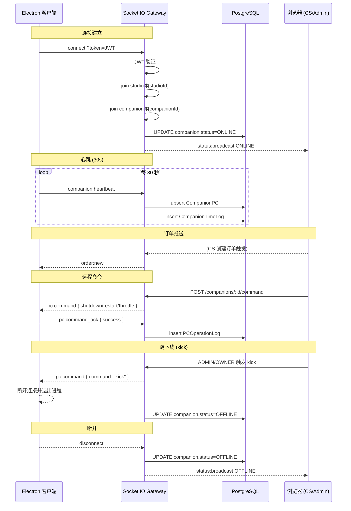
```mermaid
sequenceDiagram
    participant AGENT as Electron 客户端
    participant GW as Socket.IO Gateway
    participant DB as PostgreSQL
    participant BROWSER as 浏览器 (CS/Admin)

    Note over AGENT,GW: 连接建立
    AGENT->>GW: connect ?token=JWT
    GW->>GW: JWT 验证
    GW->>GW: join studio:${studioId}
    GW->>GW: join companion:${companionId}
    GW->>DB: UPDATE companion.status=ONLINE
    GW-->>BROWSER: status:broadcast ONLINE

    Note over AGENT,GW: 心跳 (30s)
    loop 每 30 秒
        AGENT->>GW: companion:heartbeat
        GW->>DB: upsert CompanionPC
        GW->>DB: insert CompanionTimeLog
    end

    Note over AGENT,BROWSER: 订单推送
    BROWSER-->>GW: (CS 创建订单触发)
    GW-->>AGENT: order:new

    Note over AGENT,GW: 远程命令
    BROWSER->>GW: POST /companions/:id/command
    GW-->>AGENT: pc:command { shutdown/restart/throttle }
    AGENT-->>GW: pc:command_ack { success }
    GW->>DB: insert PCOperationLog

    Note over AGENT,BROWSER: 踢下线 (kick)
    BROWSER->>GW: ADMIN/OWNER 触发 kick
    GW-->>AGENT: pc:command { command: "kick" }
    AGENT-->>AGENT: 断开连接并退出进程
    GW->>DB: UPDATE companion.status=OFFLINE

    Note over AGENT,GW: 断开
    AGENT-->>GW: disconnect
    GW->>DB: UPDATE companion.status=OFFLINE
    GW-->>BROWSER: status:broadcast OFFLINE
```

**订单推送补充（订单池里程碑 / 广播）:**

- 订单池的可见范围按里程碑逐级放开：本店上等马 → 桥接工作室 → 本店中等马 → …，「桥接工作室等待」由 `pool.bridge_delay_seconds` 控制（当前线上 300 秒）。
- 「广播」发单（`dispatchType=BROADCAST`，落库仍为 `POOL` 以保持可抢）：创建时立刻向本店在线陪玩推 `order:urgent`；到「桥接工作室等待」时间后，`WsGateway.broadcastUrgentToBridgedStudios()` 再向桥接工作室推一次同一条 `order:urgent`（带 `_bridged: true`，弹窗标题区分）。延时推送前会复查订单仍为 `PENDING` 且无人抢单/无人认领。收件人条件全站只有一份（`WsGateway.urgentRecipientWhere`，老板 2026-10-01 口径）：**`AVAILABLE`（空闲）与 `RESTING`（挂机 / 休息）一定推**，**`ENTERTAINMENT`（娱乐中）默认推、本人可关 `Companion.notifyWhileEntertainment`**，`BUSY`（接单中）只有本人打开 `Companion.notifyWhileBusy` 才推 —— 本店广播、桥接推送与「到点放给线下」全部共用这一份。
- 「线上→线下流转」的单到点放给本店线下时要**弹窗**（老板 2026-10-01）：`findPool` 里那个「到点可见」是纯读时计算，没有一个可以发弹窗的「到点」时刻，所以新增 `OnlineFirstReleaseService`（`orders.module.ts` 注册）：每 30 秒扫 `poolScope=ONLINE_FIRST & status=PENDING & companionId=null & releasedToOfflineAt=null`，到 `pool.online_first_release_minutes`（默认 5）就 `updateMany` 写 `releasedToOfflineAt = createdAt + 分钟数`（不是 `now`，保证可见时机不变，且写字段本身就是去重），再调 `orders.service.broadcastReleasedToOffline()` 给本店推 `order:urgent`（带 `_releasedToOffline: true`）。
- 新单到了客户端只弹 **Windows 桌面横幅**（老板 2026-10-01：「都只弹 windows 的弹窗，而且 15 秒消失，软件就别弹了」）：`apps/companion-electron/electron/main.ts` 的 `showBroadcastPopup()` 画置顶小窗（停留时长由 `pool.popup_seconds` 随单下发，现在默认 **15**），默认鼠标穿透（不挡玩游戏）；横幅内那段脚本在鼠标进入卡片时调 `order-banner:hover` 临时取消穿透→卡片可点，点了发 `order-banner:click`：主进程把主窗口拉到最前并发 `order-pool-focus`，页面侧（`AppLayout` → `OrderPoolPage`）跳到抢单池、把这一单标黄并滚到屏幕中间（`chunlv:order-focus` / 路由 state `highlightOrderId`）—— **点横幅不直接抢单**，避免游戏中误点。
- 网关连接时会自动 join 桥接工作室的房间（`studio:${bridgedStudioId}`），用于订单池、状态等跨工作室实时广播。
- **点对点推送一律走 `user:${userId}` 房间，不要用「userId → socketId」的映射表。** 一个人会同时开好几条连接
  （客服端主窗口 + 聊天弹窗 + 浏览器页面），单值映射表会被后连的顶掉、任何一条断开又会把整个人删掉，
  剩下活着的连接就再也收不到消息（2026-09-30 修过一次：`ChatGateway` 的 `message:new` / `chat:read` /
  `room:updated` 和 `WsGateway.notifyNewMessage`）。`userSockets` 只用来数「还剩几条连接」。

- **工作微信审核事件（老板 2026-10-02）**：陪玩提交后，服务端用 `WsGateway.notifyUser()` 逐个推给本店
  老板 / 店长 / 客服的 `user:${id}` 房间（`work-wechat:request`，前端 `useSocket.onWorkWechatRequest` → 弹提醒 + 进通知中心）；
  管理端审核完用 `notifyCompanion()` 推 `work-wechat:updated`（`useSocket.onWorkWechatUpdated`）。
  陪玩端「我的工作微信」卡片另外每 30 秒 + 切回窗口时对一次，审核通过后不用刷新页面也能看到新号。

**在线状态口径（2026-09-26 起统一在服务端判定）:**

- 「谁在线」在服务端按**服务器时间**算好后随 `GET /personnel` 下发（字段 `isOnline`）：
  陪玩看 `CompanionPC.lastHeartbeat`（2 分钟内算在线，没有心跳时退回 `Companion.status`）；
  客服 / 店长 / 老板看客户端心跳 `cs.client.version.*.lastSeen` 或网关在线表 `presence`（5 分钟内算在线）。
- 前端 `isPersonnelOnline()`（`apps/web/src/constants/companions.ts`）**优先用这个字段**，
  只有老接口没有该字段时才退回本机计算。以前一律本机算（`Date.now()` − 心跳时间戳），
  客户机系统时间偏差几分钟就会把整张人员列表显示成「离线」，换一台电脑看又是好的。
- 阈值只在两处、必须保持一致：服务端 `companions.service.ts` 的 `COMPANION_HEARTBEAT_MS` / `STAFF_HEARTBEAT_MS`，
  前端 `HEARTBEAT_THRESHOLD` / `STAFF_HEARTBEAT_THRESHOLD`。

## 7. 认证流程

```
老板创建陪玩(自动授权) → 陪玩输入账号密码 → Agent自动登录 → 在线
```

**单点登录 / 顶号（2026-10-01）:** `User.sessionVersion` 是「该账号当前的登录号码」。`AuthService.login` 对 **OWNER / ADMIN / CS** 每登录一次就 `+1`，并把号码签进 JWT（payload `sv`），同时 `WsGateway.kickUser()` 把旧电脑上的连接先推 `auth:replaced` 再断开；`JwtStrategy` / `AuthService.refresh` / `WsGateway.handleConnection` 三处都比对号码，对不上就 401 + `reason: 'SESSION_REPLACED'`。前端收到这个 reason 就清会话回登录页、写一个「被顶号」标记，登录页据此**不再自动登录**（不然两台机器互顶），只提示「该账号已在别的电脑上登录」。**陪玩的 `sessionVersion` 永远不变**（多台在线不受影响），**老令牌没有 `sv` 也一律不判失效**（发布当刻不会把正在接单的人踢下线）。

## 8. Electron 客户端 内部架构

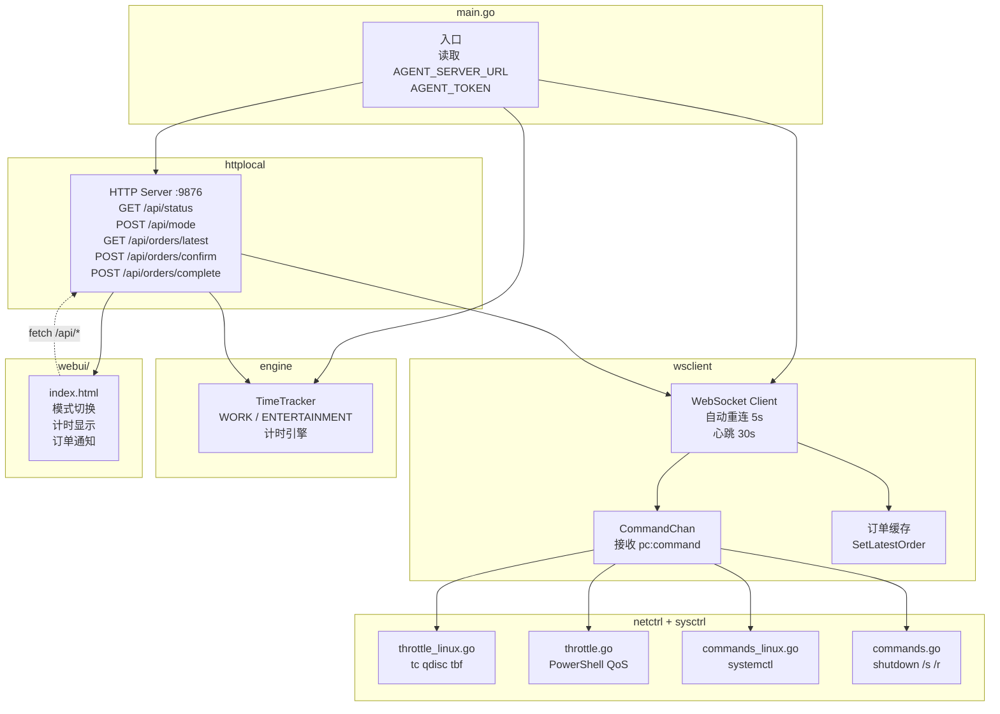
```mermaid
graph TB
    subgraph main["main.go"]
        ENTRY["入口<br/>读取 AGENT_SERVER_URL<br/>AGENT_TOKEN"]
    end

    subgraph ws["wsclient"]
        WSC["WebSocket Client<br/>自动重连 5s<br/>心跳 30s"]
        CMDS["CommandChan<br/>接收 pc:command"]
        ORDERS["订单缓存<br/>SetLatestOrder"]
    end

    subgraph engine["engine"]
        TRACKER["TimeTracker<br/>WORK / ENTERTAINMENT<br/>计时引擎"]
    end

    subgraph http["httplocal"]
        HTTP_SRV["HTTP Server :9876<br/>GET /api/status<br/>POST /api/mode<br/>GET /api/orders/latest<br/>POST /api/orders/confirm<br/>POST /api/orders/complete"]
    end

    subgraph ctrl["netctrl + sysctrl"]
        NETCTRL_LINUX["throttle_linux.go<br/>tc qdisc tbf"]
        NETCTRL_WIN["throttle.go<br/>PowerShell QoS"]
        SYSCTRL_LINUX["commands_linux.go<br/>systemctl"]
        SYSCTRL_WIN["commands.go<br/>shutdown /s /r"]
    end

    subgraph webui["webui/"]
        UI["index.html<br/>模式切换<br/>计时显示<br/>订单通知"]
    end

    ENTRY --> WSC
    ENTRY --> HTTP_SRV
    ENTRY --> TRACKER
    WSC --> CMDS
    WSC --> ORDERS
    CMDS --> NETCTRL_LINUX
    CMDS --> NETCTRL_WIN
    CMDS --> SYSCTRL_LINUX
    CMDS --> SYSCTRL_WIN
    HTTP_SRV --> TRACKER
    HTTP_SRV --> WSC
    HTTP_SRV --> UI
    UI -.->|"fetch /api/*"| HTTP_SRV
```

## 8.1 配置分层（分店配置）

老板 2026-09-21 拍板：**以后进来的租赁线下工作室 / 线上俱乐部，所有数据由他们自己的店长填写。**
所以读配置一律走 `apps/server/src/common/studio-config.ts`，生效顺序：

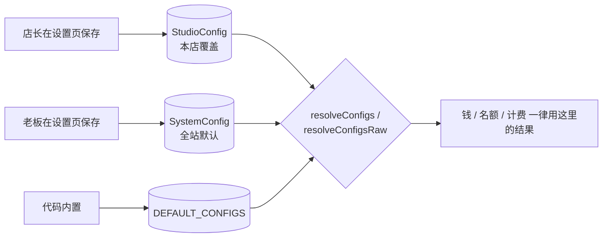
```mermaid
flowchart LR
    A["店长在设置页保存"] --> B[("StudioConfig<br/>本店覆盖")]
    C["老板在设置页保存"] --> D[("SystemConfig<br/>全站默认")]
    E["代码内置"] --> F[("DEFAULT_CONFIGS")]
    B --> G{"resolveConfigs /<br/>resolveConfigsRaw"}
    D --> G
    F --> G
    G --> H["钱 / 名额 / 计费 一律用这里的结果"]
```

- `resolveConfigs(prisma, studioId, keys)` —— 带内置默认兜底，给界面和「显示即生效」的场景用。
- `resolveConfigsRaw(prisma, studioId, keys)` —— **不做内置兜底**，没配过就返回 `undefined`，
  让调用处原来的 `?? 兜底值` 继续生效。所有从 `systemConfig.findUnique(key)` 改造过来的读点都用它，
  保证「本店没填」时行为与改造前**一模一样**。
- **归属是黑名单**（2026-09-21 从白名单翻过来）：`OWNER_ONLY_KEYS` / `OWNER_ONLY_PREFIXES`
  （`common/default-config.ts`）**之外的全部**归店长，写进本店 `StudioConfig`。
  老板专属只有两类：**密钥 / 凭据**（`identity.*` / `ai.*` / `turn.*` / `jwt.*` / `secret*`）和
  **一份值绑住全站**（客户端与网页版本号、`ws.*` 宽限期、
  `service.stale_session_hours`、`counter.global_code`、`invite.*`、`cs.client.version.*`、
  `excellence.low_tier_streak`）。
- **写入唯一入口** `saveConfigsByRole(prisma, actor, entries)`：老板 → `SystemConfig`，
  店长 → `StudioConfig`，混入的老板专属键跳过并列进 `skipped`。
  **任何服务都不许再自己 upsert `SystemConfig`**，否则店长一保存就改到了别人的账。
  没有 `studioId` 的非老板账号直接报错，不做「没店就当老板」兜底。
- `PUT /api/config` 按身份分流（老板写全局 / 店长写本店），
  `DELETE /api/config/studio-overrides` 恢复默认，
  `GET /api/config` 返回生效值 + `_meta.overridden` / `_meta.ownerOnlyKeys`；
  密钥 / 凭据类的值不下发给店长。
- **杀进程只剩一道闸**（`common/blacklist-switch.ts` 是唯一判定）：**本店开关** `blacklist.enabled`
  （店长可改，默认**不生效**）。以前那道「全站总开关」`blacklist.auto_kill` 已于 2026-09-24 按老板要求整条移除
  —— 现在**只有店长自己定本店要不要真的动手**。开关开着，服务端才把名单下发给客户端；
  关着 / 没拨过 / 分不出是哪家店，都下发**空名单**（老客户端收到空名单也会立刻停下，不用等它升级）。
  REST 兜底拉名单（`GET /api/processes/blacklist/my-rules`）同样只看这一个开关，WebSocket 断了也绕不过去。

## 9. 部署架构

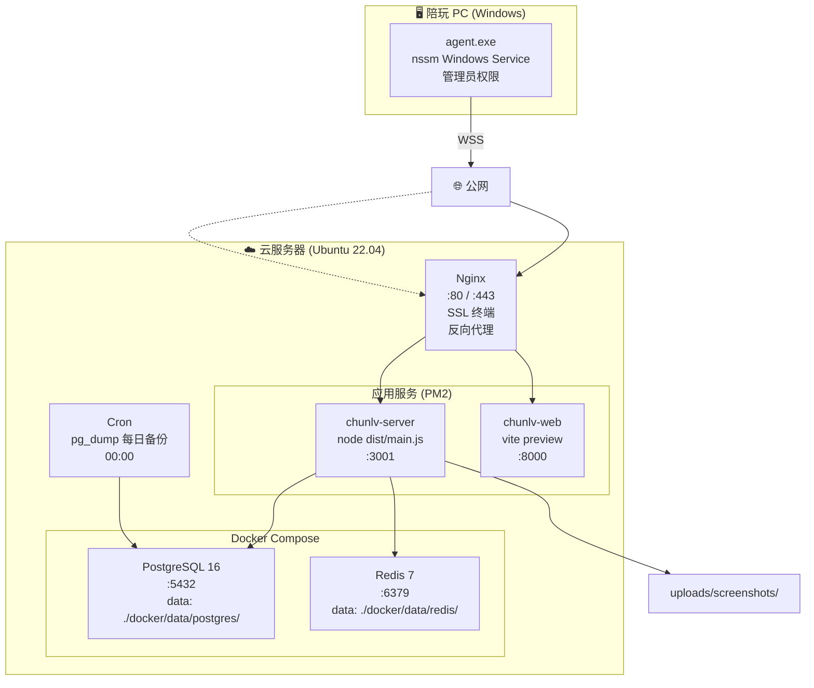
```mermaid
graph TB
    subgraph VPS["☁️ 云服务器 (Ubuntu 22.04)"]
        subgraph Docker["Docker Compose"]
            PG_D["PostgreSQL 16<br/>:5432<br/>data: ./docker/data/postgres/"]
            REDIS_D["Redis 7<br/>:6379<br/>data: ./docker/data/redis/"]
        end

        subgraph App["应用服务 (PM2)"]
            API_P["chunlv-server<br/>node dist/main.js<br/>:3001"]
            WEB_P["chunlv-web<br/>vite preview<br/>:8000"]
        end

        NGINX_P["Nginx<br/>:80 / :443<br/>SSL 终端<br/>反向代理"]
        CRON["Cron<br/>pg_dump 每日备份<br/>00:00"]
    end

    subgraph Client["🖥️ 陪玩 PC (Windows)"]
        AGENT_EXE["agent.exe<br/>nssm Windows Service<br/>管理员权限"]
    end

    INTERNET["🌐 公网"] --> NGINX_P
    NGINX_P --> API_P
    NGINX_P --> WEB_P
    API_P --> PG_D
    API_P --> REDIS_D
    API_P --> DISK_P["uploads/screenshots/"]
    AGENT_EXE -->|"WSS"| INTERNET
    INTERNET -.-> NGINX_P
    CRON --> PG_D
```

---

> 图表使用 Mermaid 语法，支持 GitHub / VS Code / 多数 Markdown 渲染器直接预览。

### 进程黑名单管理模块

**数据模型:**
- ProcessBlacklist: 工作室级黑名单规则 (processName + isActive)
- CompanionBlacklistOverride: 陪玩个人黑名单覆盖
- ProcessWhitelist: 白名单 (isSystem 标记内置条目)
- CompanionProcessReport: 陪玩进程上报快照
- ProcessKillLog: 杀进程审计日志

**API 端点:**
- `GET/POST/PUT/DELETE /api/blacklist` — 黑名单 CRUD
- `POST /api/blacklist/push` — 推送黑名单到陪玩终端
- `GET /api/blacklist/my-rules` — 陪玩端拉取自身黑名单(REST兜底)
- `GET/POST/DELETE /api/whitelist` — 白名单管理
- `GET /api/processes/unique-names` — 陪玩已上报进程去重列表
- `GET /api/processes/reports` — 进程上报记录
- `GET /api/processes/kill-logs` — 杀进程日志

**WebSocket 事件:**
- `blacklist:report` (C→S): 陪玩上报进程列表
- `blacklist:update` (S→C): 推送黑名单+白名单
- `blacklist:kill_result` (C→S): 杀进程结果
- `blacklist:update_ack` (C→S): 黑名单接收确认

**客户端 (Electron):**
- process-monitor.ts: PowerShell 进程采集 → OS 过滤 → 5分钟上报
- process-killer.ts: taskkill /F /PID 杀进程 + 速率限制
- blacklist-notification.ts: 5秒倒计时气泡弹窗
- 60秒 REST 轮询拉取黑名单 (WebSocket 断开时兜底)

### 客户端自更新与看门狗模块 (SystemHelper)

> 2026-09-23 重做：以前是「边下边盖」，包烂了照样报成功，能把客户端装成半残；现在下载 → 校验 → 整目录换 → 等健康标记 → 失败回滚并拉黑该版本。

**服务端:**
- 版本与下载地址：`SystemConfig` 的 `agent.latest_version` / `agent.latest_download_url`（客户端只认「服务端版本严格大于本机版本」）
- 下发限速：`common/throttled-file.ts`（约 700KB/s；**每块必须单独分配内存** —— 复用同一块 buffer 会在背压时把还没发出去的数据覆盖成乱码，字节数却分毫不差）

**API 端点:**
- `GET /api/agent/version` — 最新版本号（客户端每 30 分钟查一次，接单中自动跳过）
- `GET /api/agent/download/latest` — 自动更新包 `chunlv-latest.zip`（限速）
- `GET /api/agent/update/queue` — 谁在下载 / 排队（发版时盯铺开进度）
- `POST /api/agent/heartbeat` — 陪玩电脑心跳（带本机客户端版本、IP、MAC）
- `POST /api/agent/diag-report` — 看门狗 / 一键修复脚本回传现场，落 `onboard-reports/diag/<主机名>-<时间>-<来源>.log`（公网下不到）
- `POST /api/agent/machine-report` / `GET /api/agent/machine-tasks?as=system` / `POST /api/agent/machine-task-result` — 机器台账 + 远程任务队列（见 5.9 部署文档）。看门狗每分钟上报一次（带 `watchdogBuild` + `systemPoller`）并领任务，是**任务的首选执行者**（SYSTEM 权限，不依赖登录账号是不是管理员）

**看门狗自己的升级（2026-10-01）:** 每 30 分钟探一次 `uploads/SystemHelper.exe` 的头信息，变了才下载（PE 头 + 最小 3MB 校验），构建号（编进二进制的 `CHUNLV_WATCHDOG_BUILD=<8 位>`）更新就原子换掉自己，再用一次性计划任务重启服务。跳过条件：`watchdog-no-selfupdate` 标记、有 `update.json` / `pending-update.json` 在、构建号标记读不出来。

**客户端侧落盘:**
- `C:\ProgramData\chunlv\client-healthy.json` — 客户端启动后每分钟写一次的健康标记（版本 / exe 路径 / 时间），看门狗据此判定「这次更新到底跑起来没有」
- `C:\ProgramData\chunlv\blocked-versions.json` — 本机拉黑的版本（更新完没跑起来就拉黑，避免每 30 分钟又把自己更新坏一次）
- `<客户端目录>.bak-<时间>` / `.broken-<时间>` / `.chunlv-new-<时间>` — 回滚备份 / 修复留档 / 解压暂存（这三个前缀的目录不再被当成客户端目录）

**更新与自愈链路:**

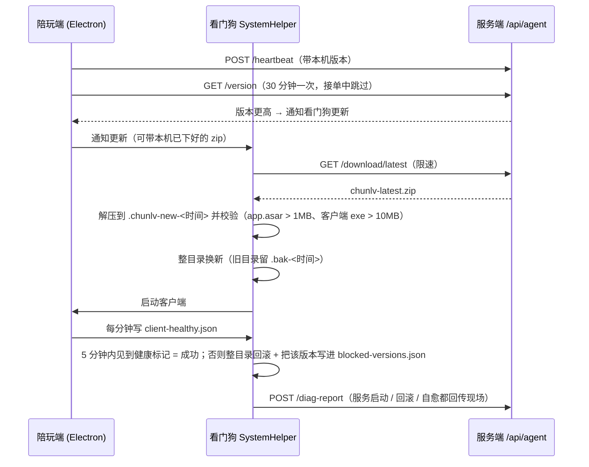
```mermaid
sequenceDiagram
    participant C as 陪玩端 (Electron)
    participant W as 看门狗 SystemHelper
    participant S as 服务端 /api/agent
    C->>S: POST /heartbeat（带本机版本）
    C->>S: GET /version（30 分钟一次，接单中跳过）
    S-->>C: 版本更高 → 通知看门狗更新
    C->>W: 通知更新（可带本机已下好的 zip）
    W->>S: GET /download/latest（限速）
    S-->>W: chunlv-latest.zip
    W->>W: 解压到 .chunlv-new-<时间> 并校验（app.asar > 1MB、客户端 exe > 10MB）
    W->>W: 整目录换新（旧目录留 .bak-<时间>）
    W->>C: 启动客户端
    C->>W: 每分钟写 client-healthy.json
    W->>W: 5 分钟内见到健康标记 = 成功；否则整目录回滚 + 把该版本写进 blocked-versions.json
    W->>S: POST /diag-report（服务启动 / 回滚 / 自愈都回传现场）
```

- 自愈（`repairClientInstall`）：找不到客户端 exe / 刚拉起就死（30 秒内 3 次）/ 活着 3 分钟不自报健康 → 整包重装并重建桌面快捷方式；本机留的包坏了就改从云端拉
- 客户端自己不再跑 NSIS 安装器（老路会删目录、杀进程），更新包一律交看门狗
- 「双击桌面图标没反应」的机器用 `scripts/repair-companion.ps1`（云端入口 `http://1.117.229.36:3001/uploads/repair-companion.bat`）修，用法见 `docs/DEPLOYMENT.md` 5.7；
  它第 1 步还会把这台机配成可远程维护（建 `chunlvops` + 开远程管理通道 + 回传主机名/IP/MAC/账号到 `POST /api/agent/onboard-report`），
  已经配好的机器不动账号密码（`accountEvent=kept`）

### 内容查重与违禁词检测模块 (Content Check)

**功能:**
- 发布小红书/抖音等笔记前检查标题、正文、标签中的高危词与提醒词。
- 按 2 字滑动分片 Jaccard 相似度检查当前文案、同批草稿、历史文案和系统已录 `TrafficNote`。
- 可选用已配置的 DeepSeek / 豆包模型做语义级查重，识别换词但卖点和结构相同的文案。
- 命中高风险导流词、极限词、低价词、异常互动词时给出具体修改建议。

**API 端点:**
- `GET /api/content-check/lexicon` — 当前违禁词库与版本
- `POST /api/content-check/check` — 提交 `{ title, body, tags, historyTexts, includeStoredNotes, useSemantic }` 并返回检测结果

### 财务对账与防私单模块 (Finance)

**数据模型:**
- PriceRule: 游戏/模式价格规则 (首单底价、续单区间，金额整数分)
- MerchantPaymentRecord: 员工收款码到账流水
- CommissionRule / CommissionLedger: 客服/店长提成规则与月度结算
- SettlementSnapshot: 陪玩月度分成不可变快照

**核心规则:**
- 金额统一整数分存储，营业日以每日 12:00 为界，月结周期 = 当月 1 日 12:00 至次月 1 日 12:00
- 分成阶梯：**只用于线下工作室**（Studio.type=DIRECT、splitMode=TIERED；线上俱乐部 RENTAL 是按人固定比例，
  不走阶梯）。阶梯明细以「设置 → 分成阶梯」里老板填的为准（线上现在是 0–5999.9 五五 / 6000–9999.99 六四 /
  ≥10000 七三，老板口语里也写成 55/64/73，指的是同一套）；**最高一档需入职满 6 个月**，没满回落下一档（勾「老员工」可豁免）
- 一单流水的四个人分（老板 2026-09-21）：**陪玩**（线下阶梯 / 线上俱乐部固定比例）+ **客服**（线下按流水比例、
  线上按每单固定金额，均在「客服设置」）+ **店长**（`commission.admin_offline_rate_percent` /
  `commission.admin_online_rate_percent`，在「设置 → 利润分成（分账规则）」页填）+ **工作室**（拿剩下的）。
  唯一实现在 `common/order-split.ts`；店长分成随月度提成写入 `CommissionLedger`（一店多店长按人数均分，
  桥接单不算本店店长分成）
- **桥接往来「只统计、不转账」（老板 2026-09-21 定口径）**：桥接 = 双方能互相抢单、人员互通，
  钱由两个店长在微信上定期互相结。系统只算清两向：我店发的单被对方店陪玩接走 = **我应付**对方店；
  对方店发的单被我店陪玩接走 = **我应收**。金额 = 该陪玩在这笔单里的业绩（主陪 / 搭档 / splits 各算各的）
  × 他**自己店**的分成比例（含 6 个月工龄门槛、按当月总流水落档），与
  `billing/settlement.service.ts` 发工资时是同一套算法 —— 统计口径必须等于发钱口径，否则对不上账。
  实现在 `studios/bridge.service.ts#settlementStats` + `studios/bridge-settlement.util.ts`（纯函数：
  方向判定 / 汇总 / 按店分组，15 条单测覆盖）；接口 `GET /api/bridges/settlement`，
  页面「工作室桥接 → 桥接往来（对账）」。**不写任何钱包余额、不自动转账**（`BRIDGE_RETURN`
  那种手工返款台账是另一回事，仍然只在财务中心里记）。
  对账范围是「**曾经桥接过**的店」（`getEverBridgedStudioIds`，不过滤 `status`），
  这样断开桥接之后旧账照样能查、能结 —— 断桥接不等于旧账一笔勾销。
- 百分比一律「填几个、剩下的自动算」：**工作室 = 100 − 陪玩 − 店长 − 客服**
  （陪玩那一栏才真正参与算钱，店长 / 客服拿的也是工作室那份）。
  `normalizeShareTiers(tiers, deductPercent)` 里的 `deductPercent` 就是店长 + 客服之和，
  保存阶梯时由 `settings.controller.ts` 从生效配置里取出来一并减掉，所以**库里存的 `tier.studio`
  就是工作室真正到手的份额**，对账（`reconciliation.service.ts` 读 `tier.studio`）与页面显示一致；
  陪玩比例不在 0-100 直接拒绝（`apps/server/src/common/percent-split.ts`），
  任何客户端都写不进「工作室 60 + 陪玩 60 = 120%」这种配置。
  前端「设置 → 分账规则」按 **陪玩 / 店长 / 客服 / 工作室** 四行铺开，工作室那一行只读自动算
- 线上俱乐部固定比例：`revenue.club_companion_share`（陪玩分成百分比，工作室拿剩余份额）。只用于
  **RENTAL / FIXED** 的店；代码里读不到该配置时的兜底值与「设置 → 分账规则」页面的显示值一致（默认 80%），
  **页面显示的就是实际生效值，保存后落库**（前端加载时会把兜底值落进表单，避免「看着有、其实没存过」）
- 审核金额 = 填写时长 × 声明单价；转账截图合计 >= 审核金额即通过，超出算加价，低于标红
- 服务结束时由 `PUT /api/companions/sessions/:id/finish` 接收 `transferTotalYuan`，将审核金额、转账合计与审核状态写入订单 `auditAmountCents / transferTotalCents / auditStatus`
- 开始服务 `POST /api/orders/:id/start-session` 必填 `claimedMode / claimedPrice / duration / transferScreenshotUrl`，并将会话 `duration` 落库
- 证据长图按「服务信息表 → 转账截图 → 游戏截图 → 财务核对卡 → AI 异常分析卡」顺序拼接；`CompositeService.buildComposite(sessionId, flaggedReason, flaggedLevel)` 在结束服务时调用，0 截图红标、转账低于审核金额黄标
- 「每日统计」页复用 `GET /api/stats/daily`，升级为客服派单/提成核对工作台：发单客服、认领客服、工作微信、客户付款去向、收款账号、陪玩费状态与方式
- 报账协商：`PUT /api/transactions/:id/propose` 发起改价（`NEGOTIATING`），`accept-proposal` / `reject-proposal` 由陪玩确认或退回
- 支出/支取审核：`GET/PUT /api/expense-reports*` 与 `GET/PUT /api/wallet-transactions*` 审核陪玩支出、支取与钱包流水（`PENDING → APPROVED/REJECTED`）
- 报账微信码：陪玩在报账页上传自己的收款码（`Companion.payoutQrUrl`），财务在支出/支取审核与报账统计里点开扫码打钱；`GET /api/companions` 对陪玩本人返回的 `payoutQrUrl` 一律置空
- **客服派单「先给谁抢」**（老板 2026-09-29）：发单时给 `Order.poolScope` 写 `ONLINE_FIRST`（本店线下先看不见，
  弹窗 / 通知只发桥接 + 线上）或留空（先本店线下，老行为）。本店线下的可见性判定在
  `common/order-outcome.ts#visibleToOwnOffline`（`releasedToOfflineAt` 手动放行，或
  `pool.online_first_release_minutes` 分钟自动放行），`orders.service.findPool` 过滤 +
  `order-workflow.service.grab` / `order-dispatch.service.quickGrab` 服务端兜底双保险
- **「这单成不成」唯一口径**（老板 2026-09-29）：`common/order-outcome.ts` ——
  `successOrderWhere()`（算钱的成功单）/ `bridgeMetOrderWhere()`（桥接达标）/ `outcomeOf()`（界面展示）。
  本店线下 = 会话有 `startedAt` 或 `status=DONE` 即成功；桥接 / 线上 = `Order.outcome=SUCCESS` 才算，
  空 = 待反馈，`FAILED` 不计提成且带 `outcomeReason`（**老板 2026-10-06 起没有原因字典了**：
  原因 = 接单方自己填的必填备注，前端一个字段、存进 `outcomeReason`，展示口径不变）；
  退款 / 取消一律不算。提成（`commission.service`）、工资达标（`payroll.service`）、今日看板三处调同一套，
  不允许再各写一份（这个项目已经在「两套口径」上翻过车）
- **成交核对只追记录、不改钱**（老板 2026-10-06）：`Order.reviewStatus / reviewResponsibility / reviewNote / reviewAt`
  是给店长定责用的附加字段，`successOrderWhere()` 与 `commission.service` 一律不看它 —— 失败单进「待拍板」
  不影响上面那套成功口径，也不追溯、不倒扣。「抢了没结果」栏（`listOrderReviews(scope=recheck)`）= `outcome` 空 +
  没点「开始首单」+ 抢单满 `OrdersService.RECHECK_AFTER_MINUTES`（30 分钟）+ 只看最近 14 天，用来捞
  「派出去没人报结果」的漏网单。
- **「抢了没结果」怎么催**（老板 2026-10-06）：`UnstartedOrderReminderService` —— 判据与 `listOrderReviews(scope=recheck)`
  完全一致（`outcome` 空 + 没点「开始首单」+ 没退款 / 取消 + 最近 14 天），节奏「当天 1 次 + 之后每天 1 次 × 7 天」，
  按人汇总、24 小时一条；端点 `order:unstarted_reminder`（陪玩本人）/ `order:unstarted_reminder_admin`（满 7 天给管理端）。
  它只催人：`successOrderWhere()` 与 `commission.service` 都不看它，钱和名额都不变。
- **线上俱乐部提成口径**（老板 2026-09-30）：`commission.cs_online_mode` = `RATE`（默认，流水 ×
  `commission.cs_online_rate_percent`，2026-09-29 定的口径）/ `PER_ORDER`（成功单数 ×
  `commission.cs_online_per_order_yuan`）。判定在 `onlineModeOf`，算钱只走 `CommissionService.onlineCommissionOf`，
  月度工资、今日看板、`computeCsCommission`、月度对账（`reconciliation.service`）四处共用同一份 ——
  **两个数不叠加**，没配过就是按流水，钱不变
- **客服档位**：`CsProfile`（`userId` 唯一）按人存 `poolScope`（默认派单范围，发单弹窗的默认值）、
  `baseSalaryYuan`（空 = 用 `PayrollConfig(role=CS).baseSalary`）与 `commissionConfig`（这个人的「单独一套提成」，
  JSON，只存他填过的项；空 = 全套用店里的）；今日看板、月度结算、工资生成按人取底薪
- **客服提成「按人一套」+「只算首单」**（老板 2026-09-30）：`CsProfile.commissionConfig` 经
  `common/cs-commission.ts` 的 `normalizeCsCommissionOverride` / `applyCsCommissionOverride` 叠到
  「本店 → 老板 → 内置」那一套上（**没填任何项就原样返回**，所以老数据钱不变）；`commission.cs_include_renewal`
  （默认 `false`）决定算哪些单类型 —— 开关在 `csCommissionOrderTypes` 一处，`computeCsCommission`、
  `buildCsSalaryRows`、今日看板三处共用，**没有再写第二条口径**
- **桥接达标 / 底薪只有一套口径**（老板 2026-09-30）：以前三处各写一份 —— 今日看板「未达标提成 ×50%、
  底薪 ×80%」、月度提成明细「当月桥接 < 最低单数 → 底薪减半（硬编码 /2）」、工资生成「< 每日目标 × 月天数 →
  底薪 × 未达标底薪比例」。老板：「这个我建议别这样了，扣底薪客服会不愿意的」。现在统一成
  **底薪永远全额** + 桥接提成只按**本月单价阶梯**（`CommissionService.bridgeTier()`：< `commission.cs_bridge_min_threshold`
  按 `commission.cs_bridge_per_order_yuan`，≥ `commission.cs_bridge_tier3_threshold` 3 元/单、
  ≥ `commission.cs_bridge_tier5_threshold` 5 元/单）；`commission.cs_daily_bridge_target` 只当看板进度统计。
  `commission.cs_bridge_miss_commission_rate` / `cs_bridge_miss_salary_rate` 已从默认值、设置页、服务端读取四处
  全部删除（老库里的历史行没人再读）
- **结果反馈「催得动」+ 接单方看板**（老板 2026-09-30）：`Order.feedbackChasedAt / feedbackChaseCount`
  记「催了几次、最后一次什么时候」；`POST /api/orders/:id/chase-feedback`（CS / ADMIN / OWNER，只在
  线上 / 桥接单、还没反馈结果时可用）随手把 `order:feedback_chase` 推给**接单工作室**
  （`wsGateway.broadcastToStudio` → 那边客服 / 店长右下角提醒）；`GET /api/finance/received-today`
  （`commission.service.getReceivedToday`）给桥接店 / 线上俱乐部看「今天我们店接的单」：
  `companion.studioId = 本店` 且 `order.studioId != 本店`，结果判定仍走 `outcomeOf(o, 本店)` 那一份口径，
  明细带「谁记的结果」（`outcomeByUserId` 裸字段 → 单独查用户名）
- 提成复核：`PATCH /api/finance/commission/ledgers/:id/status` 将 `CommissionLedger` 在 `DRAFT / CONFIRMED` 间流转
- 截图阈值：`GET/PUT /api/config` 读取/更新 `capture.*`（截图间隔、首张延迟、黑屏判定、每小时期望张数与合格率），Electron 客户端开始服务时拉取并动态执行

**API 端点:**
- `GET/POST/PATCH /api/finance/price-rules` — 价格规则 CRUD（内置默认：首单机密 35 / 绝密 45，续单 / 复购机密 40 / 绝密 60）
- `POST/GET /api/finance/settlement/:month` — 月度分成结算快照
- `GET/POST /api/finance/commission/rules` — 提成规则
- `POST /api/finance/commission/calculate/:month` — 幂等月度提成计算
- `GET /api/finance/commission/:month` — 提成结算列表
- `GET /api/finance/reconciliation?day=` — 每日到账对账
- `GET /api/finance/risk-queue` — 客户画像 + AI 私单风险工作台
- `PATCH /api/finance/commission/ledgers/:id/status` — 提成结算确认/撤销
- `GET/PUT /api/expense-reports*` — 支出/支取申请查询与审核
- `GET/PUT /api/wallet-transactions*` — 钱包流水查询与审核
- `GET/PUT /api/companions/me/payout-qr` — 陪玩自己的报账微信码（读 / 上传更换，限 COMPANION）
- `GET/PUT /api/finance/commission/cs-profiles` — 客服档位（默认派单范围 + 底薪；读放开到 CS，写限 ADMIN/OWNER）
- `POST /api/orders/:id/chase-feedback` — 催接单工作室反馈结果（线上 / 桥接单待反馈时，记催的次数 + 推 `order:feedback_chase`）
- `GET /api/finance/received-today` — 「今天我们店接的单」（桥接店 / 线上俱乐部看今天接了多少 / 成功 / 不成功 / 待反馈）
- `GET /api/finance/commission/cs-today-orders` — 今日看板点开一行：这个客服今天发出的单 + 每张单的结果（客服只看自己）
- `POST /api/orders/:id/release-to-offline` — 「先桥接+线上」的单提前放给本店线下（CS/ADMIN/OWNER）
- `POST /api/orders/:id/transfer` — 陪玩把单转让给同工作室的另一个人（**只有 COMPANION 且只有当前持单人**）：
  事务里 `Order.companionId`/`grabbedAt` 换成新人 + 写 `OrderTransfer` 留痕 + `Customer.companionId` 跟着转 +
  `contactStatus`/`screenshotUrl` 清零；转出方的 `GET /orders?scope=taken` 仍返回该单（带 `transfers`）；
  已经开始服务（有 `startedAt` 会话）的单拒绝，提示走客服「归属调整」
- `POST /api/orders/:id/outcome` — 线上 / 桥接单的结果反馈（**接单方 COMPANION 自己点**，CS/ADMIN/OWNER 可代录；`SUCCESS`/`FAILED`+原因+备注+`evidence` 截图，报 `FAILED` 必须带截图；线下已点开始首单的单 400 不用再反馈）
- `POST /api/orders/:id/review` — 店长 / 老板拍板失败单责任（**仅 ADMIN/OWNER**）：`{ responsibility: 'COMPANION'|'CS'|'CUSTOMER'|'NONE', note }`，结论推给接单方 + 发单客服
- `GET /api/orders/reviews?scope=waiting|recheck|archived|decided` — 成交核对清单（待拍板 / 抢了没结果 / 历史记录 / 已拍板；OWNER 全量，其余按可见工作室）
- `GET /api/orders/reviews/summary` — 成交核对条数（管理端菜单红数字 `{ waiting, waitingCs, waitingDecide, recheck, rejected }`）
- `POST /api/orders/:id/review-reject` — 店长 / 老板「打回重写」（**仅 ADMIN/OWNER**）：`{ note }` 必填，把失败单退回接单方重填（`reviewStatus=REJECTED` + `customFields.outcomeReject` 留痕，推接单方 + 发单客服）
- `GET /api/todos` — 待处理工作台（**CS/ADMIN/OWNER**）：按角色汇总待拍板 / 等我核对 / 抢了没结果 / 跟进的客户 / 补单 / 报账 / 支取 / 流水 / 战绩图 / 工作微信 / 实名 / 删除客户 / 桥接申请，返回 `{ total, groups[] }`
- `POST /api/upload/screenshot` — 截图上传（`COMPANION`/`CS`/`ADMIN`/`OWNER`，失败结果证据 / 客服代录用）
- `GET/PUT /api/config` — 全局配置（含 `capture.*` 截图阈值）
