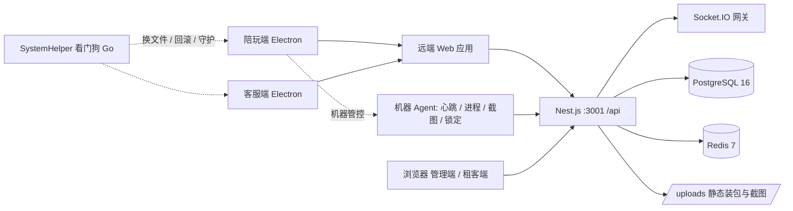
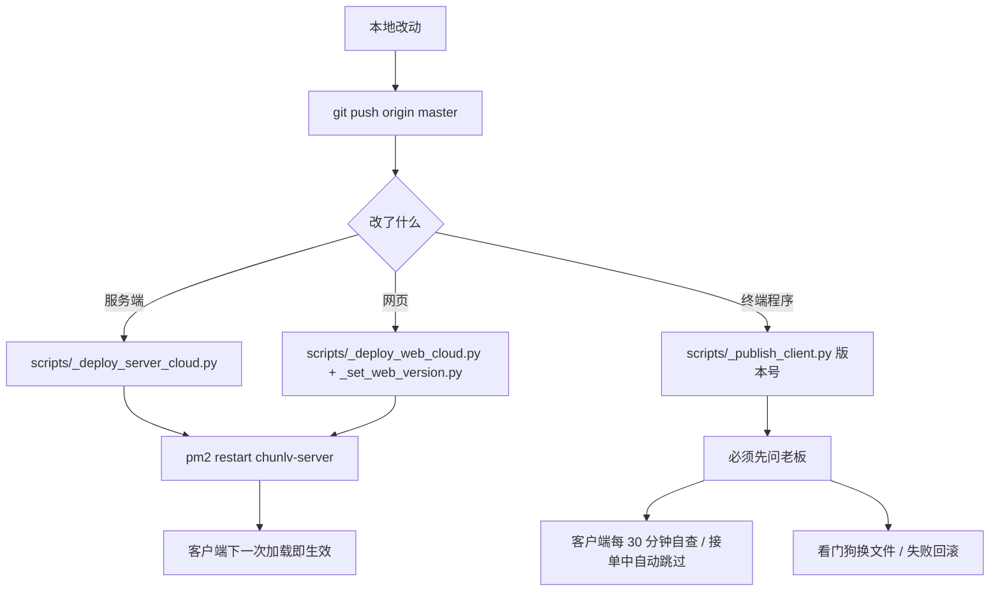

# 蠢驴电竞陪玩派单管理系统 — 重构方案（dev 分支）

> 编写日期：2026-10-06（v2：补充多工作室场景、客户端自动升级、功能/交互/UI 优化）
> 扫描基线：`dev` 分支（`59c7f581` + 本方案提交）
> 需求准绳：`docs/蠢驴电竞陪玩派单管理系统-需求文档-v2.0.md`（与本文冲突时以需求文档为准）
> 适用范围：`dev` 分支；`master` 始终保留「可随时发布」的线上版本

---

## 进展（滚动更新）

> 只记「已完成 / 在做 / 下一批」，与 `CHANGELOG.md` 呼应，细节看对应提交与 CHANGELOG。

### 第 0 批 · 已完成（2026-10-06）

| 任务 | 对应问题 | 交付 | 提交 |
|---|---|---|---|
| 仓库瘦身 | P0-4 / P2-5 | `.rtfm/library.db` 停止跟踪（本地文件保留）；`.gitignore` 补 `/tmp_*`、`/__pycache__/` | `9d398178` |
| ESLint 救活 | P2-1 | `.eslintrc.json` → `eslint.config.mjs`（flat config）；lint 脚本从 `--max-warnings 50` 改为只卡 error | `6e084c5a` |
| CI 覆盖 dev + 补打包 | P0-7 | CI 改为在 `master` / `dev` 触发，任务 `typecheck → lint → test` + `build`，加 concurrency | `6e084c5a` |
| CI 修绿（预存问题） | P0-3 / P2-1 | 类型错误 ×1、失效测试 ×1、条件 hooks ×1、外链 `rel` ×5、机械问题若干 | `637e9dd6` |
| 升级名额按店隔离 | P0-6 | `agent.service.ts` 全网单变量 → 每店一名额 + 每店一条队列；`/api/agent/update/queue` 加 `byScope` | `c543be6c` |
| 契约自动导出 + CI 冻结 | P0-3 / 前提 3 | `scripts/_export_api_contract.mjs` → `docs/API-CONTRACT.json`（400 接口 / 15 入站 / 19 出站）；CI `--check` 拦截路径与事件名变更 | 本次 |

### 第 1 批 · 进行中

1. **P0-6 升级名额按店** ✅：全网单个内存名额 → 按店名额 + 按店队列（**先做内存版**；用 Redis 做多实例持久化留到真的要多开进程时再说 —— `redis.module.ts` 是 `lazyConnect` 且「Redis 挂了聊天也能用」，把更新名额改成强依赖 Redis 反而多一个能挂的点）。
2. **P0-5 升级信号按端隔离**：陪玩端 / 客服端 / 看门狗的信号文件分命名空间，兼容读取旧路径（避免一台机器装两端时互相踩）。
3. **P0-2 部署可回滚**：远端改为 `releases/<sha>` 目录 + `current` 软链，脚本支持 `--rollback`（纯新增能力，不动线上；需要 `CHUNLV_SSH_PASS`）。
4. **P0-1 抢单主链路 e2e**：把「抢单 / 报账 / 结算 / 黑名单」四条主链路的自动化回归建起来，作为后续所有拆分的验收基线。
5. **契约自动导出 + CI 冻结** ✅：`scripts/_export_api_contract.mjs` → `docs/API-CONTRACT.json`（400 接口 / 15 入站 / 19 出站），CI `--check` 拦路径与事件名变更。

---

## 0. 结论速览

**一句话判断**：这套系统已经跑完了「从 0 到 1」——业务闭环完整、线上有真实用户和真实钱在流。它的问题不是功能不够，而是**结构已经到顶**：一个 4000 行的订单服务、一个 3000 行的前端外壳、两套复制粘贴的客户端、116 个散装配置键、零前端测试。再往上叠功能，成本会指数上升。

**重构不是重写。** 线上每天有陪玩在接单挣钱，铁律第一条「不影响正在接单的陪玩」同样约束重构：任何时刻 `master` 必须能独立发布，`dev` 允许长时间不稳定。

**三条必须先立的前提（没有它们，后面全是白干）**

1. **回归安全网**：前端零测试、客户端零测试。先把「抢单 / 报账 / 结算 / 黑名单」四条主链路的自动化回归建起来，否则任何拆分都无法验证。
2. **交付链路可回滚**：当前部署靠手写 Python 脚本 + SSH + pm2，没有版本回退能力。重构期间必须能「一键回到上一个可用版本」。
3. **契约冻结**：400 个接口 + 68 处 Socket 事件是四端共用的契约，重构期间**接口路径与事件名不得变更**，只允许内部结构调整。

**三个必须正视的业务事实（v2 新增）**

- **多工作室不是「以后的事」，而是正在发生的事**：直营店 + 租赁店 + 桥接工作室（如光耀电竞）已经同库跑着，但「一台电脑服务多家店」「一个人跨店兼职」这两个真实场景目前是**漏洞区**。
- **自动升级是运营的生命线**：陪玩端与客服端的升级机制**不是同一套实现**，客服端明显更弱；升级名额是**全网单个内存变量**，一家店在升级，所有店都得排队。
- **UI 已经在漂移**：184 个硬编码色值、2,389 处行内样式、64 处 `!important`，主色紫 `#7C4DFF` 只用 36 次，而 Ant Design 默认蓝 `#1677ff` 用了 42 次——三套「主色」在打架。

**七个重构包（按性价比排序）**

| 包 | 目标 | 直接收益 | 风险 |
|---|---|---|---|
| P1 安全网 | 回归测试 + 可回滚交付 | 让后续每一步可验证 | 低 |
| P2 后端拆分 | 订单服务按子域拆开 | 改一处不再牵全身 | 中 |
| P3 前端拆分 | 外壳/路由/数据层解耦 | 加页面从「半天」到「半小时」 | 中 |
| P4 客户端统一 | 双客户端共享机器端能力 | 修一次两端生效 | 中高（涉及终端程序更新，必须请示） |
| P5 配置中心 | 116 个散键收进类型化配置 | 消除「页面显示 ≠ 实际生效」 | 中 |
| P6 **多租户作用域** | 统一 `ScopeContext` + 一机多店 | 打开规模化与跨店兼职，堵住越权与串店 | 中高（触及全部查询） |
| P7 **升级与体验** | 统一升级协议 + 设计令牌 | 升级不再互相踩、界面不再漂移 | 中 |

---

## 1. 项目画像

### 1.1 这个系统是什么

**面向陪玩工作室老板的 SaaS 派单管理系统**，直营店 + 租赁店/加盟店同库多租户（`studioId` 隔离）。

- **对外人设是「散陪」**：每个陪玩对客户呈现为独立个人，界面上不暴露工作室。
- **价值锚点是防私单**：让老板「看得见每一单、看得见每一笔钱」。
- **开发者的双重身份**：既是系统开发者，也是持有全部数据的超级管理员。
- **中期路线**：先把线下陪玩店免费拉进来用，再对外卖这套软件（自助开户 / 计费 / 白标目前只有雏形）。

### 1.2 受众与四端

| 端 | 载体 | 用户 | 核心诉求 |
|---|---|---|---|
| 管理端 | Web（也跑在陪玩端里） | 老板 / 店长 | 看盘、管人、管钱、配置 |
| 客服端 | Electron `cs-electron` | 客服 | 发单要快、抢单池要顺、客户资料一眼看清 |
| 陪玩端 | Electron `companion-electron` | 陪玩 | 抢单要快、计时准、报账顺、别被乱杀进程 |
| 租客端 | Web | 租赁店店长 | 只看本店、自己配本店参数 |
| 超管 | Web | 开发者 | 全部数据、版本与授权 |

**注意**：客服端与陪玩端**不是两套前端**，而是两个 Electron 外壳加载**同一个远端 Web 应用**（`http://<server>/login`）。这是理解本项目架构的关键前提——真正的前端只有一套。

### 1.3 业务主链路

```
客服/店长/老板 发单 ──┬─ 广播 ──▶ 陪玩端右下角弹窗（秒级，点了就抢）
                      └─ 入池 ──▶ 订单池（按段位分段放行：上等马 0s / 中等马 60s /
                                     下等马 120s / 桥接工作室 300s）
                              │
                        陪玩一键抢单（原子化，先到先得）
                              │
              单人单 ─────────┴───────── 双陪单 → 呼叫搭档（指定/广播）→ 搭档接单
                              │
                         开始服务（计时、状态=接单中）
                              │
                 结束服务 → 战报截图 + 客户 + 金额 + 报账
                              │
                 结算 → 业绩入账 → 可支取余额（阶梯分润，四人均分：工作室/店长/客服/陪玩）
```

**横切口径**：每天 **12:00 换营业日**；报账、结算、看板、配额全部走同一套时间界线。

### 1.4 规模现状（实测）

| 模块 | 文件数 | 代码行 | 说明 |
|---|---|---|---|
| `apps/server` | 306 | 48,594 | 不含 `dist`；含 73 个测试文件 |
| `apps/web` | 200 | 49,399 | 唯一前端，四端共用 |
| `apps/companion-electron` | 12 | 3,657 | 陪玩端外壳 + 机器管控 |
| `apps/cs-electron` | 3 | 1,003 | 客服端外壳（纯 JS，无构建） |
| `packages/shared` | 4 | 152 | 共享枚举/类型，**极薄** |
| `apps/watchdog-service` | Go | 100+ | 看门狗服务（SystemHelper），换文件/回滚 |

**后端**：66 个 Prisma 模型 · 62 次迁移 · 28 个 Controller · 55 个 Service · 26 个 Module · **400 个接口** · 289 处 `@Roles` 判权 · 仅 15 个 DTO 文件。
**前端**：86 条路由 · 62 个组件 · 26 个 API 模块 · 229 处 `useEffect` · 50 处 `setInterval` · **0 个测试文件**。

---

## 2. 架构现状

### 2.1 运行时拓扑



**两个关键点**
1. 客户端把 API 和 Web 资源都指向同一台云服务器（`1.117.229.36:3001`）——服务端一改，四端立即生效。这是重构最大的杠杆点。
2. **看门狗与两个客户端共用同一个信号目录** `C:\ProgramData\chunlv\`。陪玩端与客服端都往这个目录写 `update.json` / `client-healthy.json` / `blocked-versions.json`，见第 14 章。

### 2.2 代码拓扑

```
apps/server/src/
  orders/          ← 业务核心，也最臃肿（god service）
  companions/  customers/  finance/  billing/  chat/  ws/
  agent/       managed-pc/ process-blacklist/   ← 终端管控
  auth/  studios/  stats/  dashboard/  payroll/  traffic-account/
  common/            ← 30 个纯函数工具（业务口径的唯一实现，质量最好）
  __tests__/         ← 73 个测试，覆盖率集中在这里
apps/web/src/
  layouts/AppLayout.tsx   ← 3095 行的全局外壳
  pages/{admin,owner,cs,dispatch,finance,settings,companion}
  components/  api/  stores/  hooks/  constants/  styles/  workers/
```

**`common/` 是这块代码库里最健康的部分**：`business-day.ts`、`withdrawable.ts`、`revenue-calculator.ts`、`order-privacy.ts`、`entertainment-fee.ts` 等把「唯一口径」收敛成了纯函数并配了单测。重构应当**沿用这个模式**，把散落在 Service 里的口径逻辑继续往 `common/` 搬。

### 2.3 交付链路



**现状特征**：CI 只跑 `typecheck` + 服务端测试（`.github/workflows/ci.yml`），**部署完全不经过 CI**，是本地脚本直连生产。这既是当前最大的运维风险，也是重构必须最先补的一环。

---

## 3. 问题诊断

### 3.1 P0 — 会让重构直接翻车的

| # | 问题 | 证据 | 后果 |
|---|---|---|---|
| P0-1 | **前端与客户端零测试** | `apps/web` 与两个 Electron 目录下 0 个 `*.test.ts(x)`；对比服务端 73 个测试文件 | 前端拆到一半无法判断「有没有拆坏」，只能靠人肉点 |
| P0-2 | **部署无版本管理、无回滚** | `scripts/_deploy_*.py` 直接 `rm -rf` 远端目录再解包；指纹只用于「要不要重启」 | 一次坏发布只能手工救，重构期高频发布风险极高 |
| P0-3 | **契约面巨大且无 schema 校验** | 400 个接口 / 68 处 socket 事件 / 仅 15 个 DTO 文件 | 内部重构极易打破某个客户端，且类型系统拦不住 |
| P0-4 | **工具产物混入仓库** | `.rtfm/library.db` 17 MB 被 git 跟踪；`CHANGELOG.md` 已 4,676 行 / 606 KB | 仓库膨胀、clone 慢、diff 噪声大 |
| P0-5 | **两端升级信号文件共用** | 陪玩端 `updater.ts` 与客服端 `main.js` 都写 `C:\ProgramData\chunlv\update.json`、`client-healthy.json`、`blocked-versions.json`；看门狗只有一份 `updateSignalDir` | **同一台机器装了两端时互相踩**：健康上报被对方覆盖 → 误判更新失败 → 误回滚 / 误拉黑版本 |
| P0-6 | **升级名额是全网单个内存变量** | `agent.service.ts` 模块级 `let updateSlot`，`updateWaiters` 同为内存 Map | 一家店在升级，**所有店一起排队**；服务重启即丢状态；无法多实例 |
| P0-7 | **CI 此前只在 master 触发** | `.github/workflows/ci.yml` 的 `on.push.branches` 只有 `master`，且从不跑打包 | 重构全在 `dev` 上做，等于整个重构期没有任何自动检查（2026-10-06 已修） |

### 3.2 P1 — 结构性债务

| # | 问题 | 证据（实测） | 影响 |
|---|---|---|---|
| P1-1 | **订单服务是上帝对象** | `orders.service.ts` 4,089 行 / 71 个公开方法 / 204 处 `this.prisma.` 直连 | 任何改动都会波及抢单主链路，回归范围无法界定 |
| P1-2 | **前端外壳是巨型组件** | `AppLayout.tsx` 3,095 行，内含 20+ 个独立角标 state、菜单配置、通知中心、聊天窗口、socket 编排 | 加一个角标要改全局文件，冲突率极高 |
| P1-3 | **路由样板重复 ~70 次** | `router.tsx` 779 行，每条路由都被 `Suspense` 包一遍；`owner/*` 与 `admin/*` 大量重复指向同一组件 | 加页面成本高、老路径无人敢删 |
| P1-4 | **配置键散装且无类型** | `SystemConfig`/`StudioConfig` 是 `key + Json` 的 KV 表，`default-config.ts` 里 116 个键以裸字符串硬编码 | 需求文档里反复出现「页面显示 ≠ 实际生效」这类事故 |
| P1-5 | **双客户端复制粘贴** | `companion-electron/electron/machine-agent.js` 与 `cs-electron/machine-agent.js` 归一化后 **298/305 行完全相同**；客服端是纯 JS、无 TS、无构建 | 机器端能力修一次要改两份，客服端长期落后 |
| P1-6 | **WebSocket 网关单文件承担全部事件** | `ws.gateway.ts` 1,447 行 / 12 个 `@SubscribeMessage` / 21 处 emit | 事件与业务耦合，测试只能整体打桩 |
| P1-7 | **没有租户作用域抽象** | `user.studioId` 191 处、`req.user` 330 处、`studioId:` 条件 **661 处**、`UserRole.OWNER` 判断 292 处，判权/取数逻辑逐服务重写 | 「OWNER 看全部 / 本店 / 加桥接店」三套规则靠人记，**漏一处就是越权或串店** |
| P1-8 | **客服端升级能力弱于陪玩端** | 客服端 `checkForUpdates` 只有「拉版本 → 下载 → 写信号」；陪玩端有备货（`staged-update.json`）、等空闲（`waitUntilIdle`）、名额申请（`acquireUpdateSlotWithRetry`）、健康校验 | 客服端更新会在**正在发单时**把窗口换掉 |
| P1-9 | **机器台账没有店的归属** | `ManagedPC` 是 `@@unique([ip])` 全局唯一，**没有 `studioId`**；`CompanionPC` 一陪玩一台、无 MAC | 多店共用一台机器时台账串店；一机多账号无法表达 |

### 3.3 P2 — 工程化与卫生

| # | 问题 | 证据 |
|---|---|---|
| P2-1 | 类型逃逸严重 | 服务端 `: any` 1,007 处 / `as any` 734 处；前端 1,120 / 189 |
| P2-2 | 数据层被绕过 | 前端 42 处直接 `axios.` / `fetch(` 写在 `api/` 目录之外 |
| P2-3 | 大文件密度高 | 服务端 39 个文件 > 300 行；前端 46 个 |
| P2-4 | 轮询替代推送 | 前端 50 处 `setInterval`（看板 15 秒轮询等），与既有的 Socket.IO 能力重复 |
| P2-5 | 仓库根目录污染 | 根目录约 250 个 `tmp_*.py/.txt` 未跟踪残渣；`.gitignore` 只忽略了带点的 `/.tmp-*`、`/.tmp_*`，漏掉 `tmp_*` |
| P2-6 | 文档与代码耦合 | `docs/ARCHITECTURE.md` 已退化成「按日期的变更流水」，75 KB，读不出结构 |
| P2-7 | **UI 设计令牌缺失** | 184 个不同硬编码色值（总引用 1,276 次）；主色 `#7C4DFF` 36 次 vs AntD 默认蓝 `#1677ff` 42 次 vs `#2563eb` 30 次；绿色 3 种、红色 4 种；2,389 处行内 `style={{`；64 处 `!important` |
| P2-8 | **反馈层无统一出口** | 624 处 `message.*` 直接调用，无去重/合并/优先级；加载态混用 Skeleton 与 Spin，空态不统一 |
| P2-9 | **主题自我矛盾** | `theme.ts` 注释写「经典蓝主色调」但 `colorPrimary` 是紫色 `#7C4DFF`；整体浅色但侧栏 `#0B1024` 深色，无暗色模式 |

---

## 4. 重构目标、原则与红线

### 4.1 目标（可验证）

1. **改一处不牵全身**：订单子域可独立改动与测试，回归范围可界定为「一个子域 + 抢单主链路」。
2. **加页面成本下降**：新增一个管理端页面 ≤ 30 分钟（现状约半天）。
3. **契约显式化**：接口与 socket 事件有类型/契约清单，CI 可比对是否有破坏性变更。
4. **发布可回滚**：任何一次部署都能在 3 分钟内回到上一个版本。
5. **两客户端收敛为一套机器端能力**：机器管控逻辑只有一份实现。
6. **口径唯一**：所有金额/时间/分润口径只存在一处实现，并有单测锁定。
7. **多店可规模化**（v2）：作用域只有一处实现；一台机器可安全服务多家店；升级按店灰度、互不阻塞。
8. **两端可自升级**（v2）：升级协议统一、可观测、可回滚，且**永不打断正在服务的人**。
9. **界面可维护**（v2）：颜色/间距/字号只来自设计令牌；改主题是改一个文件，不是全局搜索替换。

### 4.2 原则

- **绞杀者模式（Strangler）**：新结构在旁边长出来，老代码逐步改道，不做大爆炸重写。
- **行为等价优先**：拆分只搬逻辑、不改行为；行为变更必须独立成提交并单独验证。
- **口径下沉 `common/`**：延续现有最健康的模式，纯函数 + 单测。
- **一次一个子域 / 一次一个页面**：一个 PR 只动一个限界上下文。
- **兼容优先于整洁**：迁移期保留旧路径与旧字段，双写或兜底读取，稳定后再删。

### 4.3 红线（违反即事故，与需求文档 0.3 节一致）

- **不影响正在接单的陪玩**：客户端更新、黑名单等动作永不打断服务中的人。
- **不影响正在发单的客服**（v2 补充）：客服端更新必须等「没有正在编辑/提交的订单」。
- **线上业务开关不许脚本碰**：`blacklist.enabled`、版本号/宽限期类键，只能由老板/店长在界面上拨。
- **测试数据必删**：线上验证造的数据一律收尾清理，真实业务数据只读。
- **接口路径与事件名冻结**：`/api/**` 路径与 socket 事件名在重构期不得改名。
- **终端程序更新必须先请示**：`_publish_client.py` / `_publish_cs_client.py` 及整包换装，先问再发。

---

## 5. 分阶段方案

| 阶段 | 名称 | 关键产出 | 依赖 |
|---|---|---|---|
| 0 | 安全网 | 契约清单、四条主链路 e2e、前端冒烟、可回滚部署、仓库瘦身 | — |
| 1 | 工程基线 | CI 全链路、Swagger 契约导出、架构文档重写 | 0 |
| 2 | 后端领域拆分 | `orders` 门面化 + 子域服务、网关拆分、DTO 补齐（见第 6 章） | 0 |
| 3 | 前端解耦 | 拆 `AppLayout`、路由去样板、数据层收口（见第 7 章） | 0 |
| 4 | 客户端统一 | `packages/machine-agent` + `packages/electron-shell`（见第 8 章） | 2、3 |
| 5 | 配置中心 | 键常量 + schema + 单入口（见第 9 章） | 0 |
| 6 | **多租户作用域** | `ScopeContext` + 一机多店（见第 13 章） | 2、5 |
| 7 | **升级与体验** | 统一升级协议 + 设计令牌（见第 14、15 章） | 4 |

### 阶段 0：安全网（前置，必做）

| 任务 | 产出 | 验收 |
|---|---|---|
| 冻结契约清单 | 从 28 个 Controller 生成 `docs/api-contract.md` + 事件清单 | 脚本可一键重生成并 diff |
| 关键链路集成测试 | 抢单原子性 / 报账口径 / 可支取余额 / 黑名单开关 四条 e2e | CI 中跑通，任一破坏即红 |
| 前端冒烟测试 | 引入 Vitest + Testing Library，先覆盖 `router` + 登录 + 订单池 | `pnpm -r test` 可跑 |
| 部署可回滚 | 远端保留上两个版本目录（`releases/` 软链切换） | 一次演练：回滚耗时 < 3 分钟 |
| 仓库瘦身 | `.rtfm/library.db` 移出跟踪；补 `tmp_*` 到 `.gitignore`；`CHANGELOG.md` 滚动归档 | 仓库体积明显下降，`git status` 干净 |

### 阶段 1：工程基线

- 统一 Node/pnpm 版本（`.nvmrc` 与 CI 对齐，当前 CI 用 Node 18、本地未锁）。
- CI 扩展为 `typecheck → lint → test → build`，并新增**契约 diff 校验**。
- 服务端导出 Swagger JSON 作为机器可读契约（`main.ts` 已挂 `/api/docs`，只需导出）。
- 重写 `docs/ARCHITECTURE.md` 为真实结构文档，把「按日期的流水」交给 `CHANGELOG.md`。

---

## 6. 详设：`orders` 领域拆分

### 6.1 目标产物

```
apps/server/src/orders/
  orders.controller.ts          ← 仅 HTTP 编排（586 行 → 目标 < 200）
  lifecycle/                    ← 单的创建 / 发布 / 入池 / 抢单 / 状态机
    order-lifecycle.service.ts
    order-pool.service.ts
    order-grab.service.ts
    order-dispatch.service.ts   （已存在，收编）
  session/                      ← 服务过程：开始 / 暂停 / 结束 / 时长
    order-session.service.ts
    companion-quota.service.ts  （已独立，保留）
  transfer/                     ← 转让 / 申请 / 归属调整（已部分独立，收编）
  outcome/                      ← 报结果 / 成交核对 / 打回重写
    order-outcome.service.ts
  reminders/                    ← 6 个 *-reminder.service.ts 归拢
  order-query.repository.ts     ← 只读查询下沉（204 处 prisma 直连的一半）
```

### 6.2 拆分手法（避免大爆炸）

1. **先建门面**：`orders.service.ts` 保留为门面，内部方法体逐步委托给新服务，外部调用方零改动。
2. **再按「读 / 写」切一刀**：查询类下沉到 `order-query.repository.ts`，写操作留在服务里并全部走事务。
3. **口径外移**：金额、时间窗、可见性判断搬进 `common/`（`order-split.ts`、`business-day.ts` 已是对的方向）。
4. **每个子域配测试**：拆分一个子域 → 补该子域单测 → CI 全绿 → 再拆下一个。

### 6.3 事件层重构

`ws.gateway.ts` 目前既是连接层又是业务发射器。拆为：

- `ws.connection.ts`：握手、JWT 校验、room 编排（studio/role/user）、在线心跳、断线宽限。
- `events/order.events.ts` 等：只暴露 `emitXxx()` 语义方法，业务服务依赖它而**不依赖 gateway**。

收益：业务服务可以在测试里断言「发出了什么事件」，而不必启动 socket 服务器。

### 6.4 不做什么

- **不改表结构**（除必要索引）。66 个模型 / 62 次迁移已经很重，重构期再动 schema 会放大风险。
- **不改接口路径**、不改事件名。

---

## 7. 详设：前端解耦

### 7.1 拆 `AppLayout.tsx`（3,095 → 目标 < 400）

| 抽出物 | 内容 |
|---|---|
| `config/roleMenus.ts` | 已存在的 `roleMenus` / `roleLabels` / `ROLE_PAGES` 三张映射表（约占 500 行） |
| `hooks/useBadges.ts` | 20+ 个角标 state 与各自的轮询/推送订阅，统一成一个 `useBadges(role)` |
| `components/shell/NotificationCenter.tsx` | 通知面板 |
| `components/shell/ChatDock.tsx` | 聊天浮窗与群聊窗口编排 |
| `components/shell/BannerHost.tsx` | 横幅 / 邀请 / 转让 / 紧急单的统一渲染与 `onBannerAction` |
| `sockets/useAppSocket.ts` | 68 处 `socket.on` 的注册与清理，收敛进一个 hook |

### 7.2 路由去样板

```tsx
// 现状：每条路由重复包裹
{ path: 'admin/orders', element: (<Suspense fallback={<SuspenseFallback />}><OrdersPage /></Suspense>) }

// 目标：一个 lazy 帮助函数 + 数据表驱动
const page = (loader: () => Promise<{ default: React.FC }>) => {
  const Lazy = React.lazy(loader);
  return <Suspense fallback={<SuspenseFallback />}><Lazy /></Suspense>;
};
```

再配一张 `routes.ts` 表（`path / roles / title / icon / loader`），由它**同时派生菜单与路由**——目前这两份数据各自维护，经常对不上。

同时清理 `owner/*` 与 `admin/*` 的重复：`owner/*` 作为历史别名保留 `Navigate` 重定向，不再挂真实组件。

### 7.3 数据层收口

- 42 处 `api/` 之外的 `axios` / `fetch` 全部收回 `api/`，统一走 `api/client.ts`（拦截器已有 token 刷新逻辑）。
- 引入服务端状态库（TanStack Query），把 50 处 `setInterval` 轮询换成 **Socket 推送为主 + 定点 refetch 兜底**。
- 统一「列表页」抽象：订单 / 客户 / 陪玩三个大表都是同一套（定宽列 + 钉左钉右 + 点行进详情 + 列规格全局共享），抽 `DataTable` 并打通 `constants/datasetColumns.ts`（已是雏形）。

---

## 8. 详设：双客户端统一

### 8.1 现状

| | 陪玩端 | 客服端 |
|---|---|---|
| 语言 | TypeScript + esbuild 打包 | **纯 JS，手写，无构建** |
| 机器端能力 | `electron/machine-agent.js` | `machine-agent.js`（与陪玩端 298/305 行相同） |
| 主进程 | `electron/main.ts` 1,848 行 | `main.js` 678 行 |
| 页面 | 加载远端 Web | 加载远端 Web |
| 升级 | `updater.ts` 574 行：备货 + 等空闲 + 名额 + 进度 | `main.js` 内联：拉版本 → 下载 → 写信号（**无备货、无等空闲、无名额**） |
| 看门狗 | 共用 `SystemHelper`（按 `--client=companion/cs` 区分身份） | 同左 |

### 8.2 方案

1. 新建 `packages/machine-agent`：把心跳、进程黑名单监听（WMI `Win32_ProcessStartTrace` + 兜底扫描）、截图采集、屏幕锁定、机器上报、远程指令通道收成**一个带单测的 TS 包**。
2. 新建 `packages/electron-shell`：窗口管理、托盘、IPC 通道定义（28 个 `ipcMain` handler / 30 个 preload 通道）、横幅宿主——两端共用。
3. 新建 `packages/client-updater`：统一升级状态机（见第 14 章），两端共用。
4. 客服端 TS 化：`main.js` / `machine-agent.js` 退役，改为与陪玩端同构的 `electron/main.ts`，只保留客服特有的窗口与菜单差异。

### 8.3 迁移顺序（风险可控）

先让客服端**依赖**共享包（阶段 A，行为不变）→ 再让陪玩端依赖（阶段 B）→ 最后删掉两份 `machine-agent.js` 与两份升级实现。
每一步都涉及打包与客户端更新，**发布前必须先请示**，且必须在陪玩空闲窗口发布。

---

## 9. 详设：配置中心

现状：116 个键以字符串写在 `default-config.ts`，`SystemConfig`（老板级）与 `StudioConfig`（店长级）是 `key + Json` 的 KV 表，读取点分散在各 Service。

**改造三步**

1. **键常量化**：把裸字符串换成 `as const` 常量表，消灭拼写错误与「找不到读取点」。
2. **Schema 校验**：每个键配 `zod`（或手写校验器）定义类型、范围、默认值、作用域（`SYSTEM` / `STUDIO`）。写入时校验，**非法值不落库**。
3. **读写单入口**：延续并强化现有 `saveConfigsByRole(prisma, actor, entries)`，服务端一律通过 `ConfigService.get(key, studioId)` 读取，禁止直接查表。配一条「显示 = 生效」的断言测试（遍历所有键，断言页面读到的值等于服务读到值）。

第 10 章会把「版本键」从 `SystemConfig` 下移，正是这一步的延伸。

---

## 10. 风险与回滚

| 风险 | 触发场景 | 缓解 |
|---|---|---|
| 重构期间线上出 bug 无法快速修 | `dev` 与 `master` 分叉越来越大 | 线上修复永远直接提交 `master` 并 cherry-pick 回 `dev`；`dev` 定期 rebase `master` |
| 抢单主链路被拆坏 | 阶段 2 拆 `orders` | 抢单原子性 e2e + 名额扣减测试必须常绿；先拆读路径再拆写路径 |
| 作用域重构引入越权/串店 | 阶段 6 | 先建「跨角色 × 跨店 × 资源」越权回归矩阵，再动代码；一次只换一个服务 |
| 客户端更新打断服务 | 阶段 4、7 | 复用并强化「接单中跳过 + 空闲安装」；客服端补「发单中跳过」；发布前请示；先灰度一台 |
| 一机多店误杀进程 | 阶段 6 | 黑名单按「当前登录账号所属店」下发，账号切换时**立即清空本地名单**并重新拉取 |
| 仓库历史被工具产物污染 | 大文件 | 阶段 0 先停止跟踪；如需清理历史（`git filter-repo`）会改写历史，**需单独评估与确认** |

**回滚原则**：服务端与网页回滚 = 切回上一个 release 目录并重启；客户端回滚 = 看门狗自动回滚（已有 `pending-update.json` 备份机制）+ 手动重发上一版本（必须请示）。

---

## 11. 验收度量

| 指标 | 现状 | 目标 |
|---|---|---|
| 前端测试文件数 | 0 | ≥ 20，覆盖主链路 |
| 最大单文件行数（服务端 / 前端） | 4,089 / 3,095 | < 800 |
| `orders.service.ts` 行数 | 4,089 | < 500（门面） |
| DTO 覆盖写接口比例 | 约 4% | 100% |
| `: any` 数量（服务端 + 前端） | 2,127 | 减半 |
| `api/` 之外的直接请求 | 42 | 0 |
| 部署回滚耗时 | 无能力 | < 3 分钟 |
| 接口破坏性变更检出 | 靠人 | CI 自动拦截 |
| **作用域实现处数**（`studioId:` 条件） | 661 | 收敛到 `ScopeContext` 一处 + 显式传参 |
| **升级信号文件共用** | 两端共用 3 个文件 | 按客户端命名空间隔离 |
| **升级并发** | 全网 1 台 | 每店 N 台 + 全局带宽上限 |
| **两端升级机制差异** | 2 套实现 | 1 套 `client-updater` |
| **硬编码色值数量** | 184 | < 20（全部来自 token） |
| **行内样式数量** | 2,389 | 减半，且不含颜色 |
| **`message.*` 调用** | 624 | 统一反馈层，去重合并 |

---

## 12. 第一批可立即开工的任务（按顺序）

1. `chore(repo): 仓库瘦身` —— `.rtfm/library.db` 移出跟踪、`.gitignore` 补 `tmp_*`、根目录残渣清理、`CHANGELOG.md` 归档滚动。
2. `chore(ci): 部署可回滚` —— 远端改为 `releases/<sha>` + 软链，脚本增加 `--rollback`。
3. `test(orders): 抢单主链路 e2e` —— 抢单原子性、名额扣减/退回、订单池分段可见性。
4. `docs: 生成接口与事件契约清单` —— 从 Controller 与 gateway 自动导出并在 CI diff。
5. `refactor(web): 路由去样板` —— `Suspense` 帮助函数 + `routes.ts` 数据表，清理 `owner/*` 重复。
6. `refactor(web): 拆 AppLayout` —— 先抽 `config/roleMenus.ts`（纯搬运，零行为变更）。
7. `refactor(orders): 建立门面 + 抽出 order-pool` —— 第一个限界上下文，验证拆分手法。
8. `fix(watchdog): 升级信号按客户端命名空间隔离`（阶段 A：只改写入路径 + 兼容读取）—— 解决 P0-5。
9. `feat(agent): 升级名额按店并发`（内存单变量 → Redis + 按店配额）—— 解决 P0-6。

> 第 1、2、4、8 项不触碰业务逻辑，是重构的地基。
> 第 3、7、9 项开始触碰核心链路，务必在阶段 0 的安全网建成之后进行。

---

# 第二部分：专题详设（v2 新增）

## 13. 专题：多工作室（多租户）场景

### 13.1 现在的模型

| 结构 | 现状 | 问题 |
|---|---|---|
| `User.studioId` | **单值**（`String?`），一个人只属于一家店 | 跨店兼职必须开两个账号 → 业绩/考勤/报账割裂 |
| `User.role` | **单值**（OWNER/ADMIN/CS/COMPANION） | 同一人在 A 店是店长、B 店是客服，无法表达 |
| `StudioBridge` | 两两桥接 + 5 个权限位（ORDERS/POOL/CUSTOMERS/BILLING/KPI），双确认 | 粒度粗，只有「整块可见」没有「按字段可见」 |
| `TenantAuthorization` | 店 × 客服 的 5 个能力开关 | 只有客服在用 |
| `StudioConfig` | 店级配置（116 键中属于店级的那部分） | 方向正确，但版本键等仍停在 `SystemConfig` |
| 作用域取数 | 每个 Service 自己写 `if (role === 'OWNER') ... else where.studioId = user.studioId` | **661 处 `studioId:` 条件**，规则靠人记 |

### 13.2 必须支持的四个场景

| # | 场景 | 现状 | 目标 |
|---|---|---|---|
| A | 平台有 N 家店（直营 + 租赁/加盟），数据互不可见 | ✅ 已支持 | 规模化后仍稳（作用域单点实现） |
| B | 桥接工作室互相接单、互相看部分数据 | ✅ 已支持 | 权限精细到「字段级」 |
| C | **同一台电脑服务多家店**（陪玩跨店打工 / 网吧共享机 / 店长兼客服） | ⚠️ **漏洞区** | 机器维度有归属，账号切换即切换策略 |
| D | **同一个人服务多家店**（跨店兼职） | ❌ 需开两个账号 | 一个账号多店身份，可切换 |

### 13.3 场景 C 的具体危害（今天就可能发生）

1. **机器台账串店**：`ManagedPC` 只按 `ip` 全局唯一、没有 `studioId` —— A 店登记的机器会出现在 B 店的列表里。
2. **黑名单跨店误杀**：黑名单是**店级**配置（`ProcessBlacklist` / `CompanionStatusBlacklist` 都有 `studioId`），但客户端是**按当前登录账号所属店**下发的。陪玩换账号（换店）时，如果本地旧的杀进程名单没被立刻清空，**B 店的人会被 A 店的名单杀掉进程**——这正是需求文档里反复强调的「静默生效」类事故。
3. **升级信号互相踩**：见 P0-5。
4. **`CompanionPC` 一机一账号**：同一台机器换人登录，心跳/在线时长/接单率的统计归属会漂。

### 13.4 方案

**第一步：`ScopeContext`（这是整个 P6 的核心）**

```ts
// apps/server/src/common/scope.ts
export type Scope =
  | { kind: 'GLOBAL' }                                  // 老板 / 超管
  | { kind: 'STUDIO'; studioId: string }                 // 店长 / 客服 / 陪玩
  | { kind: 'STUDIO_PLUS_BRIDGED'; studioId: string; bridgedIds: string[] };

export function scopeOf(user: AuthUser): Scope { /* 单点实现 */ }

/** 生成 Prisma where 片段：GLOBAL → {}，其它 → { studioId: { in: [...] } } */
export function studioWhere(scope: Scope): Prisma.StudioWhereInput;
/** 单资源校验：越权即抛 Forbidden */
export function assertInScope(scope: Scope, resourceStudioId: string | null): void;
```

- 全部 661 处 `studioId:` 条件逐步替换为 `studioWhere(scope)`；
- 289 处 `@Roles` 保留（管「能不能做」），新增 `StudioScopeGuard` 管「能不能看这家店」（管「能看什么」）；
- **判权与取数分离**：`@Roles` 决定动作权限，`ScopeContext` 决定数据边界，两者不再混在业务代码里。

**第二步：一机多店（场景 C）**

| 改动 | 做法 |
|---|---|
| 机器归属 | `ManagedPC` 增加 `studioId`；`@@unique([ip])` 改为 `@@unique([studioId, ip])` |
| 机器标识 | 统一用 `machineKey`（MAC + 主机名哈希）作为稳定标识，`ip` 只作展示 |
| 账号切换 | 客户端监听登录/切换事件：**先清空本地名单与状态，再按新店拉取**；切换时不残留上一家店的策略 |
| 黑名单确认 | 下发包里带上 `studioId` + `version`，客户端发现 `studioId` 变了就立刻丢弃旧名单 |
| 看门狗 | 每端独立命名空间（见第 14 章），不再共用信号目录 |

**第三步：一账号多店（场景 D，中期）**

- 新增 `UserStudio`（`userId + studioId + role + isPrimary`），保留 `User.studioId` 作主店兼容；
- 登录后返回可用店列表，前端顶栏加「当前店」切换器；
- 业绩 / 考勤 / 报账按「(账号, 店, 营业日)」三元组归属；
- **这一层不阻塞前两步**，可作为对外售卖时的「多店连锁」卖点。

### 13.5 隔离验收（必须做，别跳）

建立一张**越权回归矩阵**，用自动化测试逐格点亮：

| 角色 × 目标 | 本店 | 桥接店 | 它店 | 全站 |
|---|---|---|---|---|
| OWNER | ✅ | ✅ | ✅ | ✅ |
| ADMIN（店长） | ✅ | 按权限位 | ❌ | ❌ |
| CS（客服） | 按授权位 | ❌ | ❌ | ❌ |
| COMPANION | 自己 / 本店看板 | 只读且隐藏金额 | ❌ | ❌ |

这张矩阵同时是**对外售卖前的「数据隔离验收」**（需求文档 2.4 节明确要求）。

---

## 14. 专题：客户端自动升级

### 14.1 现状全景

```
陪玩端（强）                                客服端（弱）
  /api/agent/version                          /api/agent/cs-version
      ↓                                           ↓
  比较版本 + 拉黑名单检查                     比较版本 + 拉黑名单检查
      ↓                                           ↓
  【名额申请】acquireUpdateSlotWithRetry            （无）
      ↓                                           ↓
  【备货】下载 zip → staged-update.json        下载 → update-cs.zip
      ↓                                           ↓
  【等空闲】waitUntilIdle（接单中不装）            （无：立刻写信号）
      ↓                                           ↓
  写 C:\ProgramData\chunlv\update.json  ◀──── 同 一 个 文 件 ────▶ 写
      ↓                                           ↓
  看门狗换文件 → 客户端自报健康 client-healthy.json ◀── 同一个文件 ──▶ 写
      ↓                                           ↓
  失败回滚（pending-update 备份）+ 拉黑该版本      同左
```

### 14.2 五个问题（按危害排序）

| # | 问题 | 危害 |
|---|---|---|
| 1 | **信号文件共用**（`update.json` / `client-healthy.json` / `blocked-versions.json` 都在 `C:\ProgramData\chunlv\`） | 同机装两端时健康上报互相覆盖 → 误判失败 → **误回滚 + 误拉黑版本**，越修越坏 |
| 2 | **升级名额是全网单个内存变量**（`agent.service.ts` 模块级 `let updateSlot`） | 跨店串行排队；服务重启状态丢失；无法多实例；几十台机器要排很久 |
| 3 | **客服端无「等空闲」** | 客服正在编单时窗口被换掉，**发单丢失** |
| 4 | **版本键全局**（`agent.latest_version` / `cs.latest_version` 在 `SystemConfig`） | 无法按店灰度；一改就是全网升级 |
| 5 | **升级过程不可见** | 陪玩/客服不知道自己在第几位、还要等多久；管理端也看不出版本分布 |

### 14.3 目标：一个统一升级协议

新建 `packages/client-updater`，两端共用同一套状态机：

```
IDLE
 └─ CHECKING       拉 /api/agent/{version|cs-version}，比对本地版本、查本机拉黑名单
     └─ STAGING    申请名额（按店配额）→ 下载到备货位 → 写 staged-update.json
         └─ WAITING_IDLE   轮询「可以装了吗」
             ├─ 陪玩端：不在接单中（含刚开机宽限窗口）
             └─ 客服端：没有未提交的订单编辑/发单弹窗
                 └─ APPLYING    写 update.json 信号，退出自身，交看门狗换文件
                     └─ VERIFYING   重启后自报健康（client-healthy.json）
                         ├─ 健康 → DONE（清备货、清拉黑候选）
                         └─ 未健康 → 看门狗回滚 + 拉黑该版本 → ROLLBACK
```

**四个关键改造**

1. **命名空间隔离**
   `C:\ProgramData\chunlv\companion\` 与 `C:\ProgramData\chunlv\cs\` 各自一份 `update.json` / `client-healthy.json` / `blocked-versions.json` / `staged-update.json`。
   看门狗按自己的 client kind 读对应子目录；**迁移期双读**（先看新路径，再回落到旧路径），保证老版本客户端仍能升级。

2. **名额按店并发 + 全局带宽上限**
   `updateSlot` 从模块级 `let` 改为 **Redis**（`update:slot:{studioId}`），因为：
   - 内存变量服务重启即丢、无法多实例；
   - 需要按店配额（每店同时 N 台）+ 全站带宽上限（总数 M），而不是「全网 1 台」。
   同时保留现有的「预约名额 + 15~30 秒抖动重试」语义，避免几十台机器同时抢。

3. **灰度发布**
   版本键从 `SystemConfig` 下移到 `StudioConfig`（或新增 `ReleaseChannel`：`STABLE` / `BETA` / `PINNED`），支持：
   - 先给 1 台冒烟 → 观察健康 → 再放 10% → 全量；
   - 出问题的店**单独**回滚，不影响其它店；
   - 保留「老板专属版本键」的现有语义（全局兜底值），店级只做覆盖。

4. **多客户端同机的看门狗**
   `SystemHelper` 支持一机多 kind（按进程名下发的 zip 分别处理），或退化为**每端一个看门狗实例**（`SystemHelper` / `SystemHelper-cs`）。二选一需要在 Windows 服务层验证，**建议先在 2 台测试机上演习**。

5. **可见性**
   扩展管理端 `AgentVersionPage` 为「版本看板」：每台机器显示 当前版本 / 目标版本 / 排队位次 / 上次升级结果 / 是否被拉黑；陪玩端在设置页显示「我的版本 / 最新版本」。

### 14.4 与铁律的兼容

| 铁律 | 升级协议如何满足 |
|---|---|
| 不影响正在接单的陪玩 | `WAITING_IDLE` 只在「空闲 且 不在接单中」时进入 `APPLYING`；下载阶段可以在忙时进行（现有设计已如此） |
| 不影响正在发单的客服 | 客服端新增 `WAITING_IDLE` 判定：有未提交订单 / 正在发单弹窗时不装 |
| 危险功能可见 | 管理端版本看板 + 客户端设置页版本信息 |
| 改完必复查 | 升级后健康上报 + 管理端可查每台机器的升级结果 |
| 终端程序更新必须先请示 | 协议只是**能力**，发布动作仍由 `_publish_client.py` 触发，**发之前一律先问** |

---

## 15. 专题：功能、交互与 UI 优化

### 15.1 功能优化（对齐需求文档的优先级 1→7）

| 优先级 | 方向 | 具体动作 |
|---|---|---|
| 1 抢单快 | 降点击、降延迟 | 订单池/弹窗支持**单键抢单**（现网 27 处键盘处理，但没有抢单快捷键）；弹窗打开即聚焦；列表虚拟滚动（`@tanstack/react-virtual` 已在依赖里）；抢完自动跳订单管理（已有） |
| 2 客户管理 | 少翻页、少拖动 | 列宽/字号全局唯一（`datasetColumns.ts` 已是雏形，需真正落地到三个大表）；详情用**抽屉**代替跳页；微信号一键复制（并留痕，见防私单） |
| 3 呼叫搭档 | 不让人装看不见 | 邀请强提醒（横幅 + 声音 + 任务栏闪烁）；超时与拒绝必通知（已有）；搭档间语音（已有 WebRTC，需质量兜底） |
| 4 统计准确 | 口径唯一 | 全部口径收敛到 `common/`（已部分完成），配「页面数字 == 服务端数字」的断言测试 |
| 5 报账稳定 | 不丢单不错账 | 报账入口的草稿保护；偏差预警（已有）扩展为「一键核对」 |
| 6 防私单 | 补齐待做 5 条 | 接单工作室列（需求文档 5.2 第 1 条，成本最低先做）→ 报账金额偏差预警（已有雏形）→ 客户微信改绑预警 → 跨店撞单检测 → 敏感操作留痕（需老板拍板） |
| 7 多店扩张 | 见第 13 章 | — |

**未开工但已有占位的**：小红书私信自动化（库里已建 8 张 `Xhs*` 表，服务端与前端都没有）——建议**明确决策**：要么排期，要么把表和「占位」一起清掉，别长期悬着。

### 15.2 交互逻辑优化

| 问题 | 现状 | 目标 |
|---|---|---|
| 反馈噪音 | **624 处** `message.*` 直接调用，无去重/合并 | 统一 `notify` 层：同键去重、多消息合并、按优先级（错误必显、提示可合并）、可关闭 |
| 加载态不一致 | Skeleton 与 Spin 混用，空态不统一 | 约定：首屏列表用 Skeleton、局部刷新用 Spin、无数据用 Empty + 引导动作 |
| 乐观更新缺失 | 抢单/切状态后等接口回来才变 | 抢单、状态切换、标记已读等走乐观更新 + 失败回滚 |
| 轮询替代推送 | 50 处 `setInterval`（看板 15 秒轮询） | Socket 推送为主 + 定点 refetch；页面隐藏时暂停轮询 |
| 危险操作确认 | 已有二次确认约定 | 分级：破坏性操作二次确认，常规操作不打扰；确认框写明**影响范围**（会影响谁） |
| 表单草稿 | 发单/报账中途刷新即丢 | 本地草稿（`idb` 已在依赖里），刷新可恢复 |
| 窄屏适配 | `AppLayout` 有 `isCompact` 判定 | 陪玩端常见小屏/高分屏缩放，列表列宽要能用「列配置」保存 |

### 15.3 UI 风格优化

**现状问题**

- `theme.ts` 注释写「经典蓝主色调」，实际 `colorPrimary` 是紫色 `#7C4DFF`；
- **184 个硬编码色值**、1,276 次引用；主色紫只用 36 次，AntD 默认蓝 `#1677ff` 反而 42 次，另一个蓝 `#2563eb` 30 次 → **三套主色并存**；
- 绿色 3 种（`#16A34A` / `#52c41a` / `#22c55e`）、红色 4 种（`#CF1322` / `#DC2626` / `#EF4444` …）；
- 2,389 处行内 `style={{`、64 处 `!important` —— 说明缺少可复用的样式层；
- 字号偏小（大量 12px），陪玩长时间盯屏；
- 整体浅色 + 侧栏深色，但没有暗色模式（夜间接单场景真实存在）。

**目标：三层落地**

1. **设计令牌层**（唯一真源）
   `styles/tokens.ts` 定义 `color.brand / color.success / color.warning / color.danger / color.text.* / color.bg.* / space.* / radius.* / font.*`，并导出 CSS 变量。AntD `theme.ts` 从 token 生成，**不再手写色值**。
2. **语义化约束**
   - ESLint 规则：`apps/web/src` 内禁止出现十六进制颜色字面量（除 tokens 文件）；
   - 行内样式禁止携带颜色（已有 2,389 处，逐步减半）。
3. **统一组件层**
   - `DataTable`：三个大表共用（表头/行高/字号/列宽/钉左钉右/列配置持久化）；
   - `PageShell`：标题区 + 筛选区 + 操作区统一；
   - `EmptyState` / `LoadingState` / `ErrorState` 统一。

**顺带修的**：`theme.ts` 的注释与主色对齐；若确实要保留紫色主色，就把「经典蓝」的描述改掉，并把 AntD 默认蓝全部替换。

### 15.4 建议做法（别一次性全改）

1. 先出**一页 UI 规范**（tokens + 组件示例），放到管理端「设计规范」页，团队可见；
2. 再落地 tokens + ESLint 规则（新代码强约束，老代码不动）；
3. 按「列表页 → 详情页 → 设置页」顺序逐页改造，每页配一张改前/改后截图；
4. 阶段结束后统计硬编码色值数量作为验收（184 → < 20）。

---

## 16. 修订后的推进顺序（v2）

```
阶段 0 安全网 ──▶ 阶段 1 基线 ──▶ 阶段 2 后端拆分 ──▶ 阶段 3 前端解耦
                                        │                     │
                                        ├──▶ 阶段 5 配置中心 ──┤
                                        │            │        │
                                        └──▶ 阶段 6 多租户 ◀──┘
                                                     │
                          阶段 4 客户端统一 ──▶ 阶段 7 升级 + 体验
```

**优先级建议（资源有限时按此取舍）**

1. **先做阶段 0**（安全网 + 回滚 + 仓库卫生）——不做这个，后面每一步都是赌。
2. **再做 P0-5 / P0-6**（升级信号隔离 + 名额按店）——这是**正在发生的线上隐患**，且改动小、收益立竿见影。
3. **然后阶段 2 + 3**（后端与前端拆分）——主体工程量，决定长期速度。
4. **阶段 6（多租户）**——决定能不能规模化与对外卖。
5. **阶段 7（UI/交互）**——可以并行小步推进，每页独立，风险最低。

> 全程遵守红线：不打断接单、不打断发单、不动线上业务开关、终端程序更新先请示。
