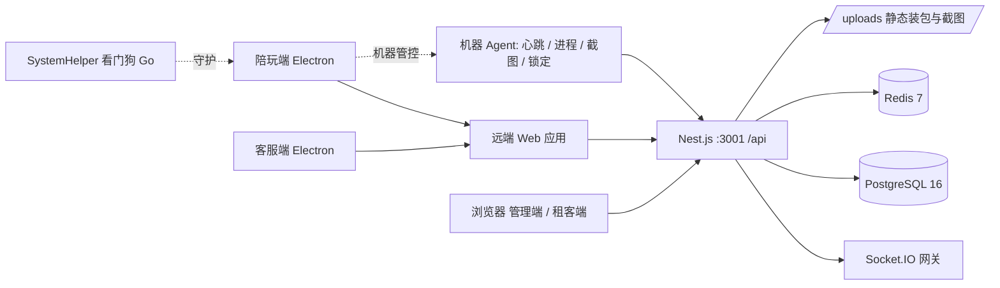
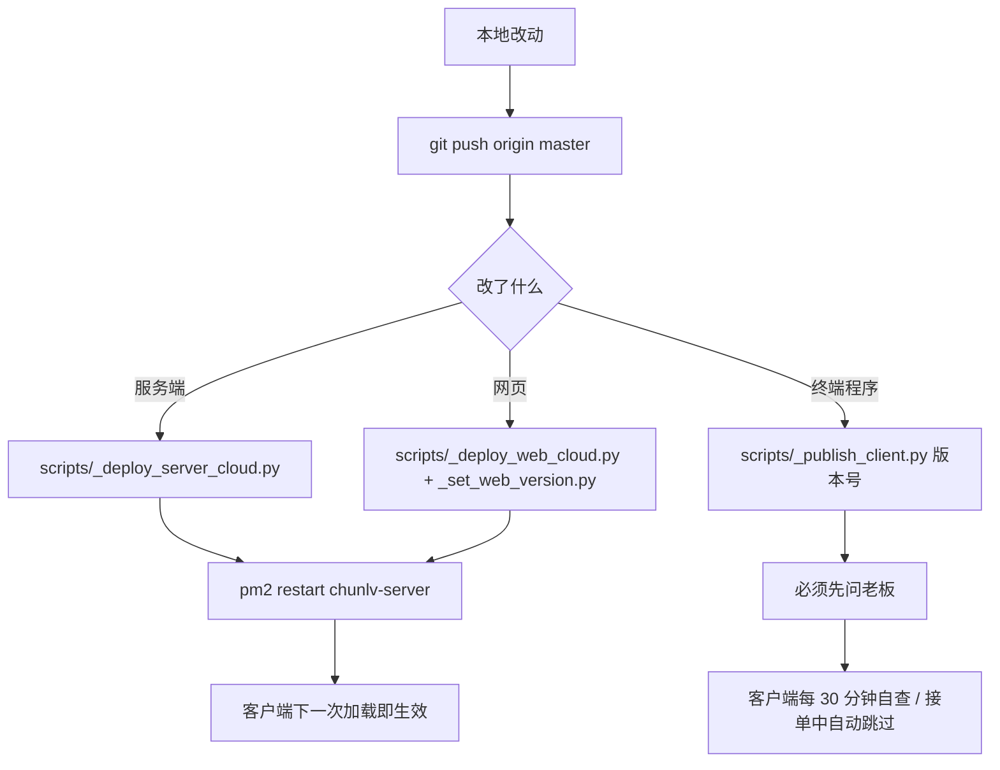

# 蠢驴电竞陪玩派单管理系统 — 重构方案（dev 分支）

> 编写日期：2026-10-06
> 扫描基线：`dev` 分支 `59c7f581`（= `master` 当前线上版本）
> 需求准绳：`docs/蠢驴电竞陪玩派单管理系统-需求文档-v2.0.md`（与本文冲突时以需求文档为准）
> 适用范围：`dev` 分支；`master` 始终保留「可随时发布」的线上版本

---

## 0. 结论速览

**一句话判断**：这套系统已经跑完了「从 0 到 1」——业务闭环完整、线上有真实用户和真实钱在流。它的问题不是功能不够，而是**结构已经到顶**：一个 4000 行的订单服务、一个 3000 行的前端外壳、两套复制粘贴的客户端、116 个散装配置键、零前端测试。再往上叠功能，成本会指数上升。

**重构不是重写。** 线上每天有陪玩在接单挣钱，铁律第一条「不影响正在接单的陪玩」同样约束重构：任何时刻 `master` 必须能独立发布，`dev` 允许长时间不稳定。

**三条必须先立的前提（没有它们，后面全是白干）**

1. **回归安全网**：前端零测试、客户端零测试。先把「抢单 / 报账 / 结算 / 黑名单」四条主链路的自动化回归建起来，否则任何拆分都无法验证。
2. **交付链路可回滚**：当前部署靠手写 Python 脚本 + SSH + pm2，没有版本回退能力。重构期间必须能「一键回到上一个可用版本」。
3. **契约冻结**：400 个接口 + 68 处 Socket 事件是四端共用的契约，重构期间**接口路径与事件名不得变更**，只允许内部结构调整。

**六个重构包（P1 → P6，按性价比排序）**

| 包 | 目标 | 直接收益 | 风险 |
|---|---|---|---|
| P1 安全网 | 回归测试 + 可回滚交付 | 让后续每一步可验证 | 低 |
| P2 后端拆分 | 订单服务按子域拆开 | 改一处不再牵全身 | 中 |
| P3 前端拆分 | 外壳/路由/数据层解耦 | 加页面从「半天」到「半小时」 | 中 |
| P4 客户端统一 | 双客户端共享机器端能力 | 修一次两端生效 | 中高（涉及终端程序更新，必须请示） |
| P5 配置中心 | 116 个散键收进类型化配置 | 消除「页面显示 ≠ 实际生效」 | 中 |
| P6 多租户预留 | 为对外售卖做隔离与白标底座 | 打开第二增长曲线 | 低（增量） |

---

## 1. 项目画像

### 1.1 这个系统是什么

**面向陪玩工作室老板的 SaaS 派单管理系统**，直营店 + 租赁店/加盟店同库多租户（`studioId` 隔离）。

- **对外人设是「散陪」**：每个陪玩对客户呈现为独立个人，界面上不暴露工作室。
- **价值锚点是防私单**：让老板「看得见每一单、看得见每一笔钱」。
- **开发者的双重身份**：既是系统开发者，也是持有全部数据的超级管理员。
- **中期路线**：先把线下陪玩店免费拉进来用，再对外卖这套软件（自助开户 / 计费 / 白标目前只有雏形）。

### 1.2 受众与四端

| 端 | 载体 | 用户 | 核心诉求 |
|---|---|---|---|
| 管理端 | Web（也跑在陪玩端里） | 老板 / 店长 | 看盘、管人、管钱、配置 |
| 客服端 | Electron `cs-electron` | 客服 | 发单要快、抢单池要顺、客户资料一眼看清 |
| 陪玩端 | Electron `companion-electron` | 陪玩 | 抢单要快、计时准、报账顺、别被乱杀进程 |
| 租客端 | Web | 租赁店店长 | 只看本店、自己配本店参数 |
| 超管 | Web | 开发者 | 全部数据、版本与授权 |

**注意**：客服端与陪玩端**不是两套前端**，而是两个 Electron 外壳加载**同一个远端 Web 应用**（`http://<server>/login`）。这是理解本项目架构的关键前提——真正的前端只有一套。

### 1.3 业务主链路

```
客服/店长/老板 发单 ──┬─ 广播 ──▶ 陪玩端右下角弹窗（秒级，点了就抢）
                      └─ 入池 ──▶ 订单池（按段位分段放行：上等马 0s / 中等马 60s /
                                     下等马 120s / 桥接工作室 300s）
                              │
                        陪玩一键抢单（原子化，先到先得）
                              │
              单人单 ─────────┴───────── 双陪单 → 呼叫搭档（指定/广播）→ 搭档接单
                              │
                         开始服务（计时、状态=接单中）
                              │
                 结束服务 → 战报截图 + 客户 + 金额 + 报账
                              │
                 结算 → 业绩入账 → 可支取余额（阶梯分润，四人均分：工作室/店长/客服/陪玩）
```

**横切口径**：每天 **12:00 换营业日**；报账、结算、看板、配额全部走同一套时间界线。

### 1.4 规模现状（实测）

| 模块 | 文件数 | 代码行 | 说明 |
|---|---|---|---|
| `apps/server` | 306 | 48,594 | 不含 `dist`；含 73 个测试文件 |
| `apps/web` | 200 | 49,399 | 唯一前端，四端共用 |
| `apps/companion-electron` | 12 | 3,657 | 陪玩端外壳 + 机器管控 |
| `apps/cs-electron` | 3 | 1,003 | 客服端外壳（纯 JS） |
| `packages/shared` | 4 | 152 | 共享枚举/类型，**极薄** |
| `apps/watchdog-service` | Go | 100+ | 看门狗服务（SystemHelper） |

**后端**：66 个 Prisma 模型 · 62 次迁移 · 28 个 Controller · 55 个 Service · 26 个 Module · **400 个接口** · 289 处 `@Roles` 判权 · 仅 15 个 DTO 文件。
**前端**：86 条路由 · 62 个组件 · 26 个 API 模块 · 229 处 `useEffect` · 50 处 `setInterval` · **0 个测试文件**。

---

## 2. 架构现状

### 2.1 运行时拓扑



**关键点**：客户端把 API 和 Web 资源都指向同一台云服务器（`1.117.229.36:3001`）。服务端一改，四端立即生效——这既是需求文档里「服务端改完即全端生效」的原因，也是重构最大的杠杆点。

### 2.2 代码拓扑

```
apps/server/src/
  orders/          ← 业务核心，也最臃肿（god service）
  companions/  customers/  finance/  billing/  chat/  ws/
  agent/       managed-pc/ process-blacklist/   ← 终端管控
  auth/  studios/  stats/  dashboard/  payroll/  traffic-account/
  common/            ← 30 个纯函数工具（业务口径的唯一实现，质量最好）
  __tests__/         ← 73 个测试，覆盖率集中在这里
apps/web/src/
  layouts/AppLayout.tsx   ← 3095 行的全局外壳
  pages/{admin,owner,cs,dispatch,finance,settings,companion}
  components/  api/  stores/  hooks/  constants/  workers/
```

**`common/` 是这块代码库里最健康的部分**：`business-day.ts`、`withdrawable.ts`、`revenue-calculator.ts`、`order-privacy.ts`、`entertainment-fee.ts` 等把「唯一口径」收敛成了纯函数并配了单测。重构应当**沿用这个模式**，把散落在 Service 里的口径逻辑继续往 `common/` 搬。

### 2.3 交付链路



**现状特征**：CI 只跑 `typecheck` + 服务端测试（`.github/workflows/ci.yml`），**部署完全不经过 CI**，是本地脚本直连生产。这既是当前最大的运维风险，也是重构必须最先补的一环。

---

## 3. 问题诊断

### 3.1 P0 — 会让重构直接翻车的

| # | 问题 | 证据 | 后果 |
|---|---|---|---|
| P0-1 | **前端与客户端零测试** | `apps/web` 与两个 Electron 目录下 0 个 `*.test.ts(x)`；对比服务端 73 个测试文件 | 前端拆到一半无法判断「有没有拆坏」，只能靠人肉点 |
| P0-2 | **部署无版本管理、无回滚** | `scripts/_deploy_*.py` 直接 `rm -rf` 远端目录再解包；指纹只用于「要不要重启」 | 一次坏发布只能手工救，重构期高频发布风险极高 |
| P0-3 | **契约面巨大且无 schema 校验** | 400 个接口 / 68 处 socket 事件 / 仅 15 个 DTO 文件 | 内部重构极易打破某个客户端，且类型系统拦不住 |
| P0-4 | **线上工具产物混入仓库** | `.rtfm/library.db` 17 MB 被 git 跟踪；`CHANGELOG.md` 已 4,676 行 / 606 KB | 仓库膨胀、clone 慢、diff 噪声大 |

### 3.2 P1 — 结构性债务

| # | 问题 | 证据（实测） | 影响 |
|---|---|---|---|
| P1-1 | **订单服务是上帝对象** | `orders.service.ts` 4,089 行 / 71 个公开方法 / 204 处 `this.prisma.` 直连 | 任何改动都会波及抢单主链路，回归范围无法界定 |
| P1-2 | **前端外壳是巨型组件** | `AppLayout.tsx` 3,095 行，内含 20+ 个独立角标 state、菜单配置、通知中心、聊天窗口、socket 编排 | 加一个角标要改全局文件，冲突率极高 |
| P1-3 | **路由样板重复 ~70 次** | `router.tsx` 779 行，每条路由都被 `Suspense` 包一遍；`owner/*` 与 `admin/*` 大量重复指向同一组件 | 加页面成本高、老路径无人敢删 |
| P1-4 | **配置键散装且无类型** | `SystemConfig`/`StudioConfig` 是 `key + Json` 的 KV 表，`default-config.ts` 里 116 个键以裸字符串硬编码 | 需求文档里反复出现「页面显示 ≠ 实际生效」这类事故 |
| P1-5 | **双客户端复制粘贴** | `companion-electron/electron/machine-agent.js` 与 `cs-electron/machine-agent.js` 归一化后 **298/305 行完全相同**；客服端是纯 JS、无 TS、无构建 | 机器端能力修一次要改两份，客服端长期落后 |
| P1-6 | **WebSocket 网关单文件承担全部事件** | `ws.gateway.ts` 1,447 行 / 12 个 `@SubscribeMessage` / 21 处 emit | 事件与业务耦合，测试只能整体打桩 |

### 3.3 P2 — 工程化与卫生

| # | 问题 | 证据 |
|---|---|---|
| P2-1 | 类型逃逸严重 | 服务端 `: any` 1,007 处 / `as any` 734 处；前端 1,120 / 189 |
| P2-2 | 数据层被绕过 | 前端 42 处直接 `axios.` / `fetch(` 写在 `api/` 目录之外 |
| P2-3 | 大文件密度高 | 服务端 39 个文件 > 300 行；前端 46 个 |
| P2-4 | 轮询替代推送 | 前端 50 处 `setInterval`（看板 15 秒轮询等），与既有的 Socket.IO 能力重复 |
| P2-5 | 仓库根目录污染 | 根目录约 250 个 `tmp_*.py/.txt` 未跟踪残渣；`.gitignore` 只忽略了带点的 `/.tmp-*`、`/.tmp_*`，漏掉 `tmp_*` |
| P2-6 | 文档与代码耦合 | `docs/ARCHITECTURE.md` 已退化成「按日期的变更流水」，75 KB，读不出结构；真正的架构只在人脑里 |

---

## 4. 重构目标、原则与红线

### 4.1 目标（可验证）

1. **改一处不牵全身**：订单子域可独立改动与测试，回归范围可界定为「一个子域 + 抢单主链路」。
2. **加页面成本下降**：新增一个管理端页面 ≤ 30 分钟（现状约半天）。
3. **契约显式化**：接口与 socket 事件有类型/契约清单，CI 可比对是否有破坏性变更。
4. **发布可回滚**：任何一次部署都能在 3 分钟内回到上一个版本。
5. **两客户端收敛为一套机器端能力**：机器管控逻辑只有一份实现。
6. **口径唯一**：所有金额/时间/分润口径只存在一处实现，并有单测锁定。

### 4.2 原则

- **绞杀者模式（Strangler）**：新结构在旁边长出来，老代码逐步改道，不做大爆炸重写。
- **行为等价优先**：拆分只搬逻辑、不改行为；行为变更必须独立成提交并单独验证。
- **口径下沉 `common/`**：延续现有最健康的模式，纯函数 + 单测。
- **一次一个子域**：一个 PR 只动一个限界上下文。

### 4.3 红线（违反即事故，与需求文档 0.3 节一致）

- **不影响正在接单的陪玩**：客户端更新、黑名单等动作永不打断服务中的人。
- **线上业务开关不许脚本碰**：`blacklist.enabled`、版本号/宽限期类键，只能由老板/店长在界面上拨。
- **测试数据必删**：线上验证造的数据一律收尾清理，真实业务数据只读。
- **接口路径与事件名冻结**：`/api/**` 路径与 socket 事件名在重构期不得改名。
- **终端程序更新必须先请示**：`_publish_client.py` / `_publish_cs_client.py` 及整包换装，先问再发。

---

## 5. 分阶段方案

### 阶段 0：安全网（前置，必做）

| 任务 | 产出 | 验收 |
|---|---|---|
| 冻结契约清单 | 从 28 个 Controller 生成 `docs/api-contract.md` + 事件清单 | 脚本可一键重生成并 diff |
| 关键链路集成测试 | 抢单原子性 / 报账口径 / 可支取余额 / 黑名单开关 四条 e2e | CI 中跑通，任一破坏即红 |
| 前端冒烟测试 | 引入 Vitest + Testing Library，先覆盖 `router` + 登录 + 订单池 | `pnpm -r test` 可跑 |
| 部署可回滚 | 远端保留上两个版本目录（`releases/` 软链切换） | 一次演练：回滚耗时 < 3 分钟 |
| 仓库瘦身 | `.rtfm/library.db` 移出跟踪；补 `tmp_*` 到 `.gitignore`；`CHANGELOG.md` 滚动归档 | 仓库体积明显下降，`git status` 干净 |

### 阶段 1：工程基线

- 统一 Node/pnpm 版本（`.nvmrc` 与 CI 对齐，当前 CI 用 Node 18、本地未锁）。
- CI 扩展为 `typecheck → lint → test → build`，并新增**契约 diff 校验**（阶段 0 的清单）。
- 服务端导出 Swagger JSON 作为机器可读契约（`main.ts` 已挂 `/api/docs`，只需导出）。
- 重写 `docs/ARCHITECTURE.md` 为真实结构文档，把「按日期的流水」交给 `CHANGELOG.md`。

### 阶段 2：后端领域拆分（核心）

按限界上下文重排 `orders`，见第 6 节详设。收尾时同步做：

- **统一判权与归属校验**：289 处 `@Roles` 分散在各 Controller，抽成 `StudioScopeGuard` + `canAccess(user, resource)`，杜绝「忘了判 `studioId`」的越权。
- **DTO 补齐**：15 个 DTO 覆盖 400 个接口是明显缺口，按子域分批补，优先写接口。
- **网关拆分**：见第 6.3 节。

### 阶段 3：前端解耦

见第 7 节详设。要点：拆 `AppLayout`、路由去样板、数据层收口、轮询改推送。

### 阶段 4：客户端统一

见第 8 节详设。要点：`packages/machine-agent` 共享包、客服端 TS 化、更新器与看门狗协议对齐。
**注意**：本阶段所有「终端程序更新」动作必须先获得老板许可。

### 阶段 5：配置中心

见第 9 节详设。要点：键常量化 + schema 校验 + 读写单入口（现有 `saveConfigsByRole` 已是正确方向）。

### 阶段 6：多租户与白标底座（增量，不阻塞前五步）

按需求文档 2.4 节补齐：自助开户、计费与续期、跨店越权全量回归、白标（店名/LOGO/话术）、免费期开关与拉新统计。

---

## 6. 详设：`orders` 领域拆分

### 6.1 目标产物

```
apps/server/src/orders/
  orders.controller.ts          ← 仅 HTTP 编排（586 行 → 目标 < 200）
  lifecycle/                    ← 单的创建 / 发布 / 入池 / 抢单 / 状态机
    order-lifecycle.service.ts
    order-pool.service.ts
    order-grab.service.ts
    order-dispatch.service.ts   （已存在，收编）
  session/                      ← 服务过程：开始 / 暂停 / 结束 / 时长
    order-session.service.ts
    companion-quota.service.ts  （已独立，保留）
  transfer/                     ← 转让 / 申请 / 归属调整（已部分独立，收编）
  outcome/                      ← 报结果 / 成交核对 / 打回重写
    order-outcome.service.ts
  reminders/                    ← 6 个 *-reminder.service.ts 归拢
```

### 6.2 拆分手法（避免大爆炸）

1. **先建门面**：`orders.service.ts` 保留为门面，内部方法体逐步委托给新服务，外部调用方（Controller、其它 Service）零改动。
2. **再按「读 / 写」切一刀**：204 处 `this.prisma.` 中，查询类下沉到 `order-query.repository.ts`，写操作留在服务里并全部走事务。
3. **口径外移**：金额、时间窗、可见性判断搬进 `common/`（`order-split.ts`、`business-day.ts` 已是对的方向）。
4. **每个子域配测试**：拆分一个子域 → 补该子域单测 → CI 全绿 → 再拆下一个。

### 6.3 事件层重构

`ws.gateway.ts` 目前既是连接层又是业务发射器。拆为：

- `ws.connection.ts`：握手、JWT 校验、room 编排（studio/role/user）、在线心跳、断线宽限。
- `events/order.events.ts` 等：只暴露 `emitXxx()` 语义方法，业务服务依赖它而**不依赖 gateway**。

收益：业务服务可以在测试里断言「发出了什么事件」，而不必启动 socket 服务器。

### 6.4 不做什么

- **不改表结构**（除必要索引）。66 个模型 / 62 次迁移已经很重，重构期再动 schema 会放大风险。
- **不改接口路径**、不改事件名。

---

## 7. 详设：前端解耦

### 7.1 拆 `AppLayout.tsx`（3,095 → 目标 < 400）

| 抽出物 | 内容 |
|---|---|
| `config/roleMenus.ts` | 已存在的 `roleMenus` / `roleLabels` / `ROLE_PAGES` 三张映射表（约占 500 行） |
| `hooks/useBadges.ts` | 20+ 个角标 state 与各自的轮询/推送订阅，统一成一个 `useBadges(role)` |
| `components/shell/NotificationCenter.tsx` | 通知面板 |
| `components/shell/ChatDock.tsx` | 聊天浮窗与群聊窗口编排 |
| `components/shell/BannerHost.tsx` | 横幅 / 邀请 / 转让 / 紧急单的统一渲染与 `onBannerAction` |
| `sockets/useAppSocket.ts` | 68 处 `socket.on` 的注册与清理，收敛进一个 hook |

### 7.2 路由去样板

```tsx
// 现状：每条路由重复包裹
{ path: 'admin/orders', element: (<Suspense fallback={<SuspenseFallback />}><OrdersPage /></Suspense>) }

// 目标：一个 lazy 帮助函数 + 数据表驱动
const page = (loader: () => Promise<{ default: React.FC }>) => {
  const Lazy = React.lazy(loader);
  return <Suspense fallback={<SuspenseFallback />}><Lazy /></Suspense>;
};
```

再配一张 `routes.ts` 表（`path / roles / title / loader`），由它**同时派生菜单与路由**——目前这两份数据各自维护，经常对不上。

同时清理 `owner/*` 与 `admin/*` 的重复：`owner/*` 作为历史别名保留 `Navigate` 重定向，不再挂真实组件。

### 7.3 数据层收口

- 42 处 `api/` 之外的 `axios` / `fetch` 全部收回 `api/`，统一走 `api/client.ts`（拦截器已有 token 刷新逻辑）。
- 引入服务端状态库（TanStack Query），把 50 处 `setInterval` 轮询换成 **Socket 推送为主 + 定点 refetch 兜底**。
- 统一「列表页」抽象：订单 / 客户 / 陪玩三个大表是同一套（定宽列 + 钉左钉右 + 点行进详情 + 列规格全局共享），抽 `DataTable` 并打通 `constants/datasetColumns.ts`（已是雏形）。

---

## 8. 详设：双客户端统一

### 8.1 现状

| | 陪玩端 | 客服端 |
|---|---|---|
| 语言 | TypeScript + esbuild 打包 | **纯 JS，手写，无构建** |
| 机器端能力 | `electron/machine-agent.js` | `machine-agent.js`（与陪玩端 298/305 行相同） |
| 主进程 | `electron/main.ts` 1,848 行 | `main.js` 678 行 |
| 页面 | 加载远端 Web | 加载远端 Web |
| 升级 | `updater.ts` 574 行 + 看门狗换文件 | 打包脚本 `_repack_cs_zip.py` |

### 8.2 方案

1. 新建 `packages/machine-agent`：把心跳、进程黑名单监听（WMI `Win32_ProcessStartTrace` + 兜底扫描）、截图采集、屏幕锁定、机器上报、远程指令通道收成**一个带单测的 TS 包**。
2. 新建 `packages/electron-shell`：窗口管理、托盘、IPC 通道定义（28 个 `ipcMain` handler / 30 个 preload 通道）、横幅宿主、更新器——两端共用。
3. 客服端 TS 化：`main.js` / `machine-agent.js` 退役，改为与陪玩端同构的 `electron/main.ts`，只保留客服特有的窗口与菜单差异。
4. **升级策略对齐**：客服端目前缺陪玩端的「接单中跳过 + 备货后等空闲安装」机制，统一到同一套 `updater` 语义。

### 8.3 迁移顺序（风险可控）

先让客服端**依赖**共享包（阶段 A，行为不变）→ 再让陪玩端依赖（阶段 B）→ 最后删掉两份 `machine-agent.js`。
每一步都涉及打包与客户端更新，**发布前必须先请示**，且必须在陪玩空闲窗口发布。

---

## 9. 详设：配置中心

现状：116 个键以字符串写在 `default-config.ts`，`SystemConfig`（老板级）与 `StudioConfig`（店长级）是 `key + Json` 的 KV 表，读取点分散在各 Service。

**改造三步**

1. **键常量化**：把裸字符串换成 `as const` 常量表，消灭拼写错误与「找不到读取点」。
2. **Schema 校验**：每个键配 `zod`（或手写校验器）定义类型、范围、默认值、作用域（`SYSTEM` / `STUDIO`）。写入时校验，**非法值不落库**。
3. **读写单入口**：延续并强化现有 `saveConfigsByRole(prisma, actor, entries)`，服务端一律通过 `ConfigService.get(key, studioId)` 读取，禁止直接查表。配一条「显示 = 生效」的断言测试（遍历所有键，断言页面读到的值等于服务读到值）。

收益：把需求文档里反复出现的一类事故（「店长设了 70、页面还显示 80」「脚本误改开关」）从制度约束升级为**类型与测试约束**。

---

## 10. 风险与回滚

| 风险 | 触发场景 | 缓解 |
|---|---|---|
| 重构期间线上出 bug 无法快速修 | `dev` 与 `master` 分叉越来越大 | 线上修复永远直接提交 `master` 并 cherry-pick 回 `dev`；`dev` 定期 rebase `master` |
| 抢单主链路被拆坏 | 阶段 2 拆 `orders` | 抢单原子性 e2e + 名额扣减测试必须常绿；先拆读路径再拆写路径 |
| 客户端更新打断服务 | 阶段 4 | 复用现有「接单中跳过 + 空闲安装」机制；发布前请示；先灰度一台 |
| 越权漏洞 | 判权重构 | 阶段 0 先补「跨角色 × 跨店」越权回归矩阵 |
| 仓库历史被工具产物污染 | 大文件 | 阶段 0 先停止跟踪；如需清理历史（`git filter-repo`）会改写历史，**需单独评估与确认** |

**回滚原则**：服务端与网页回滚 = 切回上一个 release 目录并重启；客户端回滚 = 重新发布上一个版本的包（必须请示）。

---

## 11. 验收度量

| 指标 | 现状 | 目标 |
|---|---|---|
| 前端测试文件数 | 0 | ≥ 20，覆盖主链路 |
| 最大单文件行数（服务端 / 前端） | 4,089 / 3,095 | < 800 |
| `orders.service.ts` 行数 | 4,089 | < 500（门面） |
| DTO 覆盖写接口比例 | 约 4% | 100% |
| `: any` 数量（服务端 + 前端） | 2,127 | 减半 |
| `api/` 之外的直接请求 | 42 | 0 |
| 部署回滚耗时 | 无能力 | < 3 分钟 |
| 接口破坏性变更检出 | 靠人 | CI 自动拦截 |

---

## 12. 第一批可立即开工的任务（按顺序）

1. `chore(repo): 仓库瘦身` —— `.rtfm/library.db` 移出跟踪、`.gitignore` 补 `tmp_*`、根目录残渣清理、`CHANGELOG.md` 归档滚动。
2. `chore(ci): 部署可回滚` —— 远端改为 `releases/<sha>` + 软链，脚本增加 `--rollback`。
3. `test(orders): 抢单主链路 e2e` —— 抢单原子性、名额扣减/退回、订单池分段可见性。
4. `docs: 生成接口与事件契约清单` —— 从 Controller 与 gateway 自动导出并在 CI diff。
5. `refactor(web): 路由去样板` —— `Suspense` 帮助函数 + `routes.ts` 数据表，清理 `owner/*` 重复。
6. `refactor(web): 拆 AppLayout` —— 先抽 `config/roleMenus.ts`（纯搬运，零行为变更）。
7. `refactor(orders): 建立门面 + 抽出 order-pool` —— 第一个限界上下文，验证拆分手法。

> 第 1、2、4 项不触碰任何业务逻辑，是重构的地基，建议 3 天内完成。
> 第 3、7 项开始触碰核心链路，务必在阶段 0 的安全网建成之后进行。
